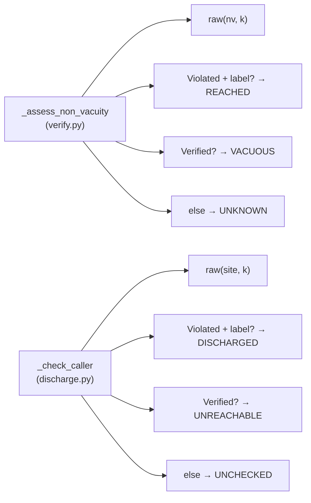
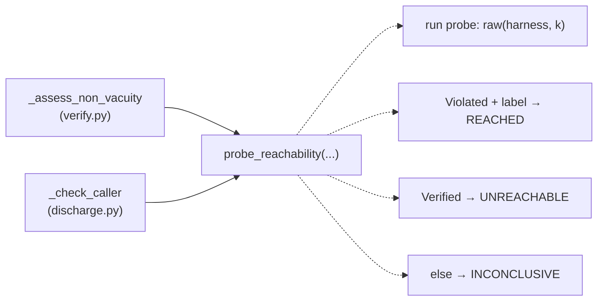
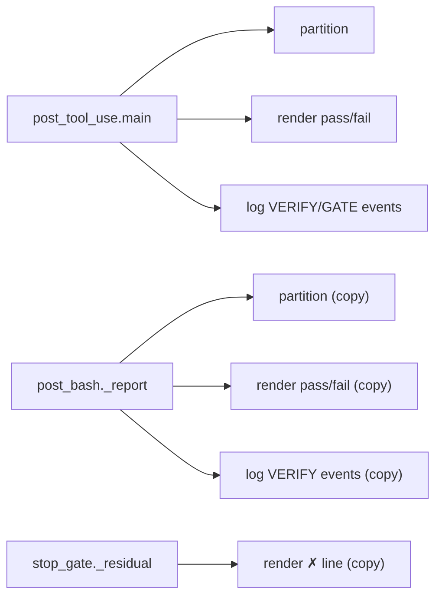
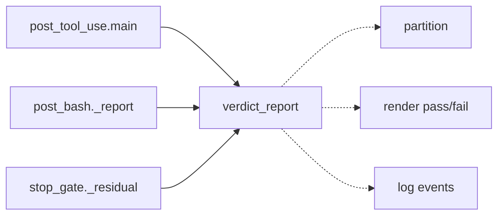

# Architecture review — forseti — 2026-09-02

**Scope**: `src/forseti/` under two parallel scans — (a) `adapters/` + `core/`, (b)
`esbmc/` + `precond/` + `properties/` + `orchestrator/`. Scoped by hot-spot inference over
`git log`: the churn clusters in `esbmc/units.py`, the `precond/` stack (`discharge.py`,
`synth.py`, `verify.py`), `core/cli.py`, and the Claude-Code adapter hooks. The tree is
unusually well-factored — most low fruit was already picked (units preprocessor extraction
#233, discharge vocabulary #238, properties C-signature split #227, precond CLI cluster
#222, git-porcelain out of `forseti_gate` #205) — so this run went looking for the
*remaining* shallowness rather than the obvious god-modules.

**Picked**: `precond-reachability-probe-tri-state` — see the PR and `.architecture/backlog.md`.

**Degradations**: none. `gh` authenticated; both exploration sub-agents ran; `codebase-design`
vocabulary used as defined. Branch adoption was **refused** — condition 3 failed: the firing
branch `sym/forseti/routine/refactor-audit/01M1FK9R0C` has upstream `@{u} = origin/main`, so it
is not an unpublished, no-upstream branch made for this run. A branch was **created** from
`origin/main` as `pm-deepen/run-2026-09-02-0102` and renamed to
`pm-deepen/precond-reachability-probe-tri-state` at step 2.

**Diagram convention** (replaces the upstream HTML legend): in every Before/After pair, a
**solid** edge is part of a module's public interface; a **dashed** edge is inside the
implementation, hidden behind a seam.

---

## Candidates

### precond-reachability-probe-tri-state — one interpreter for the assert(0) reachability probe · Strong · score 20/25

**Files**
- `src/forseti/precond/verify.py:367-410` — `_assess_non_vacuity`, tail at `395-410`
- `src/forseti/precond/discharge.py:682-709` — `_check_caller` reachability tail
- emission already unified: `src/forseti/precond/synth.py` `render_sidecar(non_vacuity=True)`
  and the site-probe injection both emit the same `__ESBMC_assert(0, "<label>")` probe
- file-count estimate: **~4–5** (new `precond` leaf, `verify.py`, `discharge.py`,
  `tests/precond/test_precond_verify.py`, `tests/precond/test_discharge.py`)

**Score 20/25**
- **Leverage 4** — two call sites simplify and one deeply-subtle inversion ("a `Violated`
  carrying the probe's label means the `assert(0)` *fired*, i.e. the site was reached") is
  learned and tested once instead of twice. Not a 5: it does not remove a whole class of test
  setup across many sites.
- **Locality 4** — a change to how a reachability probe is interpreted (a new `Error` subtype,
  a label-form change) becomes a one-file edit; today it forces edits in two files that must
  stay in lockstep.
- **Blast radius 2** — a new module and its two direct callers, plus their tests; no
  published/exported interface changes. (~4–5 files.)
- **Heat 4** — the precond stack is the hottest area in the tree: `discharge.py` and
  `synth.py` and `verify.py` all churned in the last 60 commits (#238, #222, #225, #175).

**Problem** — Both `_assess_non_vacuity` and `_check_caller` independently re-implement the
identical "assert(0)-probe → tri-state" interpretation. The interface each exposes to itself is
nearly as complex as the implementation: a `raw(harness, unwind=k)` call, an `isinstance` on the
verdict, a substring scan for a probe label, and a three-way branch — all inline, all
duplicated. The genuinely subtle part is the *inversion*: a **FAILED** (`Violated`) verdict is
the **success** signal (the probe assertion was reachable), and a **VERIFIED** verdict means the
site was **unreachable**. That inversion has no locality — it is stated twice and must be kept
correct in both.

**Deletion test** — *Concentrates.* There is nothing to delete today; the concept was never
extracted. Introducing a `probe_reachability(...)` interpreter pulls the FAILED-means-reached
inversion, the label match, and the tri-state into one tested place. Each caller then maps the
resulting enum onto its own domain vocabulary (`Assessment` in verify, `CallerOutcome` in
discharge). Inlining the interpreter back would re-scatter the inversion across two files —
exactly the "the real subtlety is in *how* the probe is interpreted, and it has no locality"
case.

**Solution** — Add a small pure `Reachability` enum
{`REACHED`, `UNREACHABLE`, `INCONCLUSIVE`} and an interpreter that, given a probe
`EsbmcResult` and the expected label, returns which arm fired. `REACHED` is scoped to mean
"the labelled probe assertion fired in *this sidecar harness* at bound k" — **not** "reachable
in general" — so the callee's own self-harness tripping its entry probe (PR #175 self-caller
residual) reads correctly. `INCONCLUSIVE` covers `Verified`-is-not (`Unknown`/`Error`) *and*
`Violated`-without-the-label, and always maps to `UNKNOWN`/`UNCHECKED`, never a pass
(CLAUDE.md: "never silently pass"). The raw-substring label scan mechanism is kept **exactly**
as-is inside the interpreter — switching to the typed `violated_property.description` is a
different candidate (`counterexample-fired-label-predicate`) and would make this a behaviour
change.

**Benefits** — *Leverage*: both callers shrink to "run the probe, ask the interpreter, map the
enum to my vocabulary". *Locality*: the reachability convention now has one home beside its one
emitter (`synth.py`). *Test surface*: the four-way input (Violated+label / Violated-without-label
/ Verified / Unknown-or-Error) → three-way output can be exercised directly through the
interpreter with a fake `VerifyPort`, instead of only through each caller's full pipeline. This
also closes a real coverage gap: the non-vacuity path's inconclusive arm (`verify.py:406-410`)
is not currently pinned by any test.

**Before**



**After**



---

### hook-verdict-report-two-hooks — one verdict-report module for the Claude-Code hooks · Worth exploring · score 19/25

**Files**
- `src/forseti/adapters/claude_code/post_tool_use.py:45-175` — `main()`
- `src/forseti/adapters/claude_code/post_bash.py:29-106` — `_verify_file` / `_report`
- (echoed) `src/forseti/adapters/claude_code/stop_gate.py:36-47` — `_residual`
- file-count estimate: **~5**

**Score 19/25**
- **Leverage 4** — scored as *pure* deepening. The scan proposed also giving `post_bash` the
  canonical `gate.decision` event it lacks; that is a change to a **wire format** (canonical
  loop events, #252) and the autonomy contract forbids changing a published interface beyond
  what the pick strictly requires, so it is excluded here. Without it, the extraction still
  collapses three near-verbatim copies of the "batch of `UnitVerdict` → (events, message, exit
  code)" transform.
- **Locality 4** — a wording change or a new verdict kind becomes a one-module edit instead of
  a lockstep edit across two hooks and a third echo.
- **Blast radius 2** — a new module and its direct callers plus tests, all inside the
  Claude-Code adapter.
- **Heat 3** — `post_tool_use` is a churned hot path; `post_bash`/`stop_gate` less so.

**Problem** — The needs/failures/verified partition, the per-verdict event loop, the pass line,
and the `✗ unit — VERDICT (k=)` + `Counterexample:` + "Fix the unit(s)…" failure block are
copied near-verbatim across the two PostToolUse hooks and echoed a third time in
`stop_gate._residual`. The rendering is not behind any interface — it is duplicated source.

**Deletion test** — *Concentrates.* A `verdict_report` module owns the partition + rendering +
event vocabulary that both hooks call; inlining keeps it scattered across two-to-three files
where a single wording change must be edited in lockstep.

**Solution** — Extract `partition(verdicts)` and a `report(...) -> (pass_text, fail_text,
exit_code)` into `adapters/claude_code/verdict_report.py`; each hook keeps only its own control
flow (post_tool_use's superseded/empty deferral, post_bash's per-file loop). Fail-closed is
preserved: exit 2 on any failure moves intact. The `post_bash` canonical-event gap is recorded
as its own backlog candidate (`canonical-gate-decision-helper`), not folded in.

**Benefits** — *Leverage*: both hooks shrink to orchestration. *Locality*: the gate's
user-facing vocabulary gets one home. *Test surface*: the message/exit-code contract is pinned
once against the module, not re-pinned per hook.

**Before**



**After**



---

### counterexample-fired-label-predicate — typed-first label predicate on `Violated` · Worth exploring · score 17/25

**Files** — `src/forseti/esbmc/result.py:71` (`Violated`, carries the typed
`counterexample.violated_property.description`); raw-text scans that bypass it at
`precond/verify.py:144,395` and `precond/discharge.py:638,685`. Contrast:
`orchestrator/fix.py:43-47` already reads the typed path. file-count ≈ 3–4.

**Score 17/25** — leverage 3 (four call sites simplify), locality 4 (the "which property fired,
and how do we degrade when the trace didn't parse" decision gets one home), blast radius 2
(esbmc `result.py` + two precond files + tests), heat 3.

**Problem** — Every precond site asks "did the property labelled X fire?" by substring-scanning
the raw ESBMC trace, re-deriving something the typed `ViolatedProperty.description` already
parsed. precond alone is coupled to ESBMC's text layout; the rest of the codebase uses the typed
model.

**Deletion test** — *Concentrates.* A `Violated`-level predicate checking
`violated_property.description` first and falling back to the raw scan on a `None`
counterexample pulls that decision into one place; the four sites become one call. **Note**: this
run deliberately does **not** fold this into the picked PR — `probe_reachability` keeps the raw
scan identical, and swapping to the typed predicate is this candidate's job so it can be reviewed
as the behaviour change it is.

**Solution** — Add a typed-first, raw-fallback substring/prefix predicate on `Violated`; route
the four precond scans through it. The raw fallback is load-bearing (the parser returns `None` on
a multi-counterexample dump) and must stay.

**Benefits** — *Leverage*: precond stops depending on ESBMC's text layout. *Test surface*: the
typed path and the raw-fallback path can each be pinned with a targeted `Violated` fixture.

---

### esbmc-caller-openings-module-split — split discharge caller-openings out of `units.py` · Worth exploring · score 17/25

**Files** — `src/forseti/esbmc/units.py` (1550 LOC) mixes unit/signature listing with ~460 LOC
of discharge caller-openings analysis (`parse_external_callers`, `parse_address_escapes`,
`parse_implicit_invocations`, `parse_symbol_aliases`, `parse_asm_statements`,
`probe_predefined_guards`, `CallerOpenings`, `list_caller_openings`). file-count ≈ 4–6.

**Score 17/25** — leverage 3, locality 4, blast radius 3 (units.py, a new module,
`esbmc/__init__.py`, and the monkeypatch-path strings in `test_units.py` /
`test_precond_corpus.py`), heat 4.

**Problem** — Understanding "how discharge decides a callee's caller set is open" forces reading
the AST-walking internals of `units.py`, a module named for another job (unit/signature
listing). One concept lives inside a module named for a different one.

**Deletion test** — *Concentrates.* The split is along the existing
`list_caller_openings`/`CallerOpenings` seam that `precond/discharge.py` already consumes;
`units.py` shrinks to its listing job and nothing scatters.

**Solution** — Move the caller-opening scanners + `CallerOpenings` + `list_caller_openings` into
their own module, exposing only that seam.

**Benefits** — *Locality*: discharge-completeness logic gets a module named for it. **Caveat**:
the largest and hottest of the precond-adjacent candidates; the test monkeypatch-path churn makes
it mechanical-but-wide, which is why it ranks below the picked candidate despite a similar score.

---

### precond-under-unwound-detection-into-esbmc — move under-unwound detection beside its reason enum · Speculative · score 15/25

**Files** — `precond/verify.py:134-156` (`_is_under_unwound` + `escalating_port`),
`esbmc/result.py:40` (`UnknownReason.UNDER_UNWOUND` already exists). Call sites of
`escalating_port`: `verify.py:328`, `discharge.py:632`, and **`core/check.py:151`** (out of the
scanned scope). file-count ≈ 3–4.

**Score 15/25** — leverage 3, locality 4, **blast radius 4** (crosses into out-of-scope
`core/check.py` *and* changes `esbmc.verify`'s published verdict under one flag combination),
heat 3. Eligible (blast 4, not 5), but the published-verdict change and the out-of-scope consumer
make it the weakest of the precond-family picks for an unattended PR.

**Problem** — The *reason* for an under-unwound verdict crossed into the esbmc layer
(`UnknownReason.UNDER_UNWOUND`) but its *detection* stayed in precond as a raw-text wrapper, so
"unwinding-assertions-on + this phrase = escalate, not a real violation" is split across two
layers.

**Deletion test** — *Concentrates, with a caveat.* Folding detection into `runner.classify`
(which already knows `no_unwinding_assertions` and owns `EsbmcResult` construction) concentrates
the rule beside its reason enum — but it changes `esbmc.verify`'s published verdict under one
flag, which may be a deliberate "keep `verify` a faithful mirror" choice. Needs a before/after
differential run.

**Solution** — Have `runner.classify` emit `Unknown(UNDER_UNWOUND)` for an unwinding-assertion
violation when unwinding assertions were on, retiring `escalating_port`.

**Benefits** — *Locality*: one home for the escalate rule. Deferred behind the picked candidate
because of blast radius 4.

---

### core-store-session-boundary — one store-session boundary for the three Core faces · Speculative · score 15/25

**Files** — `core/check.py:160-183`, `core/propose.py:72-103`, `core/submit.py:79-127`.
file-count ≈ 4.

**Score 15/25** — leverage 3, locality 3, blast radius 2, heat 2.

**Problem** — The `try: with PropertyStore.open(...) ... except sqlite3.Error: raise
PropertyStoreError(...)` block and the `read_text`/`unit_id`/`extract_signature` preamble are
copied across the three Core faces; the exact error string must not drift between them.

**Deletion test** — *Concentrates.* A `store_session` context manager and a `read_unit` helper
own the translation and preamble. **Hazard**: the `try` wraps the whole `with`, so a CM must
translate in `__exit__`; and the deepest home (`PropertyStore.open` in `properties`) is outside
the scanned scope, so an in-`core` shim honestly caps leverage at 3.

**Solution** — Add `open_store(store_root)` (CM) and `read_unit(source, function)` to a small
`core` helper; the three faces call them, preserving the `persist=False` dry-run contract.

**Benefits** — *Locality*: the sqlite→`PropertyStoreError` contract stops being copy-pasted.

---

### gate-env-config-extraction — relocate the fail-closed env cluster out of `forseti_gate.py` · Speculative · score 15/25

**Files** — `adapters/claude_code/forseti_gate.py` env cluster (`env_int`, `env_float`,
`env_config_errors`, `record_env_config_error`, `env_config_error_message`,
`build_flags_from_env`, `_ENV_CONFIG_ERRORS`). file-count ≈ 3.

**Score 15/25** — leverage 2 (callers already have `gate.env_int(...)`; the interface does not
change), locality 3, blast radius 2, heat 4 (the repo hot spot).

**Problem** — The fail-closed env-parsing cluster is a coherent, independently testable unit
buried in a 2489-line module.

**Deletion test** — Already concentrated inside `forseti_gate`; the win is *relocating* it to its
own file (the same move as the git-porcelain #205 extraction), not a shallow→deep change.

**Solution** — Move the cluster to `env_config.py`; `forseti_gate` re-exports the names, so hooks
keep writing `gate.env_int(...)`. **Hazard**: `_ENV_CONFIG_ERRORS` is module-level mutable
import-time state, so a new module's own tests must reset it (no existing test uses
`importlib.reload`).

**Benefits** — *Locality*: the fail-closed env contract gets a named home and the hot module
shrinks. Weakest as genuine deepening — the interface is unchanged, hence leverage 2.

---

### adapter-install-skeleton-two-harnesses — one managed-block install template for two adapters · Speculative · score 14/25

**Files** — `adapters/claude_code/install.py:205-267` and `adapters/codex/install.py:202-286`,
plus byte-identical `InstallOutcome`/`RemoveOutcome` enums. file-count ≈ 5.

**Score 14/25** — leverage 3, locality 3, blast radius 3, heat 2.

**Problem** — Two *real* adapters (a genuine seam — two implementations, not one) duplicate the
install/remove skeleton: symlink-refuse → read-existing → merge → unchanged-detect → atomic-write
→ outcome. Only the merge strategy (JSON dict-merge vs TOML text-splice) varies.

**Deletion test** — *Concentrates.* A shared template owns "idempotently write a forseti-owned
managed block, atomically, refusing to clobber"; each adapter supplies only `merge`/`strip` and
its error type.

**Solution** — `adapters/_install.py` with shared outcome enums and
`install_managed`/`remove_managed`; each adapter shrinks to building the merge fn.

**Benefits** — *Leverage*: the clobber-refusal + atomicity guarantee is written once. **Caveat**:
`docs/design/0004` documents the Claude merge algorithm as a deliberate decision — the template
must preserve it exactly, and the varying part is large, so the shared skeleton is thinner than
it looks.

---

### canonical-gate-decision-helper — move the `gate.decision` vocabulary into `core/events.py` · Speculative · score 13/25

**Files** — `core/events.py` (has the sibling `record_property_proposed`),
`adapters/claude_code/post_tool_use.py:30-42`, `adapters/codex/verify_hook.py:184-207`.
file-count ≈ 4.

**Score 13/25** — leverage 2, locality 3, blast radius 2, heat 2.

**Problem** — Both hooks hand-roll the canonical `gate.decision` event; the field vocabulary
lives implicitly in two adapters, not in `core/events.py` where its sibling already is.

**Deletion test** — *Concentrates* into `core/events.py`.

**Solution** — Add `record_gate_decision(...)` to `core/events.py`; both hooks (and, closing the
gap, `post_bash`) call it. **Constraint**: `docs/design/0001:127-128` documents that the event
deliberately carries `unit_ids` for Claude Code and `files` for Codex — the helper must preserve
that asymmetry, not collapse the fields. Overlaps the `hook-verdict-report-two-hooks` gap.

---

## Dropped

| Candidate | Dropped because |
|---|---|
| `mcp-server-tool-wrappers` | Leverage 1 — deletion test scatters: the re-declared typed param list *is* the MCP tool schema the SDK introspects. Shallow but load-bearing. |
| `verify-and-record-decomposition` | Not a deepening — `verify_and_record` (forseti_gate.py:1921-2489) is the fail-closed/ownership *heart* of the gate: deep, not shallow, and every line encodes an invariant reviewers re-litigate. High blast, high regression risk. |
| `cli-run-handler-shape` | Leverage 1 — the per-command exit-code logic genuinely differs (`EXIT_CODES[verdict]` vs `_check_exit_code` vs 0/1); consolidating would scatter the variation into flags. |
| `esbmc-init-all-parser-surface` | Leverage 1 — removing the unused `parse_*` re-exports from `esbmc/__init__.__all__` narrows a namespace but concentrates nothing. Interface hygiene, not a deepening. |
| `harness-writer-port-inline` | Not a deepening — the one-adapter `HarnessWriterPort` seam is a candidate to *inline* (a simplification), and the indirection defensibly keeps the driver from importing `properties` directly. |

## Too large to automate

None. No candidate hit blast radius 5. (`precond-under-unwound-detection-into-esbmc` is blast 4 —
eligible but deferred behind the pick; it changes a published verdict and reaches an out-of-scope
consumer, so it wants a human's before/after differential.)

## Pick

**`precond-reachability-probe-tri-state` (20/25).** It is a purely internal deepening in the
hottest area of the tree, with no published-interface or behaviour change, a clean test-first
path (the non-vacuity inconclusive arm at `verify.py:406-410` is currently unpinned — pin it
first), and the smallest blast radius of the top group.

The runner-up **candidate** is `hook-verdict-report-two-hooks` (19/25) — **within 1 point**, so
the pick was close and this is the natural next firing. It scored 19 only after excluding the
`post_bash` canonical-event fix (a wire-format change the contract forbids folding in); a future
firing should take it as pure extraction and file the event gap as `canonical-gate-decision-helper`.

## Design

Three interfaces were produced in parallel by sub-agents (design-it-twice), each briefed to
a *radically different* altitude, then adjudicated by a fourth sub-agent that authored none of
them, against the fixed criteria in priority order: **depth → locality → seam placement → test
surface → blast radius**.

### The three designs

**Design A — minimal, interpretation-only.** A pure `classify_site_probe(probe, expected_label)
-> Reachability` in `precond/probe.py`. Hides the tri-state derivation (incl. the
`Violated`⇒reached inversion and the fail-closed default); each caller keeps its own
render/write/run. Smallest diff; plain caller `match` with no exhaustiveness claim; positional
label.

**Design B — maximum depth, the full triple.** `probe_site(render_thunk, *, label, stem,
work_dir, verify, k) -> ProbeResult` in `precond/probe.py`. Takes over render → write →
`verify(path, unwind=k)` → interpret, returning a `ProbeResult` carrying the tri-state plus the
underlying `EsbmcResult` and k. The varying render is supplied as a `Callable[[], str]` lambda.

**Design C — interpretation-only, idiomatic.** `classify_site_probe(result, *, label) ->
Reachability` in `precond/reachability.py`. Same interpret-only seam as A, but callers use the
repo's standing `match … case _: assert_never(...)` exhaustiveness idiom (present in
`orchestrator/state.py:69`, `orchestrator/check.py:369`, `esbmc/render.py:55,107`,
`orchestrator/loop.py:163`), `label` is keyword-only, and an empty-label precondition raises
(fail-closed — an empty label substring-matches *every* trace, turning any `Violated` into a
false REACHED, i.e. an unsound `DISCHARGED`/`ASSUMED_VERIFIED` upgrade).

### Adjudication — winner: Design C

- **Depth (1)** — A/C ahead. Depth is leverage, and leverage is highest where the hidden
  behaviour is *hard to get right*: the `Violated`⇒reached inversion and the collapse of three
  unlike inputs (`Unknown`, `Error`, and the footgun — a `Violated` **without** the label) into
  one fail-closed INCONCLUSIVE bucket. A/C put exactly that behind a two-argument call. B hides
  *more absolute* behaviour, but its marginal scope over A/C is three trivial lines both callers
  already had, bought with a six-parameter, callback-bearing interface — easy behaviour behind a
  wide interface is shallow. (Tell: B's `ProbeResult.result` field exists only to hand back the
  `EsbmcResult` its own encapsulation removed.) B is *closest* here but does not overtake.
- **Locality (2) — decides C over A.** C adopts the repo's `match + assert_never` idiom, so a
  future `EsbmcResult`/`Reachability` variant breaks *at the match site, idiomatically*, instead
  of silently falling into INCONCLUSIVE; keyword-only `label` removes arg-order mistakes. A
  declines to claim exhaustiveness.
- **Seam placement (3) — separates B.** The seam belongs where behaviour *varies*: the render
  decision (include path, `non_vacuity` flag, plan, label). What is identical-and-duplicated is
  the interpretation. A/C draw the seam around the identical interpretation; B circles the
  *sameness* (write→run) and leaks the *variation* back out as a caller-authored
  `lambda: render_sidecar(...)` — its own doc concedes "the thunk buys one frame, not the render
  decision." Wrong place.
- **Test surface (4) — confirms A/C over B; slight edge C.** A/C are pure: the dangerous
  `Violated`-without-label → INCONCLUSIVE branch (which no current test isolates) becomes a
  direct unit test with no tempdir or fake port. B re-buries it behind `tmp_path` + a fake
  `VerifyPort`. C additionally covers the `label=""` guard through the interface.
- **Blast radius (5)** — A is smallest, but does not apply: A and C differ on higher-priority
  criteria 2 and 4, so C wins before the tiebreaker.

### Winner vs the runner-up **design**

The strongest loser is **Design B** (the full-triple `probe_site`) — the only real
architectural *alternative*, since it takes over the run rather than interpreting a result the
caller already computed. It lost because (a) its seam is in the wrong place — it hides the
identical/trivial write+run and passes the varying render through as a callback; (b) it makes a
shallow depth trade — a six-param thunk-bearing interface plus a self-inflicted `ProbeResult`
wrapper to hide three lines; (c) it gives back the test-surface prize by re-entangling the
inversion branch with I/O. Its one genuine merit — centralising the `{stem}.c` C-frontend
filename convention — is not the duplicated, bug-prone essence the criteria reward.

Design A is a dominated near-duplicate of C, losing only on the empty-label guard (criterion 4)
and the `assert_never` idiom (criterion 2).

### The interface to build

Module `src/forseti/precond/reachability.py` — a new leaf importing only `forseti.esbmc`
(`EsbmcResult`, `Verified`, `Violated`). Not in `model.py` (which imports `verify.py`, so a
classifier there would close a `model → verify → model` cycle); not exported from
`precond/__init__.py` (internal, shared by the two sibling drivers).

The enum is named **`ProbeReachability`** rather than a bare `Reachability`, so the type carries
the "as decided by *this* site probe, in *this* harness at bound k" framing and does not read as
"reachable in general" (the PR #175 self-caller residual; cf. the "verdict names are reviewed for
scope" convention). Members stay REACHED / UNREACHABLE / INCONCLUSIVE.

```python
from enum import Enum
from forseti.esbmc import EsbmcResult, Verified, Violated


class ProbeReachability(Enum):
    """Whether a labelled assert(0) site probe fired, in THIS harness at its bound k."""

    REACHED = "reached"            # labelled Violated: the probe assert fired
    UNREACHABLE = "unreachable"    # Verified: the assert never fired
    INCONCLUSIVE = "inconclusive"  # Unknown / Error / unlabelled Violated — never a pass


def classify_site_probe(result: EsbmcResult, *, label: str) -> ProbeReachability:
    if not label:
        raise ValueError("classify_site_probe needs a non-empty probe label")
    if isinstance(result, Violated) and label in result.raw_counterexample:
        return ProbeReachability.REACHED
    if isinstance(result, Verified):
        return ProbeReachability.UNREACHABLE
    return ProbeReachability.INCONCLUSIVE
```

Each caller keeps its own render/write/run, its own domain enum (`Assessment` vs
`CallerOutcome`), and its own detail wording; only the tri-state derivation is shared. Callers
rewrite their interpretation tail to the exhaustive `match r := classify_site_probe(...)` /
`case _: assert_never(r)` idiom, keeping `probe` in local scope so `probe.verdict.value` remains
available for the INCONCLUSIVE detail string (no wrapper object needed). The discharge site
passes the bare `OBLIGATION_SITE_LABEL_PREFIX` and keeps storing the caller's *primary*
obligation verdict (not the probe) in the `CallerCheck` — behaviour-preserving throughout.

**Test-first:** a new `tests/precond/test_reachability.py` pins REACHED / UNREACHABLE /
INCONCLUSIVE (×3: unlabelled `Violated`, `Unknown`, `Error`) / `label=""` → `ValueError`. The
non-vacuity path's INCONCLUSIVE arm (`verify.py:406-410`), currently unpinned, is now covered
directly. Existing `tests/precond/test_precond_verify.py` and `test_discharge.py` are the
unmodified regression guard.
