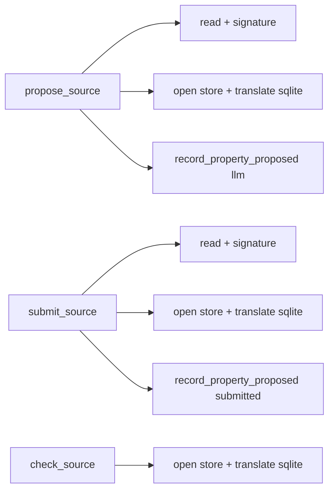
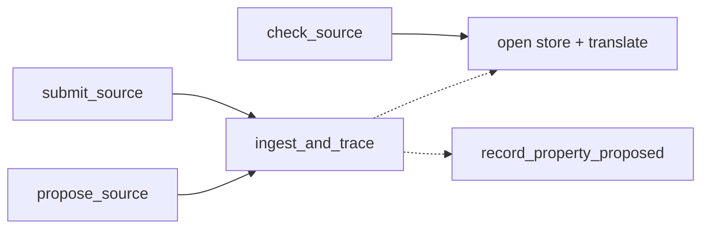

# Architecture review — forseti — 2026-09-03

**Scope**: Reconciled the persisted `.architecture/backlog.md` against `gh`, then scanned the
recent hot spots — the composed semantic-loop work (#252 `submit`/MCP, #255 loop, #259 Stop-gate
semantic block) in `src/forseti/core/` and `src/forseti/adapters/`. YAGNI weighting: the semantic
pipeline is the actively-growing area of the tree, so friction there pays back fastest.
**Picked**: `propose-submit-ingest-trace-seam` — see the PR and `.architecture/backlog.md`.
**Degradations**: none. (`advisor` was rate-limited at the pick; the pick was stress-tested by hand
instead — see *Pick*.)

Diagram convention (replaces the upstream HTML legend): **solid edges are the interface a caller
sees; dashed edges are inside the implementation.**

## Candidates

### propose-submit-ingest-trace-seam — one home for the property-ingest persistence boundary · Strong · score 20/25

- **Files** — `src/forseti/core/propose.py:72-104` (`propose_source`), `src/forseti/core/submit.py:79-128`
  (`submit_source`), and the third store-open/translate site `src/forseti/core/check.py:160-183`
  (`check_source`); a new leaf to hold the seam; plus their tests. **File-count estimate: ~6.**
- **Score — 20/25**
  - **Leverage 4** — two sibling Core faces (`propose_source`, `submit_source`) each shed a duplicated
    prologue *and* a byte-identical persistence epilogue; the store-open error translation is shared with
    a third caller (`check_source`). Several call sites simplify materially.
  - **Locality 4** — the three co-varying concerns (the `sqlite3.Error → PropertyStoreError` translation,
    the `persist=False` "touch nothing" invariant, and the `record_property_proposed` trace dispatch) are
    today kept in lockstep across two/three files only by copied code and copied comments; afterwards a
    change to any one is a one-file edit.
  - **Blast radius 2** — a module and its direct callers; no published interface changes (the public
    `propose_source`/`submit_source`/`check_source` signatures and the #44 wire shape are untouched). ~6 files.
  - **Heat 4** — `submit.py` was *created* by #252 (2026-09-02) and `propose.py`/`check.py` were touched in
    the same semantic-loop push; this is the hottest code in the tree.
- **Problem** — `propose_source` and `submit_source` are structural twins. Both open with
  `source.read_text()` → `unit_id = f"{source}::{function}"` → best-effort `extract_signature` (degrading to
  `None` on `HarnessError`) → build a `ProposalRequest`. Both then run the **identical** persistence epilogue:
  the `persist=False` early return carrying the *same verbatim comment* about the dry-run contract, then
  `with PropertyStore.open(store_root) as store: result = <ingest>(…, store=store)`, the *same*
  `except sqlite3.Error → PropertyStoreError(f"property store error at {store_root}: {exc}")`, then
  `record_property_proposed(store_root, result, channel=…)`. The only genuine variance is the ingest callable
  (`propose_properties` vs `submit_candidates`) and the channel string (`"llm"` vs `"submitted"`). This is a
  **shallow duplication with no seam**: the persistence-boundary policy (error translation + dry-run invariant
  + trace dispatch) has no single home, so it is held consistent by hand — the docstrings even cross-reference
  each other ("mirroring `propose_source`/`check_source`") to remind a maintainer to keep them in step.
- **Deletion test** — **Concentrates.** Give the epilogue one home — a higher-order seam that takes the
  ingest as a callable and owns the open/translate/trace — and the policy lives once. Delete a caller's copy
  and the behaviour does not move to the caller; it is already behind the seam. A future third ingest channel
  adds a call, not a fourth copy of the invariant.
- **Solution** — Extract a persistence-boundary seam in Core: a context manager (or helper) that opens the
  `PropertyStore` and translates `sqlite3.Error → PropertyStoreError` — reused by all three faces including
  `check_source` — and, layered on it, an "ingest-and-trace" seam for the proposer faces that owns the
  `persist=False` dry-run skip and the `record_property_proposed` dispatch, taking
  `ingest: Callable[[PropertyStore | None], ProposalResult]` and a `channel`. `propose_source` and
  `submit_source` collapse to "read the unit → build the request → delegate". The exact surface is chosen in
  *Design*.
- **Benefits** — **Leverage**: the persistence-boundary policy is written once and reused by three callers;
  a new proposer channel (a plausible next step in the #213 epic) inherits it for free. **Locality**: the
  dry-run invariant and the store-error contract stop being a "keep these two functions in sync" hazard.
  **Test surface**: the store-error translation and the dry-run "touches nothing" guarantee become directly
  testable *through the seam* with a single fake, instead of being re-asserted against each face; the faces'
  own tests shrink to "did it delegate and record the right channel".

**Before**

**After**

### hook-verdict-report-two-hooks — one UnitVerdict→report transform for the two PostToolUse hooks · Worth exploring · score 19/25 · runner-up candidate

- **Files** — `src/forseti/adapters/claude_code/post_tool_use.py`, `post_bash.py` (and the dict-based
  `stop_gate.py:_residual`, deliberately **out of scope** — it renders persisted state dicts, not live
  `UnitVerdict`s, and is the fail-closed Stop heart). ~5 files.
- **Score — 19/25** (leverage 4, locality 4, blast radius 2, heat 3). Carried from the prior firing's
  backlog; friction re-confirmed present (`post_bash._report` and `post_tool_use`'s success/failure blocks are
  still near-verbatim, differing only in a few text fragments).
- **Problem / deletion test / solution** — unchanged from `.architecture/backlog.md`; the duplicated
  `UnitVerdict[] → (message, exit code)` render across the two PostToolUse hooks would concentrate behind one
  `verdict_report` seam.
- **Recommendation strength** — Worth exploring. Lost to the pick by one point on **heat**: the pick sits in
  code created yesterday, this in code last touched 2026-09-01/-08-20. Natural next firing.

The remaining proposed candidates (`counterexample-fired-label-predicate` 17, `esbmc-caller-openings-module-split`
17, `precond-under-unwound-detection-into-esbmc` 15, `core-store-session-boundary`, `gate-env-config-extraction`,
`adapter-install-skeleton-two-harnesses`, `canonical-gate-decision-helper` 13) are unchanged from the backlog
and were re-checked as still-present but lower-scoring; they are not re-carded here.

## Dropped

No new candidate tripped a hard filter this run. The standing `dropped` rows in `.architecture/backlog.md`
were re-checked against their filters (per the reconcile step) and none has changed:

| Candidate | Dropped because (re-confirmed) |
|---|---|
| `mcp-server-tool-wrappers` | Leverage 1 — the typed `*_tool` param list *is* the MCP schema the SDK introspects |
| `verify-and-record-decomposition` | Not a deepening — the fail-closed/ownership heart of the gate; deep, not shallow |
| `cli-run-handler-shape` | Leverage 1 — per-command exit-code logic genuinely differs |
| `esbmc-init-all-parser-surface` | Leverage 1 — interface hygiene, nothing concentrates |
| `harness-writer-port-inline` | Not a deepening — a one-adapter seam to inline, not deepen |

## Too large to automate

None this run — no surviving candidate scored blast radius 5.

## Pick

**`propose-submit-ingest-trace-seam` (20/25).** It is the top-scored surviving candidate under the
deterministic rubric and clears every hard filter. It is genuinely fresh: `submit.py` was created by #252 and
did not exist at the prior firing's scan, so this is not an override of the persisted memory — the runner-up
candidate `hook-verdict-report-two-hooks` remains `proposed` for the next firing.

**The top two are within 1 point** (20 vs 19), so the pick was close. The single point is **heat**: both
refactors are the same shape (two sibling faces sharing a duplicated block, blast radius 2, leverage 4,
locality 4), but the pick sits in code created *yesterday* while the runner-up's files were last touched
2026-09-01/2026-08-20. The pick is robust to conservative scoring: even if the pick's heat were 3 (a tie at
19), the deterministic tie-break — equal blast radius, then higher heat — still selects it, because its files
are strictly more recent. `advisor` was rate-limited at the decision, so this reasoning stands in for it and is
recorded here for a reviewer to disagree with in the PR.

## Design

_Written in step 4 after this report was first committed; see the amended commit._
