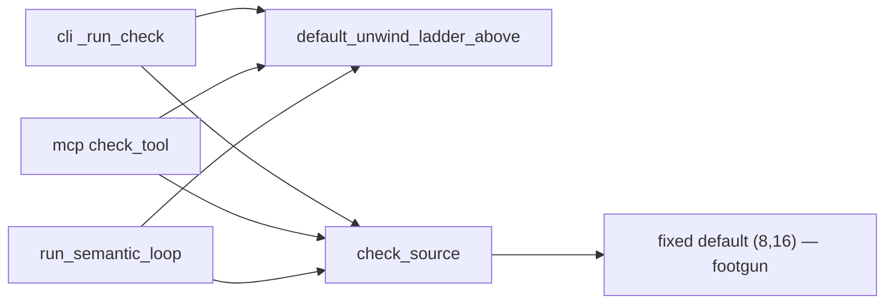
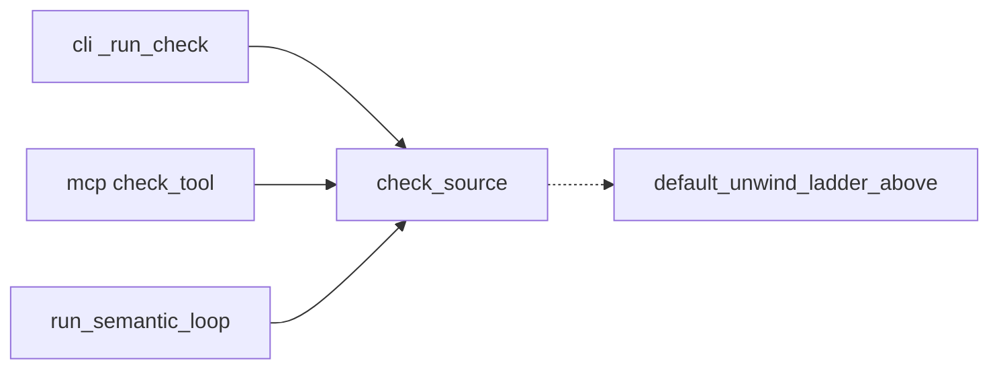
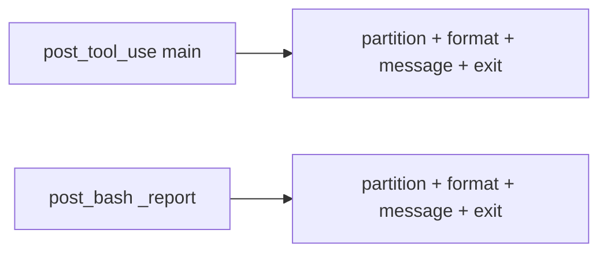
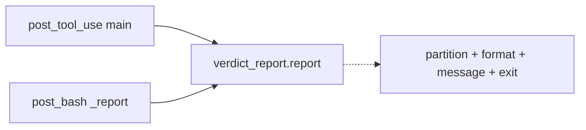

# Architecture review — forseti — 2026-09-04

**Scope**: The two feature fronts that changed since the last firing (2026-09-03):
the Core semantic loop (`core/loop.py`, `check.py`, `submit.py`, `propose.py`,
`mcp_server.py` — PRs #252/#255) and the Claude/Codex adapter hooks
(`post_tool_use.py`, `post_bash.py`, `stop_gate.py`, `property_gate.py`,
`verify_hook.py` — PRs #250/#259). Two parallel `Explore` sub-agents walked the
two fronts; findings were scored against `references/ranking.md`.
**Picked**: `check-source-ladder-default` — see PR (opened at step 6) and `.architecture/backlog.md`.
**Degradations**: none. `gh` authenticated; sub-agents available; quality-gate venv built.

**Diagram convention**: solid edges are the module's interface (what a caller sees);
dashed edges are inside the implementation (what the seam now hides).

## Candidates

### check-source-ladder-default — check_source owns its unwind-ladder default · Strong · score 20/25

- **Files**: `src/forseti/core/check.py:81-103` (`default_unwind_ladder_above`,
  `check_source`), and its three — and only three — callers, each of which
  pre-derives the ladder rather than trusting the seam:
  `src/forseti/core/cli.py:603-616` (`_run_check`),
  `src/forseti/core/mcp_server.py:215-227` (`check_tool`),
  `src/forseti/core/loop.py:214-224` (`run_semantic_loop`).
  File-count estimate: **4** src files + tests.
- **Score 20/25**
  - **Leverage 4** — all three call sites shed their `if unwind_ladder is None:
    derive` branch, *and* a direct `check_source(src, function=…, unwind=8)`
    stops crashing. Callers currently reach past the seam to compute the very
    default the seam should own — the leverage-4 "caller stops reaching past the
    seam" signal, across three of them.
  - **Locality 4** — the "when is the default ladder derived, and how" decision
    stops being restated in three modules' guards and comments (`check.py:84-89`,
    `cli.py:604-609`, `loop.py:145-148`) and lives once in `check_source`.
  - **Blast radius 2** — a module and its direct callers, four src files, no
    wire-format change (see below). `(6 − 2) = 4`.
  - **Heat 4** — `cli.py` is the single hottest file in the last-40 window (7
    touches); `check.py`/`loop.py`/`mcp_server.py` are all #213/#252/#255 churn.
- **Problem** — `check_source`'s `unwind_ladder` parameter defaults to the *fixed*
  tuple `DEFAULT_UNWIND_LADDER = (8, 16)` (`check.py:98`). Downstream,
  `validated_ladder` (`orchestrator/ladder.py:29-41`) raises `ValueError` unless
  `(unwind, *unwind_ladder)` is strictly increasing. So `check_source(src,
  function=f, unwind=8)` builds `(8, 8, 16)` and raises — the seam has a footgun
  baked into its own default. To dodge it, every caller pre-computes the ladder
  with the `default_unwind_ladder_above(unwind)` helper and passes it in. The
  helper exists *because* the seam is shallow: it externalises a defaulting rule
  the seam should own, and the interface (a fixed default that must never be used
  as-is when `unwind` is raised) is more treacherous than the implementation.
- **Deletion test** — CONCENTRATES. Delete the three caller-side derivation
  branches and let `check_source` derive `default_unwind_ladder_above(unwind)`
  when `unwind_ladder is None`: the defaulting policy, the footgun, and the
  "remember to call the helper" contract collapse into the one operation that
  owns the ladder. Nothing moves to callers — they *were* the ones doing the
  work.
- **Solution** — change `check_source`'s signature to `unwind_ladder:
  tuple[int, ...] | None = None` and derive the default internally
  (`unwind_ladder if unwind_ladder is not None else
  default_unwind_ladder_above(unwind)`). `default_unwind_ladder_above` stays a
  public helper of `check.py` (its callers keep importing it for their own help
  text / MCP schema docs); `check_source` now calls it too. Each caller drops
  its `None → derive` branch and passes `unwind_ladder` straight through (`None`
  when unspecified, `()` or an explicit tuple otherwise). The MCP face keeps its
  `list → tuple` coercion at the wire boundary; only the defaulting disappears.
- **Benefits** — *Leverage*: three call sites simplify and the direct-caller
  crash class is retired at the source. *Locality*: the ladder-defaulting rule
  becomes a one-file edit. *Test surface*: the behaviour becomes pinnable through
  `check_source`'s own interface — `check_source(src, function=…, unwind=8)` with
  no ladder is a single call whose non-crash and derived `(16,)` a test asserts,
  where today only the CLI wrapper's copy of the rule is pinned
  (`test_core_check.py:359-388`).
- **No wire change** — the observable defaults at both published boundaries are
  already "derive above unwind": the CLI arg defaults to `None`
  (`cli.py:_parse_ladder`, `default=None`) and the MCP tool documents
  `default: default_unwind_ladder_above(unwind)` (`mcp_server.py:207`). The fixed
  `(8, 16)` is only `check_source`'s Python-level default, which no external
  caller observes (all three override it). Changing it to `None`-derive alters
  behaviour *only* for a hypothetical direct Python caller who passes `unwind`
  but not `unwind_ladder` — who crashes today. That is a bug fix, not a contract
  change.





### hook-verdict-report-two-hooks — one UnitVerdict[]→report transform for the two PostToolUse hooks · Worth exploring · score 19/25

- **Files**: `src/forseti/adapters/claude_code/post_tool_use.py:79-175`,
  `post_bash.py:29-106` (`_verify_file`/`_report`); the failure-format loop is
  byte-identical (`post_tool_use.py:148-155` == `post_bash.py:89-96`). A third,
  partial site is `stop_gate.py:44-55` (`_residual`), which reimplements the
  failure listing over persisted-state dicts with its own `_CEX_CLIP = 1200`
  where the two hooks use `forseti_gate.CEX_CLIP = 1500`. Estimate ~5 files.
- **Score 19/25** — leverage 4 (two callers shed ~45–50 lines of an identical
  `list[UnitVerdict] → (events, message, exit code)` transform; a third partial
  beneficiary), locality 4, blast radius 2 `(6−2=4)`, heat 3.
- **Problem** — the partition predicate, the failure-format loop, and the "an
  UNKNOWN is not a pass" epilogue are copied across the two hooks and have
  already drifted (`post_bash` never emits the canonical `gate.decision` event
  `post_tool_use` does; `stop_gate` uses a different clip length).
- **Deletion test** — CONCENTRATES. Both callers already produce the identical
  `list[UnitVerdict]`; one `report(verdicts, …) → (message, exit_code)` seam pulls
  the transform into one place.
- **Solution** — extract the transform into one module both hooks call. Scored as
  *pure* deepening only: the `post_bash` missing-`gate.decision` gap is a
  wire-format change and stays out of this candidate (autonomy contract).
- **Benefits** — *Leverage*/*locality*: the report shape becomes one edit; *test
  surface*: pinnable esbmc-free once extracted.
- **Runner-up caveat** — `post_bash._report` is currently pinned only behind
  `@skipif(not _HAVE_ESBMC)` (`test_out_of_band.py`), so a firing that picks this
  must first add an esbmc-free characterization test (the `post_tool_use` side
  already has one).





### proposal-request-prologue — one read-unit→ProposalRequest builder for the two proposer faces · Worth exploring · score 18/25

- **Files**: `src/forseti/core/propose.py:69-79` (`propose_source`),
  `src/forseti/core/submit.py:76-89` (`submit_source`). Estimate ~3 files.
- **Score 18/25** — leverage 3, locality 4, blast radius 2 `(6−2=4)`, heat 4.
- **Problem** — the two proposer faces open with a verbatim prologue:
  `source.read_text()` → `unit_id = f"{source}::{function}"` → best-effort
  `extract_signature(...)` degrading to `None` on `HarnessError` → build a
  `ProposalRequest` (submit adds `prompt=PromptTemplate(...)`). `submit.py:60-61`
  admits it parses the signature "the same way `propose_source` does". This is
  the *complement* of the epilogue PR #262 already absorbed into
  `core/persistence.py` (`persist_proposal`): #262 took the store-open/dry-run/
  trace tail, this is the read-unit/build-request head still copied across the
  two faces.
- **Deletion test** — CONCENTRATES. One `build_proposal_request(source, function,
  *, prompt=None)` helper (natural home beside `persist_proposal`) lets both
  faces drop ~8 lines to one call.
- **Solution** — extract the prologue; the signature-degradation policy then lives
  once. No interface change to either public face.
- **Benefits** — *locality*: "how a unit becomes a `ProposalRequest`" becomes
  one-file; *test surface*: pinnable via the existing `test_propose.py` /
  `test_submit.py` unit-id/signature assertions.
- Absorbs the `read_unit`-preamble half of the now-superseded
  `core-store-session-boundary`; see the backlog.

### canonical-gate-decision-helper — one gate.decision emitter across three hooks · Worth exploring · score 17/25

- **Files**: `post_tool_use.py:30-42` (`_record_gate_decision`),
  `codex/verify_hook.py:184-207`, `stop_gate.py:231-249`
  (`_record_semantic_gate_decision`, whose docstring at `:236` literally says
  "Mirrors `post_tool_use._record_gate_decision`."). Estimate ~4 files.
- **Score 17/25** (bumped from 13/25 last run: PR #259 added the third copy) —
  leverage 3, locality 3, blast radius 2 `(6−2=4)`, heat 4.
- **Problem** — three near-identical wrappers around Core's canonical
  `gate.decision` event, each re-copied. The `:236` "Mirrors" comment is direct
  evidence #259 re-copied the epilogue instead of sharing it.
- **Deletion test** — CONCENTRATES for the emit itself: one `record_gate_decision(root,
  *, harness, adapter, decision, unit_ids=None, files=None)` seam, accommodating
  the two deliberate axes (`unit_ids` vs `files` keying; project-dir vs `cwd`).
- **Solution** — move the emitter into `core/events.py` beside its sibling
  `record_property_proposed`, preserving the Claude/Codex field asymmetry.

### hook-stdin-envconfig-prologue — one hook-input reader across the adapter hooks · Speculative · score 16/25

- **Files**: stdin-decode copied in `post_tool_use.py:46-47`, `post_bash.py:110-111`,
  `stop_gate.py:253-254`, `session_start.py:37-38` (+ a 5th divergent Codex
  variant `verify_hook.py:107-110`); env-config fail-closed block in
  `post_tool_use.py:55-64`, `post_bash.py:114-123`, `stop_gate.py:257-273`.
  Estimate ~5 files.
- **Score 16/25** — leverage 3, locality 3, blast radius 3 `(6−3=3)`, heat 4.
- **Problem** — two stacked prologues (`read stdin → json`, then the fail-closed
  `env_config_errors()` block) repeat across the hooks, with the Codex hook a
  divergent 5th variant that swallows a malformed-stdin error where the four
  Claude hooks raise.
- **Deletion test** — PARTIAL. The stdin-decode half concentrates cleanly (a
  `read_hook_input() → dict` helper) and forces one deliberate crash-vs-swallow
  decision; the env-config half only half-concentrates (detection collapses, the
  emit stays per-harness by contract). Overlaps the backlogged
  `gate-env-config-extraction`.

## Dropped

Carried forward from `.architecture/backlog.md`; the hard filters that removed
each still apply (re-checked this run). None moved back to `proposed`.

| Candidate | Dropped because |
|---|---|
| `mcp-server-tool-wrappers` | Leverage 1 — the typed `*_tool` param list *is* the MCP schema the SDK introspects; deletion scatters |
| `verify-and-record-decomposition` | Not a deepening — the fail-closed/ownership heart of the gate is deep, not shallow; high regression risk |
| `cli-run-handler-shape` | Leverage 1 — per-command exit-code logic genuinely differs; consolidating scatters it into flags |
| `esbmc-init-all-parser-surface` | Leverage 1 — interface hygiene, nothing concentrates |
| `harness-writer-port-inline` | Not a deepening — a one-adapter seam to *inline*, not deepen |
| `cli-json-or-render-epilogue` (new this run) | Leverage 1 — the render fn and exit rule differ per command; a shared helper relocates the variation to arguments |
| `codex-claude-verify-drift` (new this run) | Fails the deletion test — the Claude in-process and Codex subprocess verify pipelines genuinely differ; a shared seam parameterises rather than concentrates |

## Too large to automate

None. No surviving candidate scored blast radius 5. `precond-under-unwound-detection-into-esbmc`
(blast radius 4, 15/25) remains eligible-but-deferred — it changes `esbmc.verify`'s
published verdict under a flag and wants a human's before/after differential.

## Pick

**`check-source-ladder-default`, 20/25** — the top-scoring surviving candidate.

The runner-up **candidate** is `hook-verdict-report-two-hooks`, **19/25** — within
1 point, so this was a close pick. That is the third firing in a row to surface
`hook-verdict-report-two-hooks` as runner-up (2026-09-02, 2026-09-03, today); it
keeps placing second, not being skipped on judgement. The pick is robust to the
one soft axis: even scoring `check-source-ladder-default`'s locality at 3 (→19)
ties it with the runner-up, and the deterministic tie-break — equal blast radius,
then higher heat — still takes it (heat 4 vs 3; `cli.py` is the hottest file in
the window, `post_bash.py` is not in it at all). And unlike the runner-up, whose
`post_bash._report` is pinned only behind an esbmc gate, `check-source-ladder-default`
is pinnable esbmc-free through `check_source`'s own interface today.

`hook-verdict-report-two-hooks` remains the natural next firing.

## Design

Design-it-twice, three parallel `Plan` sub-agents each briefed for a *radically
different* interface, all constrained to keep the seam at `check_source` (per
the blast-radius cap: pushing the default into `orchestrator/ladder.py` drags in
`run_loop` and blows the ~4-file estimate). Adjudicated by this run, which
authored none of the three.

### Winner — sentinel-`None` (minimal surface)

`check_source(..., unwind_ladder: tuple[int, ...] | None = None)`, resolved by
one line at the top of the body:

```python
ladder = unwind_ladder if unwind_ladder is not None else default_unwind_ladder_above(unwind)
```

`None` is the sentinel for "not specified → derive rungs above `unwind`"; any
explicit tuple — including `()` ("verify once, no escalation") — passes through
verbatim to `validated_ladder`, which still raises cleanly on a bad *explicit*
ladder. Each caller drops its `None → derive` branch and forwards its already-
`None`-able param; the MCP face keeps only its `list → tuple` wire coercion.
`default_unwind_ladder_above` stays a public helper of `check.py`, now called by
`check_source` too. **4 files, no existing test changed** (a new direct-caller
test is added). Two design agents (the "minimal surface" and "most common caller"
briefs) converged on this shape independently.

### Runner-up design — `Ladder` value object (maximum encapsulation)

A frozen `Ladder(base, rungs)` dataclass owning validation and a
`default_above(base)` / `resolve(base, rungs)` constructor, with
`check_source(..., ladder: Ladder = DEFAULT_LADDER)`. It **lost** on three of the
five criteria: (3) *seam placement* — `Ladder` has a single consumer;
`check_source` unpacks it straight back to a `(base, rungs)` pair because the
orchestrator (`validated_ladder`, `verify_ladder`, `run_loop`) still speaks
pairs, so it is a hypothetical one-adapter seam, not a real one; (4) *test
surface* — it churns the existing `unwind_ladder=` direct-call test
(`test_core_check.py:125-129`) into a `ladder=Ladder(...)` call; (5) *blast
radius* — ~5 files and a `DEFAULT_LADDER` constant, with validation running twice
(the type's `__post_init__` and the downstream `validated_ladder`). Its
encapsulation "depth" is illusory here: with only one consumer, the value object
adds ceremony a caller must learn without a second caller to justify the seam.
The right time to revisit it is when a second consumer needs a validated ladder
that is *not* immediately unpacked.

### Rejected sub-variant — auto-drop colliding rungs

Having `check_source` silently drop rungs `<= unwind` from *any* ladder was
considered and rejected: it repairs an explicitly-passed bad ladder instead of
raising, breaking `test_cli_check_explicit_ladder_still_raises_a_clean_diagnostic`
(and risking a false exit-1 that masks the missing ladder error). The seam must
distinguish "not specified" (`None`) from "specified wrong" (raise) — which the
sentinel-`None` winner does.

### Test-first plan (step 5)

Red test pinning the deepened interface: `check_source(source, function=…,
unwind=8)` with **no** `unwind_ladder` — today raises `ValueError` on the
`(8, 8, 16)` collision; after, derives `(16,)` and verifies (asserted esbmc-free
via an injected `verify_port` fake, checking the ladder actually used). Caller-
branch removals stay pinned by the existing
`test_cli_check_unwind_above_default_ladder_floor_does_not_crash` (CLI derive),
`test_check_tool_reports_held_and_violated` (MCP derive, calls `check_tool` with
no ladder), and the loop suite; a loop-level characterization test asserting the
derived ladder is added if the removal is otherwise unpinned there.
