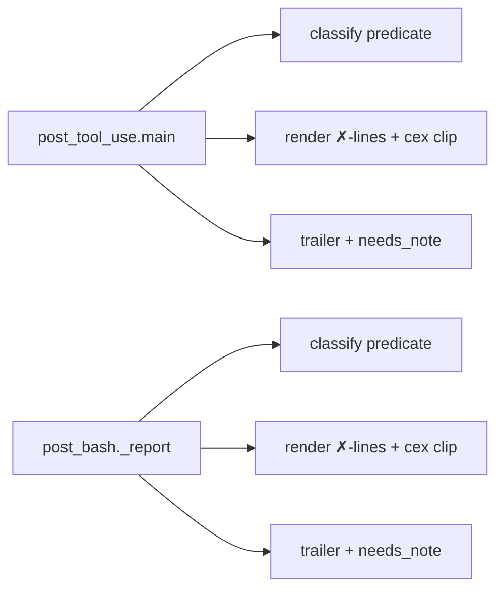
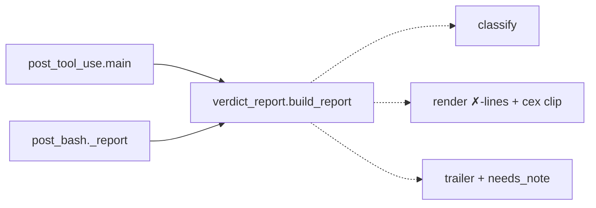
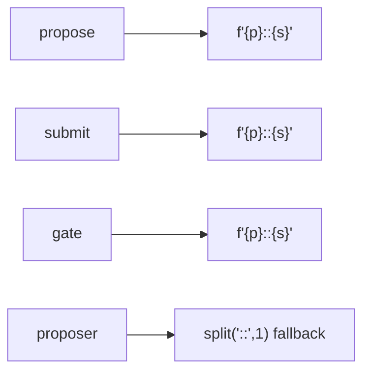
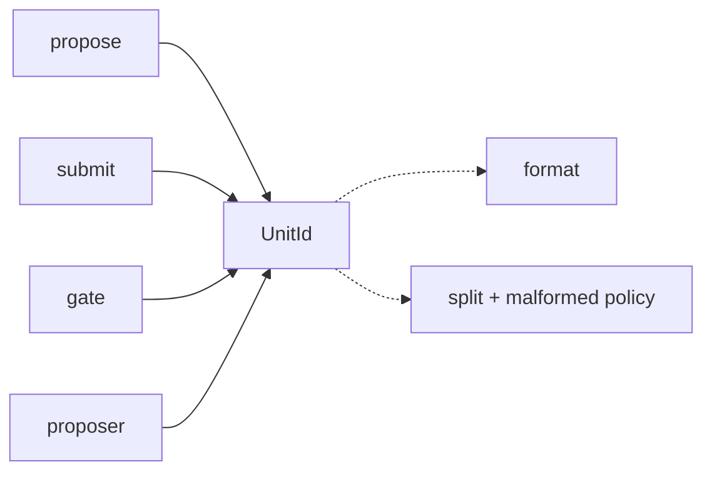

# Architecture review — forseti — 2026-09-11

**Scope**: The Claude-Code adapter hooks (`src/forseti/adapters/claude_code/`) plus a
hot-spot sweep of `src/forseti/properties/` (the current git hot spot: `harness.py`,
`proposer.py`, `__init__.py`, `store.py` all changed recently). The standing backlog was
re-verified against today's tree; three fresh `properties/` candidates were scored.
**Picked**: `hook-verdict-report-two-hooks` — see the PR and `.architecture/backlog.md`.
**Degradations**: none — `gh` authenticated, sub-agents available, ESBMC on `PATH`.

> **Diagram legend**: in every Mermaid pair below, **solid edges are the interface** (what a
> caller must wire up itself) and **dashed edges are inside the implementation** (behind one
> seam). A shallow module is one where a caller draws many solid edges; a deep one collapses
> them behind a single solid edge.

## Candidates

### hook-verdict-report-two-hooks — one home for the verdict→report transform · Strong · score 19/25

- **Files** — `src/forseti/adapters/claude_code/post_tool_use.py:116-175`,
  `post_bash.py:50-106`, a new leaf `adapters/claude_code/verdict_report.py`; tests
  `tests/adapters/claude_code/test_post_tool_use.py`, `test_out_of_band.py`. **~5 files.**
- **Score — 19/25** (leverage 4, locality 4, blast radius 2, heat 3)
  - *Leverage 4* — two full call sites collapse to a one-line delegation, and the subtle
    failure-classification predicate (below) stops being re-typed at every site.
  - *Locality 4* — the "what counts as a blocking failure" rule and the reviewer-facing
    message wording become a one-file edit instead of a keep-in-sync-by-eye edit across two
    hooks.
  - *Blast radius 2* — a module and its two direct callers; no published/wire interface
    changes (the hooks' stderr text and exit codes are preserved byte-for-byte).
  - *Heat 3* — the two hooks changed in #148/#252/#259; hot, though less than `core/`.
- **Problem** — The `list[UnitVerdict] → (message, exit code)` transform is copied nearly
  verbatim across two hooks. `post_tool_use.main()` builds it inline at `:143-161`;
  `post_bash._report()` rebuilds it at `:84-102`. The two differ only in three strings
  (fail-header, pass-line prefix, trailer). Worse, the *classification* that the message
  depends on — the deliberately non-obvious "a blocking failure is `not v.passed and
  v.verdict != NEEDS_CONTRACT`" (NEEDS_CONTRACT is honestly-unverified but must never block,
  issue #122) — is re-typed **three times**: `post_tool_use.py:118`, `post_bash.py:51`
  (`_verify_file`), and `post_bash.py:69` (`_report`). This is shallow duplication: the
  reader must confirm all three predicates agree, and a future verdict kind (a fourth
  non-blocking category) is a three-site edit with no compiler help. The `✗`-line +
  counterexample-clip block is byte-identical between the two hooks.
- **Deletion test** — *concentrates*. Deleting the two inline transforms in favour of one
  `verdict_report` module pulls the classification predicate and the message shape into a
  single tested place; nothing scatters, because the per-hook *event emission* (which genuinely
  differs — `post_tool_use` interleaves the canonical `gate.decision` event, `post_bash` logs
  per-file inside `_verify_file`) stays in the callers. Only the pure text/exit-code transform
  moves.
- **Solution** — Add `verdict_report.py` with (a) a `classify(verdicts)` seam returning the
  failures/needs/verified partition, and (b) a `build_report(verdicts, *, fail_header,
  pass_prefix, trailer)` that returns a small value carrying the assembled message, the exit
  code, and the partition. Each hook calls it, supplies its three strings, keeps its own event
  emission, and prints the returned message on the stream the exit code selects (0→stdout,
  2→stderr). `stop_gate._residual` (a `dict`-shaped partial third site with its own
  `_CEX_CLIP=1200`) is **out of scope** — see the *Design* section for why folding it in is a
  wire/shape change, not this pure extraction.
- **Benefits** — *Leverage*: the classification predicate and message wording are learned
  once, not three times. *Locality*: adding a verdict category or changing reviewer wording is
  one edit. *Test surface*: `build_report`/`classify` are pure `list[UnitVerdict] → str/int`
  functions, testable **without ESBMC and without monkeypatching a hook's stdin/subprocess** —
  which directly closes the standing gap that `post_bash._report`'s failure branch is today
  reachable only behind `@skipif(not _HAVE_ESBMC)` (`test_out_of_band.py:1923/1941`).

### unit-id-value-type — give `path::symbol` a single constructor/parser · Worth exploring · score 19/25

- **Files** — construction sites `core/propose.py:70`, `core/submit.py:77`,
  `orchestrator/ports.py:107`, `adapters/claude_code/property_gate.py:234`,
  `adapters/claude_code/forseti_gate.py:1662,1832,1912`, `adapters/oh_my_pi/verify_hook.py:239`,
  `core/_precond_cli.py:123,182`; inverse parse `properties/proposer.py:87`. A new
  `UnitId`/`make_unit_id`/`split_unit_id` seam (likely in `properties/model.py`). **~10 files.**
- **Score — 19/25** (leverage 4, locality 4, blast radius 3, heat 4)
  - *Leverage 4* — ~10 sites reconstruct or destructure the `path::symbol` key by hand; the
    inverse parse at `proposer.py:87` even silently returns the whole string as the "symbol" on
    a malformed id, so producers and this consumer can drift with no enforcement.
  - *Locality 4* — a change to the unit-id format becomes a one-place edit.
  - *Blast radius 3* — crosses `core/`, `properties/`, `adapters/`, `orchestrator/` (~10 files),
    though no wire/DB format changes (the string stays a string at boundaries).
  - *Heat 4* — the construction sites sit in the hottest files (`propose`, `submit`, `proposer`,
    `forseti_gate`).
- **Problem** — The domain keys a verification unit as `path::symbol` (`model.py:99`,
  `signature.py:3`), but the convention has no owning module: every caller re-formats it and one
  consumer re-parses it defensively.
- **Deletion test** — *concentrates*: a value type collects the format, the split, and the
  malformed-id decision (fail-loud vs degrade) into one verifiable round-trip.
- **Solution** — A `UnitId` value type (or a `make_unit_id`/`split_unit_id` pair) with the
  round-trip pinned once; callers stop hand-formatting.
- **Benefits** — *Leverage/locality* as above; *test surface*: the round-trip and the
  malformed-id policy become one pure test instead of being implicit in ten call sites.
- **Why not picked** — Ties the pick at 19/25 but loses the deterministic tie-break (lower
  blast radius: 2 < 3). Its narrow 2-core-face subset is the separately-tracked
  `proposal-request-prologue` (18/25). This is the natural firing after the pick.

### proposal-request-prologue — one build-request head for propose/submit · Worth exploring · score 18/25

- **Files** — `core/propose.py:69-79`, `core/submit.py:76-89`, a `build_proposal_request`
  helper (likely in `properties/proposer.py` or `core/persistence.py`). **~3 files.**
- **Score — 18/25** (leverage 3, locality 4, blast radius 2, heat 4). Verified STILL-LIVE:
  the read-text → `unit_id` → best-effort `extract_signature`-degrading-to-`None` → build
  `ProposalRequest` prologue is duplicated verbatim; the two faces differ only in `submit`
  adding a `prompt=PromptTemplate(...)`.
- **Problem** — PR #262 already absorbed the *tail* (store-open/dry-run/trace) into
  `core/persistence.py`; the *head* build-request prologue was left duplicated.
- **Deletion test** — *concentrates* (the `HarnessError → None` degrade lives once).
- **Solution** — Extract `build_proposal_request`; both faces delegate. **Test-first gap**:
  the `HarnessError → None` degrade branch is unpinned in both `test_propose.py`/`test_submit.py`
  (they always feed a parseable signature) — pin it first.
- **Benefits** — *Locality*: the degrade policy lives once. Narrow subset of
  `unit-id-value-type`.

### canonical-gate-decision-helper — one `gate.decision` emitter · Worth exploring · score 17/25

- **Files** — `core/events.py`, `adapters/claude_code/post_tool_use.py:30-42`,
  `adapters/codex/verify_hook.py:184-207`, `adapters/claude_code/stop_gate.py:231-249`. **~4 files.**
- **Score — 17/25** (leverage 3, locality 3, blast radius 2, heat 4). STILL-LIVE: three thin
  wrappers around `record_core_event(..., GATE_DECISION, ...)`; the stop_gate docstring at `:237`
  still reads "Mirrors `post_tool_use._record_gate_decision`."
- **Problem/Deletion test** — *concentrates weakly*. Three deliberate variance axes must
  survive: event root (`project_dir/.forseti` vs `cwd()/.forseti`), keying (`unit_ids=` Claude,
  per-function, vs `files=` Codex, whole-file — explicitly justified at `verify_hook.py:184-198`),
  and `file=rel` (post_tool_use only). A naive extraction would erase them, so the helper must
  keep both keying modes → the interface risks becoming a param-heavy switch. Lower depth than
  the pick.
- **Solution** — `record_gate_decision(root, *, harness, adapter, decision, unit_ids=None,
  files=None, file=None)` beside `record_property_proposed` in `core/events.py`.

### proposalresult-provenance-reflatten — carry a `Provenance`, don't restate it · Speculative · score 17/25

- **Files** — `properties/proposer.py:125-152` (`ProposalResult`), `:252-277`
  (`propose_properties`), `:311-337` (`submit_candidates`); `tests/properties/test_proposer.py`;
  a docstring fix at `core/propose.py:13-16`. **~3-4 files.**
- **Score — 17/25** (leverage 3, locality 4, blast radius 2, heat 4). `ProposalResult` declares
  the exact four fields of `Provenance` (`model.py:52-66`) and both proposer faces restate them
  when building result + provenance.
- **Problem/Deletion test** — *concentrates*: one `Provenance` field + `@property` shims keeps
  `to_dict` (the #44 wire shape) and readers (`core/events.py:81-82`, `core/cli.py:348`) working
  while removing the restatement. Also folds in a live drift: `core/propose.py:13-16` claims it
  "does not wire the #64 renderability gate" — but it does (`propose.py:73` → `proposer.py:413`).
- **Constraint** — `to_dict` stays flat; preserve `result.provider`/`result.model` as attrs.

### store-column-registry — derive schema/insert/mappers from one column set · Speculative · score 15/25

- **Files** — `properties/store.py:29-143`, `tests/properties/test_store.py`. **~2 files.**
- **Score — 15/25** (leverage 2, locality 4, blast radius 2, heat 3). The 14-column shape is
  restated five times (`_SCHEMA`, `_INSERT`, `_MIGRATED_COLUMNS`, `_property_to_row`,
  `_row_to_property`); adding a field is a five-site lockstep edit.
- **Deletion test** — *concentrates*, but locality is already good (all five sites in one file),
  so leverage is bounded — a column registry is a nice-to-have, not high-leverage.

## Dropped

| Candidate | Dropped because |
|---|---|
| `signature-reexport-indirection` | Leverage 1 — `__init__.py` is a facade for 10 external importers (deletion scatters); redirecting six signature names `from .signature` is interface hygiene, not a deepening. |
| `mcp-server-tool-wrappers` | Leverage 1 — the `*_tool` param lists *are* the MCP schema the SDK introspects. |
| `verify-and-record-decomposition` | Not a deepening — the densest function is the fail-closed heart of the gate; deep, not shallow. |
| `cli-run-handler-shape`, `cli-json-or-render-epilogue` | Leverage 1 — per-command exit-code/render policy genuinely differs; a shared helper relocates variation to call sites. |
| `esbmc-init-all-parser-surface` | Leverage 1 — namespace hygiene, nothing concentrates. |
| `harness-writer-port-inline` | A one-adapter seam to *inline*, not deepen. |
| `codex-claude-verify-drift` | Fails the deletion test — the two verify pipelines genuinely differ; a shared seam would be a param-heavy switch. |

(Full history of dropped candidates and their filters is in `.architecture/backlog.md`.)

## Too large to automate

None surfaced this run. `precond-under-unwound-detection-into-esbmc` (15/25, blast radius 4)
remains eligible-but-deferred in the backlog: it changes `esbmc.verify`'s published verdict
under a flag and wants a human's before/after differential.

## Pick

**`hook-verdict-report-two-hooks` (19/25).** It is the highest-scoring eligible candidate and
survives every hard filter (leverage 4 ≠ 1; blast radius 2 ≠ 5; contradicts no ADR; `proposed`,
not previously landed/dropped/rejected; pinnable — see below). PR #267
(`check-source-ladder-default`) merged on 2026-09-04, clearing the last in-flight PR, so this
run implements. This candidate placed runner-up in the last three firings and the backlog names
it "the natural next firing" each time; picking it now is the deterministic rubric doing exactly
what it is meant to.

**The top two are tied at 19/25.** The runner-up **candidate**, `unit-id-value-type` (fresh this
run), also scores 19 but loses the deterministic tie-break on blast radius (2 < 3). It is the
natural next firing. `proposal-request-prologue` (18/25) is its narrow, already-tracked subset.

**Pinnability (the one hard-filter risk).** The pick's `post_bash._report` failure branch is
today reachable only behind `@skipif(not _HAVE_ESBMC)`. It **can** be pinned ESBMC-free: the
extracted `build_report`/`classify` are pure `list[UnitVerdict] → str/int` functions, and the
hook path itself is already driven ESBMC-free elsewhere via `monkeypatch.setattr(gate,
"verify_function", ...)` + `_enumerate_one_unit` (`test_out_of_band.py:657`). The test-first step
adds those ESBMC-free pins **before** the extraction. The candidate is therefore eligible.

## Design

*(written in step 4; appended after this section was committed.)*
