# Architecture review — forseti — 2026-09-14

**Scope**: Hot-spot sweep of the files that dominate the last 120 commits — `core/cli.py`,
`esbmc/units.py`, `adapters/claude_code/forseti_gate.py`, `precond/discharge.py`,
`precond/synth.py`, `orchestrator/check.py`, `properties/*`, `core/events.py`, and the four
harness adapters — plus a reconciliation of the persisted `.architecture/backlog.md` against
`gh`. YAGNI weighting: the tree changed little since the 2026-09-11 firing (only PR #275
merged, plus dependency bumps), so this run is mostly friction re-confirmation on the standing
candidates.

**Picked**: `unit-id-value-type` — see PR (opened at step 6) and `.architecture/backlog.md`.

**Degradations**: The `advisor` was rate-limited at the step-2 pick and (as recorded in
`## Design`) at the step-4 adjudication; adjudication was done against the written designs per
the skill's no-advisor fallback. No other degradations — sub-agent exploration ran, `gh` is
authenticated, the quality gate is discoverable and green in a dev venv.

**Diagram legend**: solid edges are the interface a caller sees; dashed edges are inside the
implementation, behind the seam.

## Candidates

### unit-id-value-type — the `path::symbol` key has no owning type · Strong · score 19/25

- **Files** — construct sites `core/propose.py:70`, `core/submit.py:77`,
  `orchestrator/ports.py:107`, `adapters/claude_code/property_gate.py:234`,
  `adapters/claude_code/forseti_gate.py:1662,1832,1912,2055,2254`,
  `adapters/oh_my_pi/verify_hook.py:239`; inverse parse `properties/proposer.py:87`
  (the silent malformed-id fallback); a new leaf `properties/unit_id.py`. File-count estimate: **~9-10**.
- **Score** — 19/25.
  - *Leverage 4*: ~10 construct sites and the one re-parse route through one seam; the whole
    "producers and the consumer can silently drift" class of bug is removed by a pinned round-trip.
  - *Locality 4*: the `::` join/split convention, today spread across five modules and two
    packages, becomes a one-file edit.
  - *Blast radius 3*: ~10 files across `core`, `orchestrator`, `properties`, and two adapters;
    no published interface changes because every produced string stays byte-identical.
  - *Heat 4*: `properties/*`, `forseti_gate.py`, and `core/*` are all in the hot set.
- **Problem** — There is no `UnitId` type. The `path::symbol` convention is documented only in
  prose (`properties/model.py:4,109`) and hand-formatted with `f"{...}::{...}"` at ~10 sites,
  while one consumer re-derives the symbol half with `self.unit_id.split("::", 1)[1] if "::" in
  self.unit_id else self.unit_id` (`properties/proposer.py:87`) — a silent fallback that treats
  a malformed, separator-less id as an all-symbol id. The convention (first-`::` is the
  separator, so a C++ `Foo::bar` symbol survives; an unknown symbol is spelled `?` at
  `forseti_gate.py:2055`) lives nowhere it can be enforced. The module is *shallow by absence*:
  the behaviour exists but has no interface.
- **Deletion test** — There is nothing to delete yet; the inverse test is the right one. Adding
  the type **concentrates**: the join, the split, the C++-symbol rule, the sentinel `?` symbol,
  and the malformed-id fallback all move into one leaf that every producer and the one consumer
  import. Nothing scatters, because callers keep passing exactly the path string they pass today.
- **Solution** — Introduce `properties/unit_id.py` with a small value type owning **join and
  split only**. Producers call `make_unit_id(path, symbol)` in place of `f"{path}::{symbol}"`;
  the `proposer.py` consumer reads the symbol through the type. Each caller keeps its *current*
  left-operand spelling — Core keeps the raw `source` path, the gates keep the `..`-resolved
  project-relative `rel` from `forseti_gate.unit_id()` — so every produced string and on-disk
  DB key is unchanged. This is a pure deepening with **no wire or behaviour change**.
- **Benefits** — *Leverage*: one seam replaces ten ad-hoc format strings and the lone re-parse,
  and the C++/sentinel/malformed rules gain a single tested home. *Locality*: a future change to
  the id convention becomes a one-file edit. *Test surface*: the interface **is** the test —
  a pinned round-trip `parse(make(p, s)) == (p, s)`, the `::`-in-symbol case (`p::Foo::bar`),
  the sentinel `?` symbol, and the malformed no-`::` fallback are all exercised through
  `unit_id.py` without reaching into any caller.

> **Latent hazard, reported not fixed.** The left-operand spelling drifts between Core (raw
> `source` as typed, unnormalized — `propose.py:70`) and the gates (`..`-resolved relative —
> `forseti_gate.unit_id()`, issue #152). `property_gate.py:44-55` documents this as a known
> residual: a subagent proposing against a differently-spelled path will not be matched. This is
> a *deliberate* asymmetry, and unifying it changes DB keys and the match semantics — a
> behaviour/wire change out of scope for an unattended run ([autonomy-contract.md]). The `UnitId`
> type is deliberately scoped to **not** normalize, so it neither fixes nor worsens this. A human
> deciding to close it now has a single place (`make_unit_id`) to add a normalization argument.

**Before** — every producer wires the `::` join itself; one consumer re-parses:

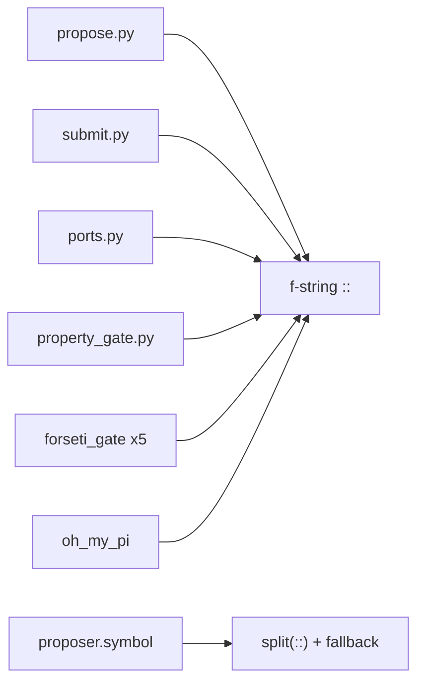

**After** — join and split live behind one seam; the C++/sentinel/malformed rules are inside it:

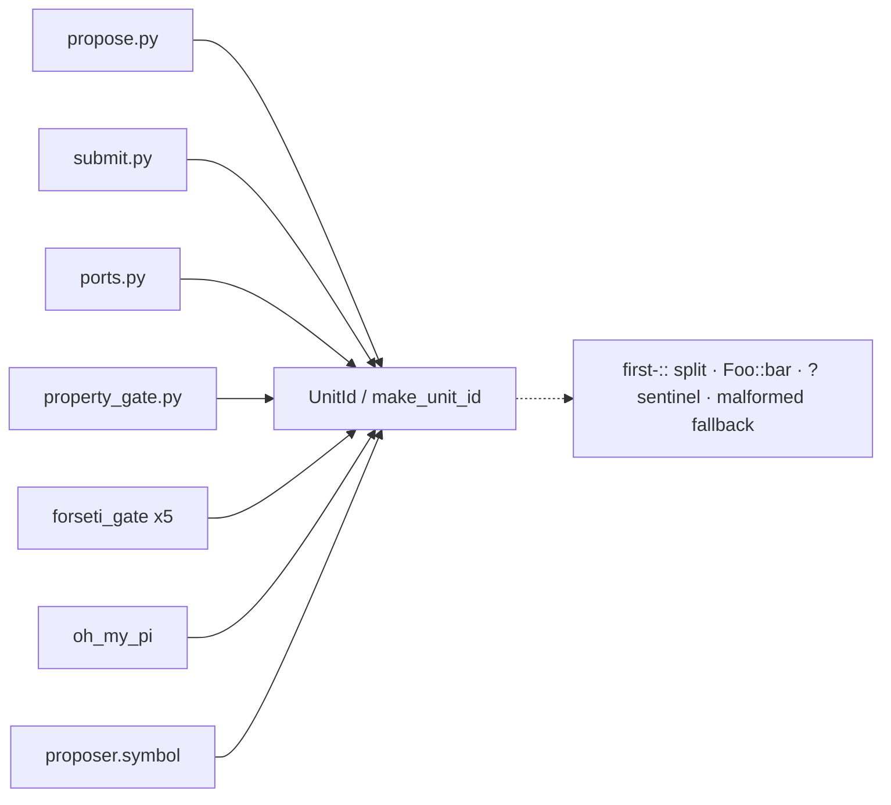

### proposal-request-prologue — verbatim read→request prologue in two Core faces · Worth exploring · score 18/25

- **Files** — `core/propose.py:69-79`, `core/submit.py:76-89`; a `ProposalRequest.from_source`
  carrier. File-count estimate: **~3**.
- **Score** — 18/25 (leverage 3: one call site each simplifies materially; locality 4; blast
  radius 2; heat 4). Justifications as recorded in the backlog.
- **Problem** — `propose.py:69-73` and `submit.py:76-80` hold a **byte-identical** five-statement
  prologue: `read_text` → `unit_id` → `signature: UnitSignature | None` → best-effort
  `extract_signature` with a `HarnessError`→`None` degrade. They diverge only in the
  `ProposalRequest(...)` build (submit adds a `PromptTemplate`).
- **Deletion test** — Concentrates: a `ProposalRequest.from_source(source, function, prompt=...)`
  classmethod absorbs both, and is the natural home for this run's `make_unit_id`.
- **Solution** — Extract the prologue into a `ProposalRequest` builder.
- **Benefits** — Leverage on two hot Core faces; the read/degrade policy gains one home.
- **Runner-up to the pick.** Overlaps `unit-id-value-type` at exactly the two `unit_id =` lines;
  the pick swaps those for `make_unit_id`, leaving the rest of this prologue for a later firing.

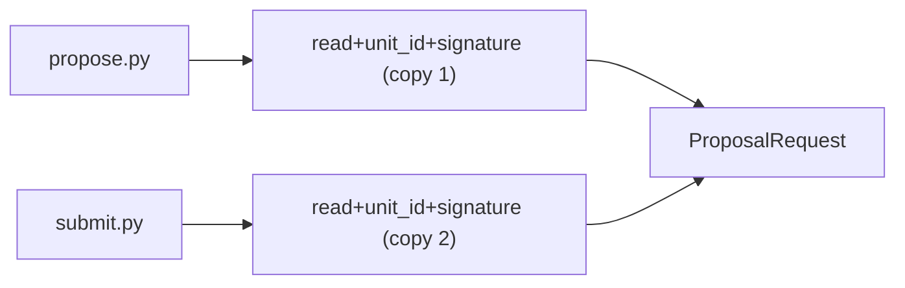

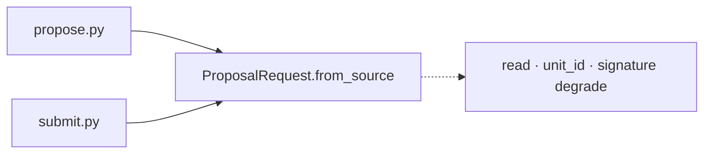

### canonical-gate-decision-helper — four hand-rolled `gate.decision` emitters · Worth exploring · score 17/25

- **Files** — `core/events.py`, `adapters/claude_code/post_tool_use.py:43-55`,
  `adapters/codex/verify_hook.py:184-207`, `adapters/oh_my_pi/verify_hook.py:294-311`,
  `adapters/claude_code/stop_gate.py:231-249`. File-count estimate: **~5**.
- **Score** — 17/25 (leverage 3: a helper must still carry the store-root and payload-key
  divergences; locality 3; blast radius 2; heat 4).
- **Problem** — Four adapters each hand-roll `record_core_event(<dir>/.forseti, GATE_DECISION,
  ...)` with the same shape but divergent store-root construction and a `unit_ids` vs `files`
  payload split. `core/events.py:65-84` already holds a sibling `record_property_proposed` these
  would join. **This run found the fourth site** (`oh_my_pi/verify_hook.py:294-311`) the prior
  scan missed.
- **Deletion test** — Concentrates onto the existing sibling slot in `events.py`.
- **Solution** — `record_gate_decision(store_root, *, harness, adapter, decision, unit_ids=None,
  files=None, file=None)` in `events.py`.
- **Benefits** — One emitter for a canonical event across three harnesses; the field asymmetry
  becomes a documented parameter rather than four independent choices.

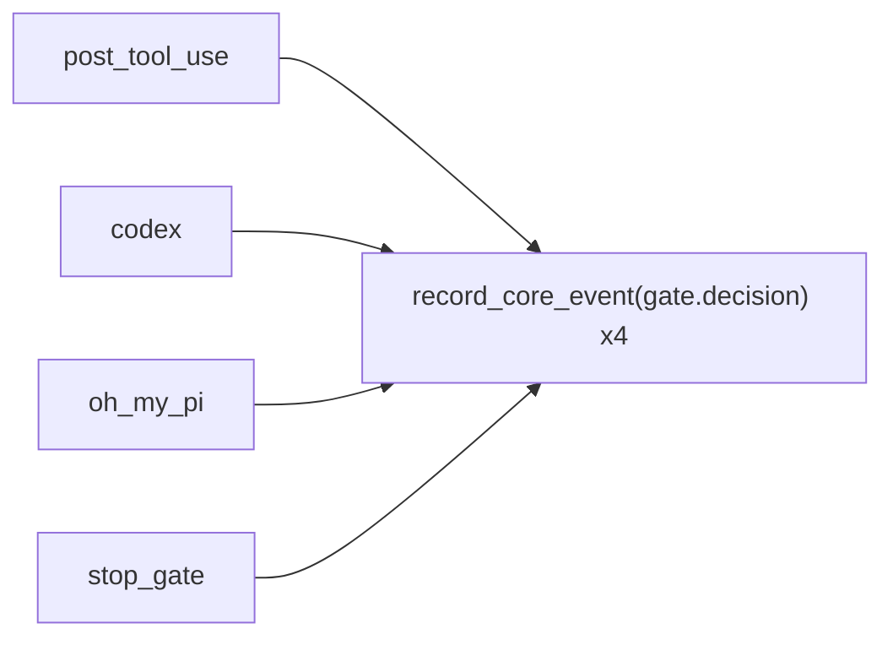

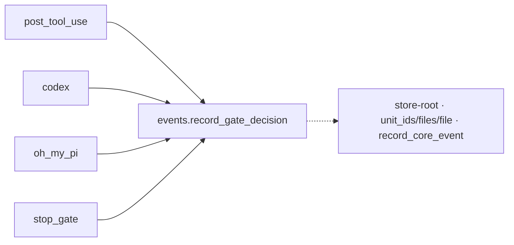

### proposalresult-provenance-reflatten — `ProposalResult` restates `Provenance` · Worth exploring · score 17/25

- **Files** — `properties/proposer.py:126-152,252-277,311-337`; docstring `core/propose.py:13-16`.
  File-count estimate: **~3-4**.
- **Score** — 17/25 (leverage 3; locality 4; blast radius 2; heat 4).
- **Problem** — `ProposalResult` (`proposer.py:126-152`) re-declares the four `Provenance`
  fields (`model.py:52-66`) and re-serializes them in `to_dict`; both build sites construct a
  `Provenance` and then separately re-pass the same four scalars. A live docstring drift rides
  along: `core/propose.py:13-16` says the face "does not wire the #64 renderability gate," but a
  *static* renderability check does run at propose time when a signature is supplied
  (`propose.py:73` → `proposer.py`); only the #64 harness-render gate is deferred.
- **Deletion test** — Concentrates: a `provenance: Provenance` field on `ProposalResult` behind
  `@property` shims keeps the flat `to_dict` wire shape and the `result.provider`/`result.model`
  readers.
- **Solution** — Carry a `Provenance`; shim the flat readers; sharpen the docstring.
- **Benefits** — The four-field provenance concept stops being restated three times; the wire
  shape is preserved.

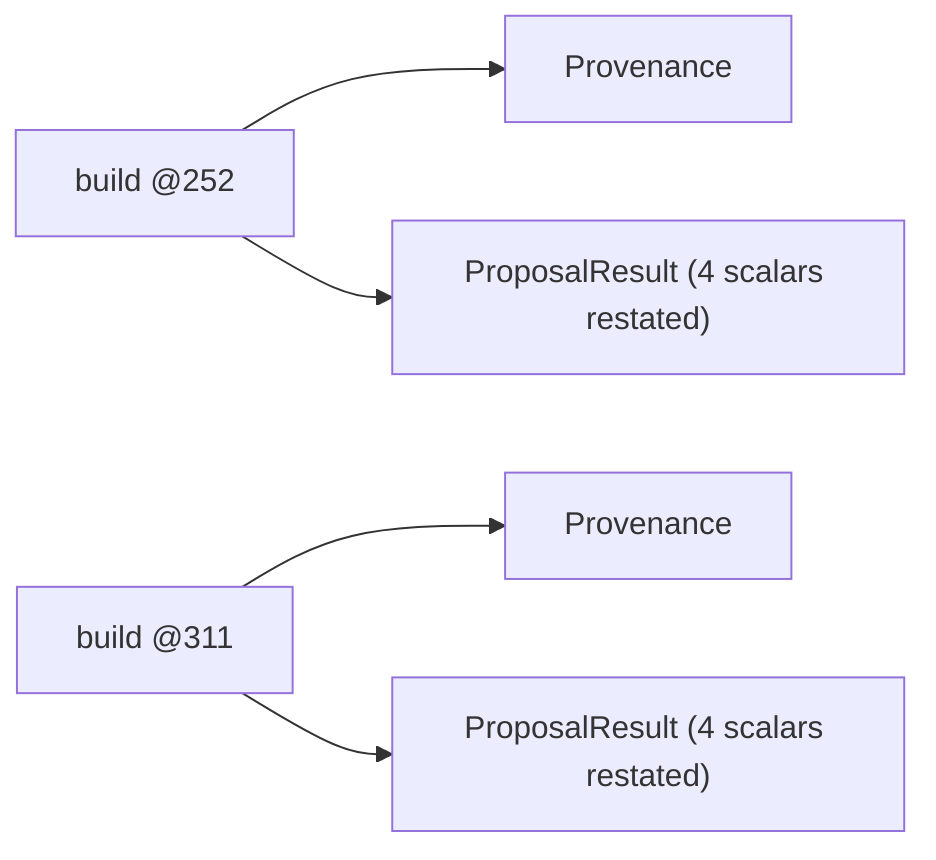

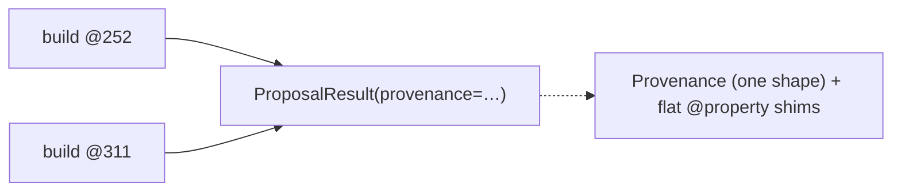

### counterexample-fired-label-predicate — raw-trace substring scans, no typed predicate · Speculative · score 17/25

- **Files** — `esbmc/result.py` (`Violated`), `precond/verify.py:145`, `precond/discharge.py:640`,
  `precond/reachability.py:55`. File-count estimate: **~3-4**.
- **Score** — 17/25 (leverage 3; locality 4; blast radius 2; heat 3).
- **Problem** — Three direct `label in result.raw_counterexample` substring scans express the
  "did this ESBMC assert label fire?" convention with no typed home on `Violated`.
- **Deletion test** — *Partially* concentrates. Caveat found this run: `ViolatedProperty`
  (`esbmc/counterexample.py:61-67`) does not capture the assert label, so a `Violated.fired(label)`
  predicate still substring-scans internally today — it concentrates the *convention* and gives
  one future upgrade point, not a pure move.
- **Solution** — A typed-first, raw-fallback `fired(label)` predicate on `Violated`; route the
  three scans through it. A behaviour-neutral extraction — do not fold into the precond
  reachability tri-state.
- **Benefits** — The label-matching convention lives with the typed result model; one place to
  later teach the parser to capture the label.

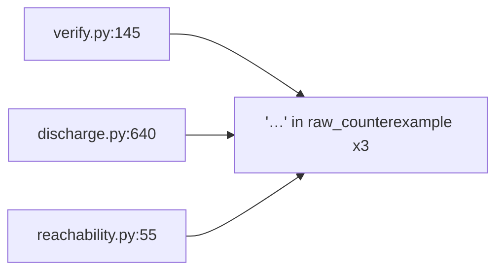

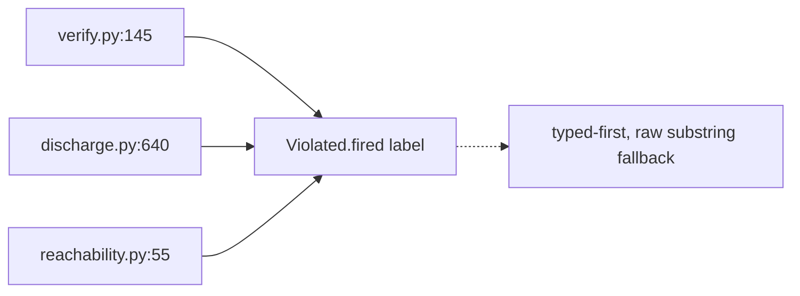

### unit-id-slug-derivations — two divergent unit_id→filename rules · Speculative · score 18/25

- **Files** — `orchestrator/persistence.py:30-39` (`_unit_slug`), `orchestrator/check.py:417-426`
  (`_harness_filename`). File-count estimate: **~2-3**.
- **Score** — 18/25 (leverage 3; locality 4; blast radius 1; heat 3).
- **Problem** — Two independent, non-identical sanitizations turn the same `path::symbol` key
  into a filesystem-safe name (`.replace("::","__").replace("/","_")` + hash vs
  `re.sub(r"[^A-Za-z0-9_.-]","_", …)`). The **consumer** complement of `unit-id-value-type`.
- **Deletion test** — Concentrates once a `UnitId` type exists: one `UnitId.slug()` replaces both.
- **Solution** — After the pick lands, add `UnitId.slug()` and route both sites through it.
- **Benefits** — One canonical slug rule instead of two ad-hoc ones.
- **Deliberately not folded into the pick** — extending the pick to slugging would inflate its
  blast radius past the score it was picked on. Natural firing *after* the `UnitId` type exists.

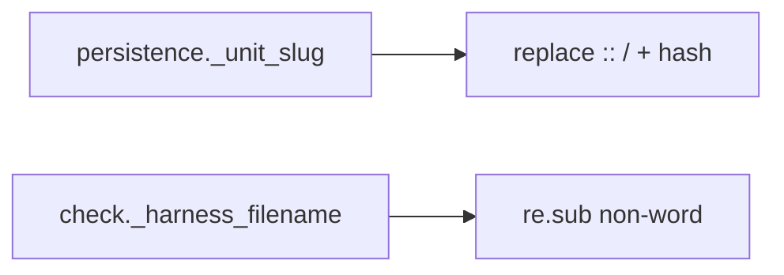

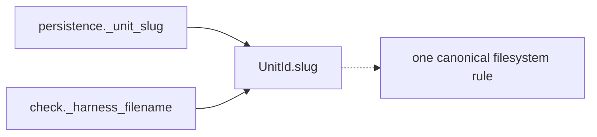

## Dropped

Re-checked this run; all filters still apply (no code change lifted them):

| Candidate | Dropped because |
|---|---|
| `signature-reexport-indirection` | Leverage 1 — `__init__.py` facade for ~10 external importers; redirecting six names is interface hygiene, nothing concentrates |
| `mcp-server-tool-wrappers` | Leverage 1 — the typed `*_tool` param lists *are* the MCP schema the SDK introspects; deletion scatters |
| `verify-and-record-decomposition` | Not a deepening — the fail-closed heart of the gate is deep, not shallow; high regression risk |
| `cli-run-handler-shape` | Leverage 1 — per-command exit-code variation would scatter into flags |
| `esbmc-init-all-parser-surface` | Leverage 1 — namespace hygiene, nothing concentrates |
| `harness-writer-port-inline` | Not a deepening — a one-adapter seam to *inline*, not deepen |
| `cli-json-or-render-epilogue` | Leverage 1 — the renderer and exit-code policy differ per command; a helper relocates the variation to the call site |
| `codex-claude-verify-drift` | Fails the deletion test — the file-vs-function mechanisms genuinely differ; a shared seam is a param-heavy switch |

Re-confirmed dropped this run: `core/cli.py`'s `_run_*` dispatch skeleton (`_run_propose`,
`_run_check`, `_run_semantic_loop`, …) — the exception tuples, renderer, and exit code all
differ per command, so a `_dispatch()` helper relocates rather than concentrates. Already covered
by `cli-run-handler-shape`/`cli-json-or-render-epilogue`; not re-flagged.

## Too large to automate

None this run. No surviving candidate scored blast radius 5. `precond-under-unwound-detection-into-esbmc`
(15/25, blast radius 4) remains eligible-but-deferred: it reaches out-of-scope `core/check.py`
and changes `esbmc.verify`'s published verdict under one flag, so it wants a human's before/after
differential — recorded `proposed`, not picked.

## Pick

**`unit-id-value-type` (19/25).** It is the top-scoring eligible candidate once PR #275
(`hook-verdict-report-two-hooks`) reconciled to `landed`, clearing the one-PR-at-a-time slot. It
outranks the runner-up **candidate** `proposal-request-prologue` (18/25) by one point — a **close
pick**, so a reviewer should read the runner-up as the natural next firing. The two overlap only
at the two Core `unit_id =` lines; taking the broader `UnitId` type first leaves the rest of the
prologue for later without collision. `canonical-gate-decision-helper`,
`proposalresult-provenance-reflatten`, and `counterexample-fired-label-predicate` (all 17/25)
follow. The scope is settled at **`::` join+split concentration with no normalization change**,
so the Core-vs-gate left-operand asymmetry is reported (above) but not touched.

## Design

_Written at step 4, after this report was first committed; the file is amended and committed
again there._
