# Architecture review — forseti — 2026-09-18

**Scope**: the whole `src/forseti/` tree, swept by three parallel sub-agents (`esbmc`+`core`+`orchestrator`;
`properties`+`precond`; `adapters`+`update_notice`). No path argument was given, so scope was inferred from
hot spots in the last 60 commits: `esbmc/units.py` (14), `core/cli.py` (16), `orchestrator/check.py` (11),
`properties/proposer.py` + `harness.py` (10 each), `precond/discharge.py` (8), `adapters/claude_code/` (~15
across the gate and its hooks).

**Picked**: `precond-sidecar-run-seam` — 21/25. See `.architecture/backlog.md`.

**Degradations**: none. `gh` authenticated; sub-agents available; advisor available.

**Diagram legend**: solid edges are the interface a caller must learn; dashed edges are inside the
implementation, hidden from callers.

---

## Candidates

### `precond-sidecar-run-seam` — one home for the ladder-and-probe sidecar recipe · **Strong** · score 21/25

- **Files**: `src/forseti/precond/verify.py:315-332` (`_run`) and `:367-383` (`_assess_non_vacuity`);
  `src/forseti/precond/discharge.py:628-637` and `:684-687` (`_check_caller`); a new leaf
  `src/forseti/precond/run.py`. Estimate **~4–6 files** (2 edited, 1 new leaf, 1 new test, plus touch-ups
  to `tests/precond/test_precond_verify.py` and `tests/precond/test_discharge.py`).
- **Score**: 21/25
  - *Leverage 4* — four call sites collapse to "render this, read the verdict"; the two drivers stop
    each re-deriving the ladder/probe protocol.
  - *Locality 5* — the protocol today forces lockstep edits in `verify.py` **and** `discharge.py`; after,
    it is a one-file edit in `precond/run.py`.
  - *Blast radius 2* — a module and its direct callers; no published interface changes.
  - *Heat 4* — `discharge.py` 8 commits in the last 60, `verify.py` 4, `synth.py` 6,
    `tests/precond/test_discharge.py` 6.
- **Problem**: "run a sidecar" is one recipe, written out twice in full. Both `verify._run` and
  `discharge._check_caller` do: derive a filename under `work_dir`, `write_text(render_sidecar(...))`,
  build `precondition_ladder(max_len, ladder_cap)`, wrap the raw port in `escalating_port(raw)`,
  `climb_to_terminal(...)`, then unpack `settled.result, settled.k`. Both then run a *probe* variant —
  and the probe deliberately calls `raw(path, unwind=k)` **directly**, bypassing the escalating port, at
  the settled bound. That escalate-vs-don't-escalate asymmetry is load-bearing and stated nowhere; it
  survives only because the two copies happen to agree. The generated-filename convention
  (`__precond.c`, `__precond_nonvacuity.c`, `__discharge.c`, `__discharge_site.c`) has no owner at all,
  so two test modules reach into it by substring to decide which phase a canned verdict is answering
  (`tests/precond/test_precond_verify.py:56-57`, `tests/precond/test_discharge.py:89-98`).
- **Deletion test**: **concentrates.** There is no seam to delete today — that is the point. The protocol
  is currently scattered across two drivers plus two test modules' dispatch logic; giving it one home is
  the move that concentrates it.
- **Solution**: a `precond/run.py` leaf owning two operations — a laddered run (render → write → climb
  through `escalating_port` → settled result + k) and an unescalated probe at a fixed k (render → write →
  `raw(path, unwind=k)` → `classify_site_probe`). Each driver supplies its own harness stem, its own
  second `render_sidecar` argument (which means something different per site: resolved source path,
  `str(obligations)`, `str(site)`) and its own probe label, and keeps its own outcome interpretation.
- **Benefits**: **leverage** — the ladder/probe protocol becomes one tested interface instead of two
  copies held in agreement by luck. **Locality** — a change to the escalation policy, the ladder, or the
  probe's bound becomes a one-file edit. **Test surface** — the escalate-vs-raw asymmetry becomes
  directly assertable on the seam rather than inferred from two drivers' behaviour, and the seam is
  already exercisable esbmc-free because both drivers take an injected `VerifyPort`.

**Before**

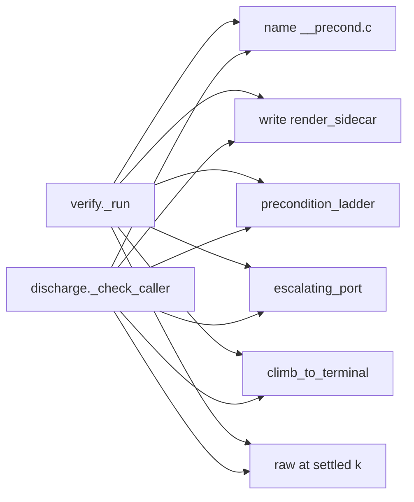
```mermaid
graph LR
  V["verify._run"] --> N1["name __precond.c"]
  V --> W1["write render_sidecar"]
  V --> L1["precondition_ladder"]
  V --> E1["escalating_port"]
  V --> C1["climb_to_terminal"]
  D["discharge._check_caller"] --> N1
  D --> W1
  D --> L1
  D --> E1
  D --> C1
  V --> P1["raw at settled k"]
  D --> P1
```

**After**

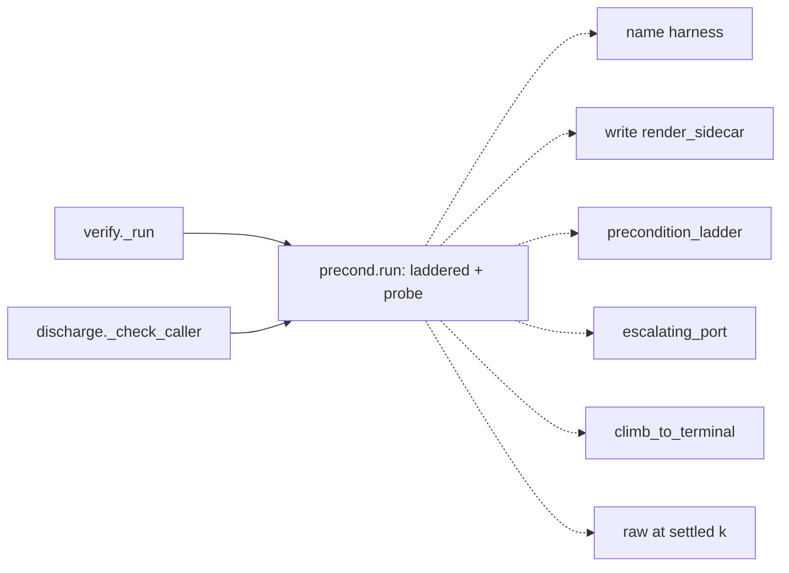
```mermaid
graph LR
  V["verify._run"] --> R["precond.run: laddered + probe"]
  D["discharge._check_caller"] --> R
  R -.-> N1["name harness"]
  R -.-> W1["write render_sidecar"]
  R -.-> L1["precondition_ladder"]
  R -.-> E1["escalating_port"]
  R -.-> C1["climb_to_terminal"]
  R -.-> P1["raw at settled k"]
```

---

### `forseti-cli-json-subprocess-seam` — one home for "how a hook invokes the Forseti CLI" · **Strong** · score 20/25

- **Files**: `adapters/claude_code/forseti_gate.py:803-846` (`_list_units`) and `:1675-1734`
  (`verify_function`); `adapters/claude_code/property_gate.py:295-349` (`_check_unit`);
  `adapters/codex/verify_hook.py:81-103` (`_verify`); `adapters/oh_my_pi/verify_hook.py:114-134`
  (`_list_functions`) and `:137-186` (`_semantic_check`); a new `adapters/_forseti_cli.py`.
  Estimate **~10 files** (1 new leaf, 4 edited src, 1 new test, ~4 edited test modules).
- **Score**: 20/25
  - *Leverage 4* — six call sites simplify; argv assembly, timeout margin, cwd, stream clipping and JSON
    decode concentrate. Not 5: each caller's failure-translation tail is genuinely its own.
  - *Locality 5* — fixing the stderr clip or the failure taxonomy today is a 3-file lockstep edit.
  - *Blast radius 3* — ~10 files across three adapter packages; 13 `monkeypatch.setattr(verify_hook.subprocess, "run", ...)`
    sites move with the call. (Band description says "a module and its direct callers"; the file count
    says 3. Scored to the file count, which is the honest one here.)
  - *Heat 4* — `forseti_gate.py` 5 commits in the last 60, `property_gate.py` 3; `oh_my_pi` landed in #270.
- **Problem**: six sites hand-roll the same four decisions. Four drifts are already present and verified:
  (1) `property_gate.py:311-317` documents *why* `FORSETI_BUILD_FLAGS` must be forwarded — codex
  (`:84-89`) and oh-my-pi (`:117-123`, `:145-161`) forward nothing, so on any project with `-I`/`-D`
  those two report `skipped`/`error` where the Claude gate gets a real verdict; (2) the
  `verdict`/`counterexample or reason or message` decoder exists twice
  (`forseti_gate.py:1731-1734`, `codex/verify_hook.py:96-102`); (3) the stderr-fallback clip drifted
  `[:800]` / `[:400]` / `[:400]`; (4) `forseti_gate` splits `FileNotFoundError` / `TimeoutExpired` /
  decode-failure into three verdict shapes, codex and oh-my-pi collapse all three into one bucket.
- **Deletion test**: **concentrates.** Argv prefix, build-flag forwarding, timeout-plus-margin, cwd and
  the launch/timeout/decode failure taxonomy are one decision; deleting the seam re-scatters them into
  six call sites, which is today's state.
- **Solution**: a leaf returning a structured run outcome (argv, returncode, stdout, stderr, an outcome
  enum covering launch-failed / timed-out / nonzero / decode-failed / ok, and the decoded payload), so
  each caller keeps its own translation to `UnitVerdict` / `UnitsUnavailable` / a tuple.
- **Benefits**: **leverage** — one place decides how Forseti talks to itself. **Locality** — the
  build-flag divergence becomes a one-line fix rather than a three-file one. **Test surface** — the argv
  half is currently *unpinned* at two of three harnesses (both suites stub `fake_run(*_a, **_kw)` and
  ignore their arguments), so a seam makes argv assertable in one place instead of nowhere.
- **Distinct from the dropped `codex-claude-verify-drift`**: that entry judged the *pipelines*
  irreconcilable (per-file vs per-function, no shared state) and that judgement still holds. This
  candidate touches only the subprocess boundary underneath them, which is identical in all six sites.

**Before**

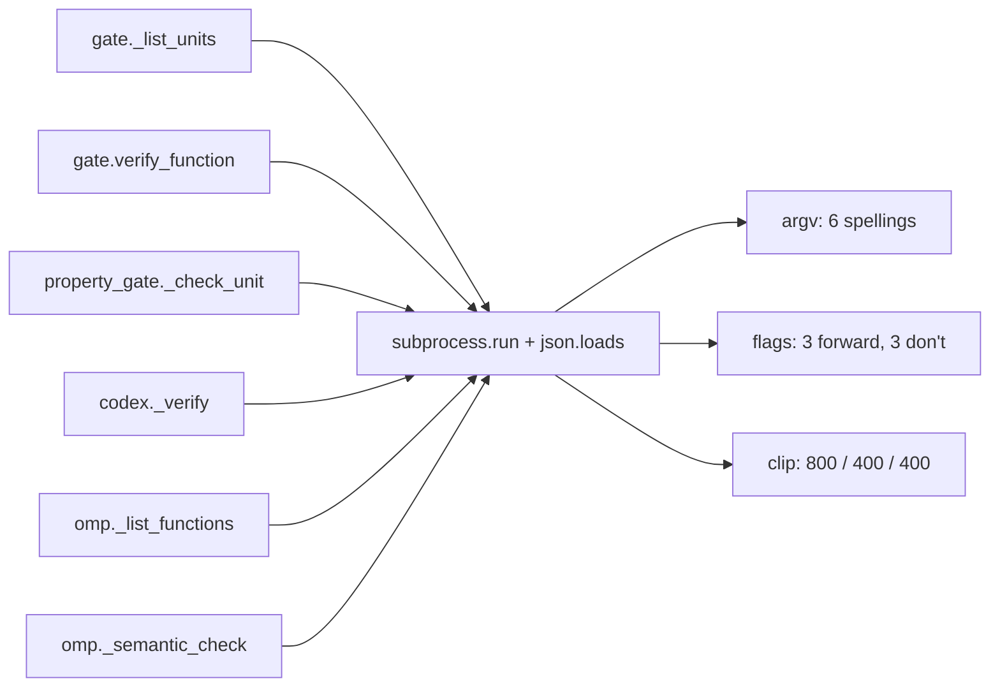
```mermaid
graph LR
  G1["gate._list_units"] --> S["subprocess.run + json.loads"]
  G2["gate.verify_function"] --> S
  P["property_gate._check_unit"] --> S
  CX["codex._verify"] --> S
  O1["omp._list_functions"] --> S
  O2["omp._semantic_check"] --> S
  S --> X1["argv: 6 spellings"]
  S --> X2["flags: 3 forward, 3 don't"]
  S --> X3["clip: 800 / 400 / 400"]
```

**After**

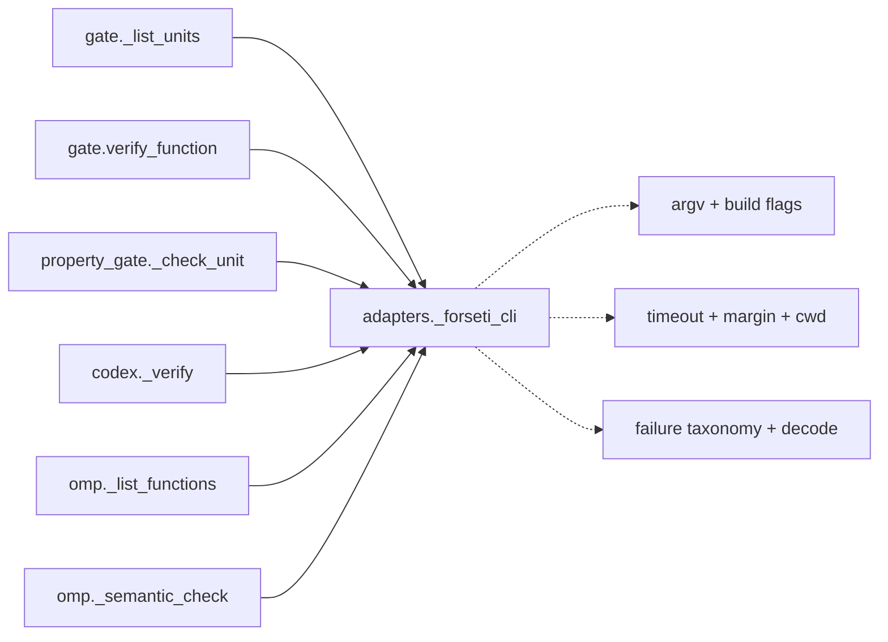
```mermaid
graph LR
  G1["gate._list_units"] --> F["adapters._forseti_cli"]
  G2["gate.verify_function"] --> F
  P["property_gate._check_unit"] --> F
  CX["codex._verify"] --> F
  O1["omp._list_functions"] --> F
  O2["omp._semantic_check"] --> F
  F -.-> X1["argv + build flags"]
  F -.-> X2["timeout + margin + cwd"]
  F -.-> X3["failure taxonomy + decode"]
```

---

### `cli-check-phase-argument-block` — the check-phase flag surface, stated once · **Worth exploring** · score 20/25

- **Files**: `src/forseti/core/cli.py:524-561` (the `check` subparser) and `:730-767` (the
  `semantic-loop` subparser). Estimate **1 file**.
- **Score**: 20/25
  - *Leverage 3* — two call sites simplify; one documented fact stops being stated twice. Callers
    otherwise do the same work.
  - *Locality 4* — both sites are already inside `cli.py`, so the file-count clause that earns a 5 is
    definitionally unavailable here.
  - *Blast radius 1* — one file, no published interface changes (the argparse surface is unchanged).
  - *Heat 5* — `cli.py` is the hottest source file, 16 of the last 60 commits.
- **Problem**: the two blocks are character-for-character identical apart from two prose strings. That
  includes the 6-line f-string help for `--unwind-ladder` that interpolates
  `CHECK_DEFAULT_UNWIND_LADDER` — so changing the documented wording of the ladder default has to be done
  twice, or the two subcommands silently document different defaults. The extraction was already started
  in this same file (`_add_unit_store_arguments`, `:274-289`) and in its sibling
  (`_precond_cli._add_precondition_arguments`, `:36-73`), then stopped one block short.
- **Deletion test**: **concentrates**, weakly — there is one "what flags does a check phase take" fact
  with two homes today.
- **Solution**: `_add_check_phase_arguments(p, *, json_help, passthrough_example)`, following the
  existing in-file precedent exactly.
- **Benefits**: **locality** — the ladder-default help becomes one site. **Test surface** — unchanged;
  `tests/core/test_core_check.py` and `test_semantic_loop_cli.py` exercise both parsers through
  `cli.main`, so the argparse surface is already pinned.

**Before**

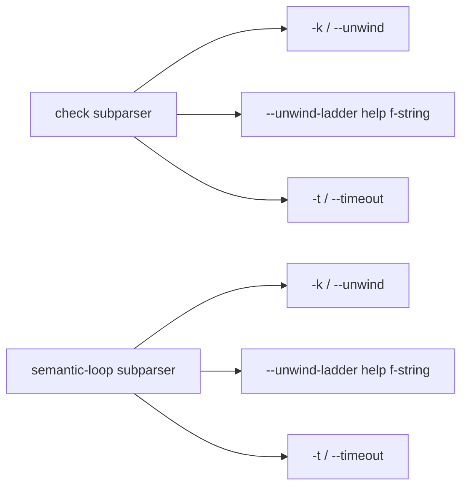
```mermaid
graph LR
  A["check subparser"] --> K["-k / --unwind"]
  A --> L["--unwind-ladder help f-string"]
  A --> T["-t / --timeout"]
  B["semantic-loop subparser"] --> K2["-k / --unwind"]
  B --> L2["--unwind-ladder help f-string"]
  B --> T2["-t / --timeout"]
```

**After**

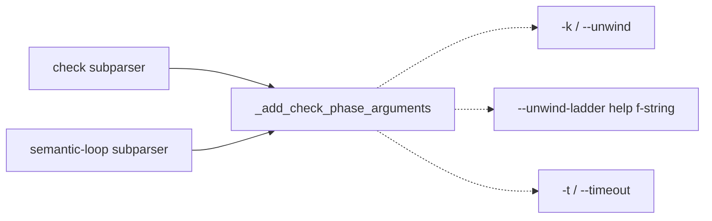
```mermaid
graph LR
  A["check subparser"] --> H["_add_check_phase_arguments"]
  B["semantic-loop subparser"] --> H
  H -.-> K["-k / --unwind"]
  H -.-> L["--unwind-ladder help f-string"]
  H -.-> T["-t / --timeout"]
```

---

### `verify-port-test-doubles` — one scripted ESBMC verdict, not eighteen · **Worth exploring** · score 20/25

- **Files**: `class FakeVerify` defined verbatim in 11 test modules (`tests/orchestrator/test_loop.py`,
  `test_ladder.py`, `test_check.py`, `test_telemetry.py`, `test_report.py`, `test_transcript.py`,
  `test_persistence.py`, `test_fix.py`; `tests/core/test_core_check.py`, `test_core_loop.py`,
  `test_semantic_loop_cli.py`), plus 35 hand-rolled `RunMeta`/`_meta` sites. `tests/esbmc/conftest.py`
  is 0 bytes; `tests/orchestrator/` and `tests/core/` have no conftest at all. Estimate **~15 files**.
- **Score**: 20/25
  - *Leverage 4* — many call sites, and it removes a whole class of test setup. Not 5: no production
    interface gets deeper, so a caller of the product gains nothing.
  - *Locality 5* — adding a `RunMeta` field is a 14-file edit today, one file after.
  - *Blast radius 3* — ~15 files, all tests; no production change.
  - *Heat 4* — the orchestrator and core test modules churn with every loop change.
- **Problem**: every driver test pays ~30 lines of scaffolding before its first assertion, and the copies
  have drifted — some record `calls`, some `unwinds`, `test_telemetry.py:61` records neither. A new test
  for `check_properties` / `run_loop` / `check_source` starts by copy-pasting a fake rather than
  importing one.
- **Deletion test**: **concentrates.** "What a scripted ESBMC verdict looks like" is one concept spread
  over ~18 files.
- **Solution**: a shared `ScriptedVerify` plus verdict/`RunMeta` builders in `tests/conftest.py` (or
  per-package conftests).
- **Benefits**: **locality** and **test surface** directly. One constraint:
  `tests/orchestrator/test_report.py:127` (`test_k_reflects_the_escalated_bound_not_the_argv`)
  deliberately relies on the meta's `argv` being stale relative to `k`, so a shared builder must let the
  caller fix `argv` rather than deriving it from `unwind`.

**Before**

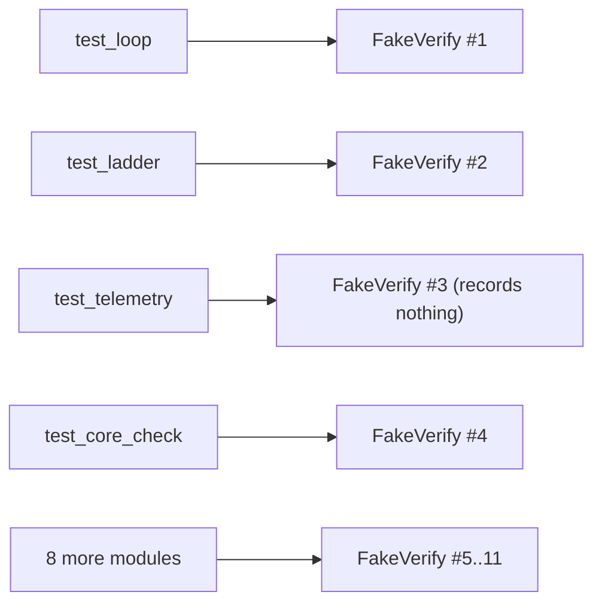
```mermaid
graph LR
  T1["test_loop"] --> F1["FakeVerify #1"]
  T2["test_ladder"] --> F2["FakeVerify #2"]
  T3["test_telemetry"] --> F3["FakeVerify #3 (records nothing)"]
  T4["test_core_check"] --> F4["FakeVerify #4"]
  T5["8 more modules"] --> F5["FakeVerify #5..11"]
```

**After**

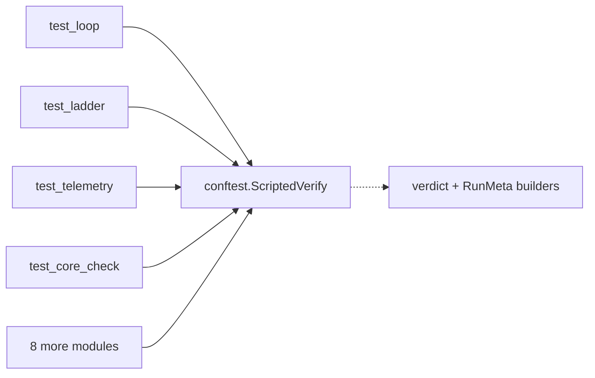
```mermaid
graph LR
  T1["test_loop"] --> S["conftest.ScriptedVerify"]
  T2["test_ladder"] --> S
  T3["test_telemetry"] --> S
  T4["test_core_check"] --> S
  T5["8 more modules"] --> S
  S -.-> B["verdict + RunMeta builders"]
```

---

### `scanned-source-carrier` — a carrier for "this source, scanned" · **Worth exploring** · score 20/25

- **Files**: `src/forseti/esbmc/units.py:1466-1506` (`_with_predefined_guards`), `:1210-1236`
  (`_annotate_array_extents`), `:1199-1209` (`_candidates_by_name`), `:1508-1550` (`list_units`),
  `:900-975` (`_select_definition`), `:32-35` (four *private* imports from `preprocessor`).
  Estimate **~3 files**, but see the scope warning.
- **Score**: 20/25
  - *Leverage 4* — ends a 4-deep hand-threading of `masked` / `candidates` / breakpoints / `predefined`.
  - *Locality 4* — mostly within `units.py` already.
  - *Blast radius 3* — `find_definition_brace` is called from `precond/synth.py:575` and
    `properties/harness.py:517`, so the change either freezes that public signature or crosses scope.
  - *Heat 5* — `units.py` 14 commits in the last 60; `tests/esbmc/test_units.py` 16.
- **Problem**: the masked text, per-name definition candidates, `#line` breakpoints and the measured
  `predefined` guard seed are four artifacts derived from one string, and every function in the chain
  either re-derives them or takes them as extra positional parameters. `_stripped_for_scan` is
  re-derived independently at `units.py:1001`, `:1082`, `:1194` and `:1533`.
- **Deletion test**: **concentrates** — deleting the (not-yet-existing) carrier scatters the scan across
  four entry points and three threaded parameter lists, which is precisely the current state.
- **Solution**: a carrier holding the scanned artifacts, derived once per listing and passed as one value.
- **Benefits**: **leverage** and AI-navigability — understanding "which `#if 0` body is the real
  definition" currently means reading across six functions in two modules, all consumed through
  underscore-private imports.
- **Not picked, and why**: highest regression risk of the 20-point cluster. This module's scan heuristics
  have historically needed differential runs against a `clang __LINE__` oracle to prove equivalence —
  more verification than one unattended firing can carry.

**Before**

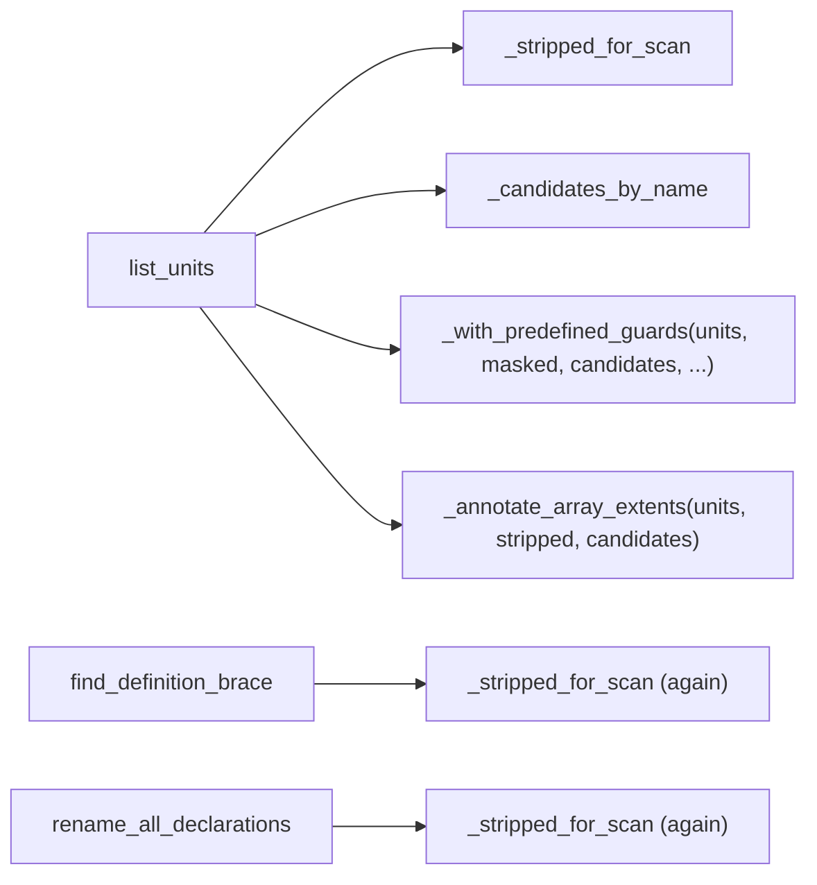
```mermaid
graph LR
  LU["list_units"] --> M["_stripped_for_scan"]
  LU --> CA["_candidates_by_name"]
  LU --> WG["_with_predefined_guards(units, masked, candidates, ...)"]
  LU --> AE["_annotate_array_extents(units, stripped, candidates)"]
  FD["find_definition_brace"] --> M2["_stripped_for_scan (again)"]
  RN["rename_all_declarations"] --> M3["_stripped_for_scan (again)"]
```

**After**

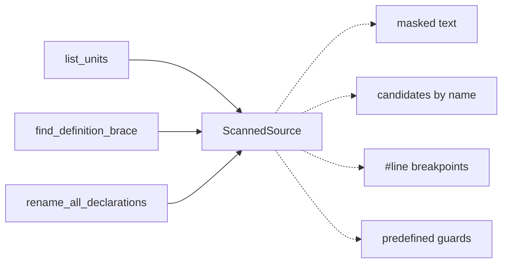
```mermaid
graph LR
  LU["list_units"] --> SC["ScannedSource"]
  FD["find_definition_brace"] --> SC
  RN["rename_all_declarations"] --> SC
  SC -.-> M["masked text"]
  SC -.-> CA["candidates by name"]
  SC -.-> BP["#line breakpoints"]
  SC -.-> PG["predefined guards"]
```

---

### `harness-reply-triage-two-hooks` — one gate-reply grammar for codex and oh-my-pi · **Worth exploring** · score 19/25

- **Files**: `adapters/codex/verify_hook.py:120-181`, `adapters/oh_my_pi/verify_hook.py:217-292`;
  in-repo template at `adapters/claude_code/verdict_report.py:25-119` (`ReportStyle`/`partition`/
  `render`/`emit`). Estimate **~4 files**.
- **Score**: 19/25 — *leverage 4* (two hooks collapse to three strings plus a label choice),
  *locality 4*, *blast radius 2*, *heat 3*.
- **Problem**: both gates own an identical triage-and-reply grammar — partition into violated /
  inconclusive, `### VIOLATED: {id}` blocks, an "Also inconclusive (do not ignore)" tail, the same
  "Not a pass — raise k, add an entry/harness, or report." sentence — and they have already drifted
  ("could not conclusively **verify**" vs "**check**"). The residual builder `", ".join(f"{x} [{y}]")`
  appears four times.
- **Deletion test**: **concentrates** — the same axis `ReportStyle` already parameterises on the Claude
  side. Distinct from the landed `hook-verdict-report-two-hooks`, which was `UnitVerdict[]` → stderr/exit
  code *inside* Claude Code; this is `(id, evidence)[]` → stdout JSON across two *other* harnesses.
- **Benefits**: **locality**; well pinned already by `tests/adapters/codex/test_verify_hook.py:234-262`
  and `tests/adapters/oh_my_pi/test_omp_verify_hook.py:394,418,447,545`.

**Before**

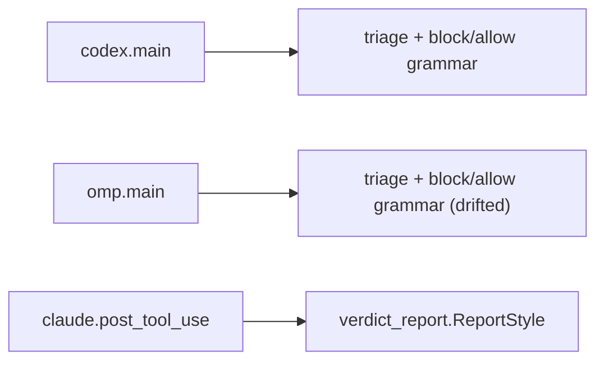
```mermaid
graph LR
  CX["codex.main"] --> G1["triage + block/allow grammar"]
  OMP["omp.main"] --> G2["triage + block/allow grammar (drifted)"]
  CC["claude.post_tool_use"] --> VR["verdict_report.ReportStyle"]
```

**After**

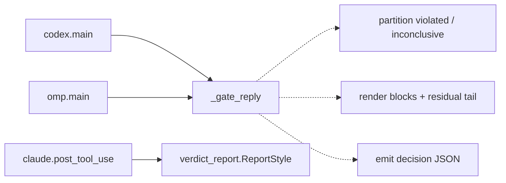
```mermaid
graph LR
  CX["codex.main"] --> GR["_gate_reply"]
  OMP["omp.main"] --> GR
  CC["claude.post_tool_use"] --> VR["verdict_report.ReportStyle"]
  GR -.-> P["partition violated / inconclusive"]
  GR -.-> R["render blocks + residual tail"]
  GR -.-> E["emit decision JSON"]
```

---

### `open-caller-checks-openings-record` — pass the record that already exists · **Worth exploring** · score 18/25

- **Files**: `precond/discharge.py:206-215` (signature), `:234-285` (five near-identical comprehensions),
  `:305-316` (`find_open_callers` destructuring); the record `CallerOpenings` already exists at
  `esbmc/units.py:1411-1436`. Estimate **~3 files**.
- **Score**: 18/25 — *leverage 3*, *locality 4*, *blast radius 1*, *heat 3*.
- **Problem**: `open_caller_checks` takes the five openings as five separate keyword-only
  `tuple[str, ...]` params, and `find_open_callers` destructures a `CallerOpenings` it already holds back
  into those five keywords — interface tax as complex as the implementation it fronts, which is the
  shallow-module signature. Two test helpers re-spread the same five keys.
- **Deletion test**: **concentrates** — the taxonomy and the stable concatenation order `_aggregate`
  relies on are one fact.
- **Benefits**: adding a sixth way the caller set can be open becomes one table row instead of a
  four-site lockstep edit. Pinned by `tests/precond/test_open_callers.py:76`
  (`test_the_concatenation_order_is_stable`), exactly the invariant a table-driven rewrite must preserve.
- **Distinct from `esbmc-caller-openings-module-split`**, which relocates the ~460 LOC of *parsing*
  inside `units.py`; this is the consumer-side shape.

**Before**

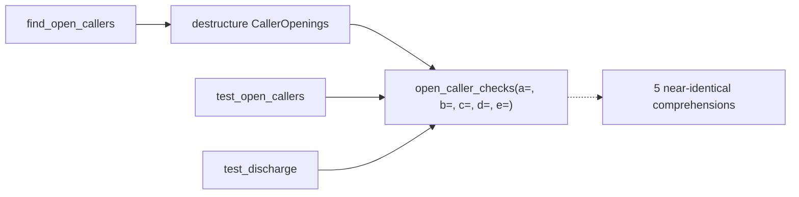
```mermaid
graph LR
  FC["find_open_callers"] --> D["destructure CallerOpenings"]
  D --> OC["open_caller_checks(a=, b=, c=, d=, e=)"]
  OC -.-> C1["5 near-identical comprehensions"]
  T1["test_open_callers"] --> OC
  T2["test_discharge"] --> OC
```

**After**

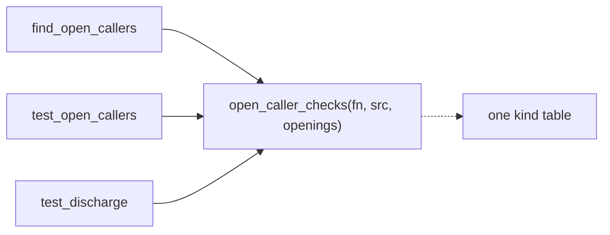
```mermaid
graph LR
  FC["find_open_callers"] --> OC["open_caller_checks(fn, src, openings)"]
  T1["test_open_callers"] --> OC
  T2["test_discharge"] --> OC
  OC -.-> KT["one kind table"]
```

---

### `harness-registry-dispatch-table` — what each harness *is*, in one table · **Speculative** · score 17/25

- **Files**: `adapters/harness.py:30-35` (the enum that names harnesses but carries no facts);
  `core/cli.py:1035-1094` (`_run_enable_project`), `:1130-1173` (`_run_disable_project`), `:894-915`,
  `:937-941`, `:961-965` (three near-identical hook dispatchers). Estimate **~3 files**.
- **Score**: 17/25 — *leverage 3*, *locality 3*, *blast radius 2*, *heat 4*.
- **Problem**: install fn, remove fn, error type, whether `--shared` applies, and the CLI prose are spread
  across six branches in two handlers, with the `--shared has no effect` guard copied four times.
- **Deletion test**: **concentrates**, weakly — the outcome-enum half of the win overlaps
  `adapter-install-skeleton-two-harnesses`.
- **Benefits**: a fourth harness would touch one file instead of four `cli.py` sites.

**Before**

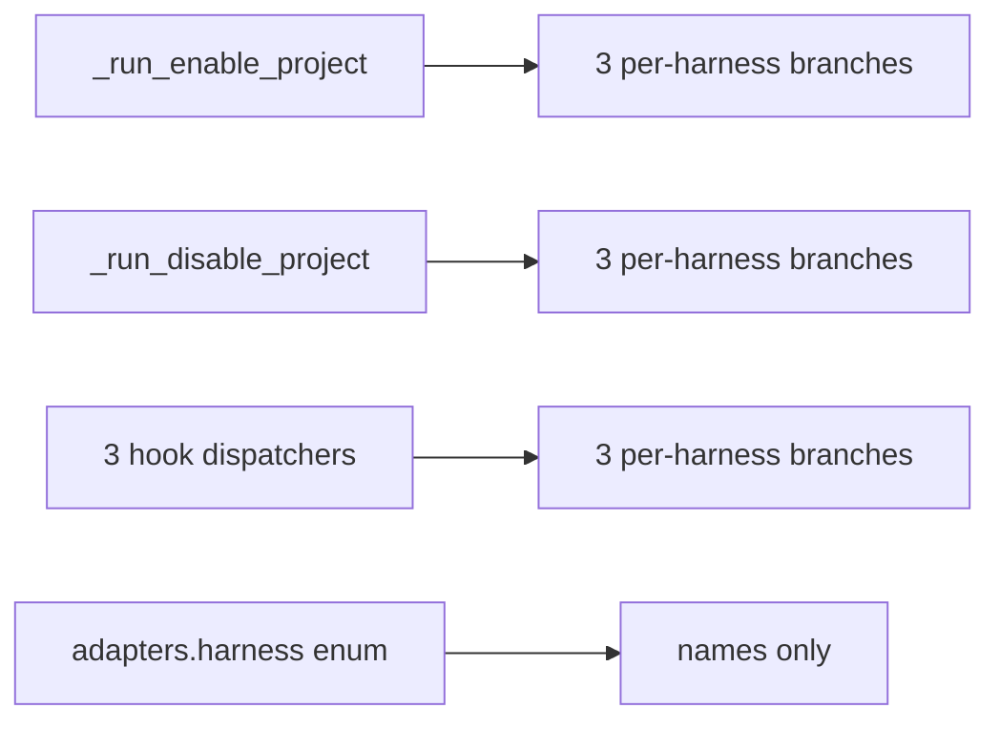
```mermaid
graph LR
  EN["_run_enable_project"] --> B1["3 per-harness branches"]
  DI["_run_disable_project"] --> B2["3 per-harness branches"]
  HK["3 hook dispatchers"] --> B3["3 per-harness branches"]
  H["adapters.harness enum"] --> N["names only"]
```

**After**

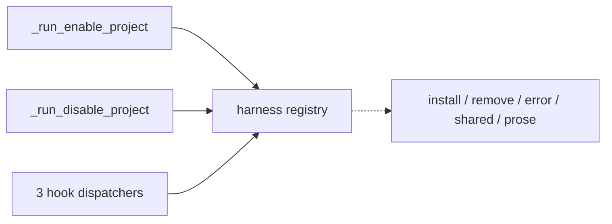
```mermaid
graph LR
  EN["_run_enable_project"] --> REG["harness registry"]
  DI["_run_disable_project"] --> REG
  HK["3 hook dispatchers"] --> REG
  REG -.-> F["install / remove / error / shared / prose"]
```

---

### `pointer-length-pairing-two-parsers` — the buffer/length rule, once · **Speculative** · score 17/25

- **Files**: `properties/signature.py:189-223` + `:96-100`, `:232-236`; `precond/synth.py:87-88`,
  `:175-176`, `:185-194`, `:258-295`. Estimate **~5 files**.
- **Score**: 17/25 — *leverage 4*, *locality 4*, *blast radius 4* (it changes which objects a generated
  harness allocates), *heat 3*.
- **Problem**: both modules answer "does this pointer parameter pair with the next integer, and in what
  units?" and have drifted into different answers. `signature.py` pairs any following non-pointer integer
  and always treats the length as an **element count**; `synth.py` pairs only on a name allowlist and
  distinguishes **byte length** from **element count**. So `f(int *p, size_t nbytes)` gets an
  `nbytes`-element object on the properties path and an `nbytes`-*byte* object on the precond path. The
  integer predicates also disagree: `synth.py:176` is a bare substring scan, so a `point_t count`
  parameter reads as an integer length because `"int" in "point_t"`.
- **Deletion test**: **concentrates** for the pairing *rule* only — the two front-ends (regex over a
  source slice vs a clang `Param` list) are legitimately different and nothing is gained by merging them.
- **Not picked, and why**: reconciling byte-length against element-count is a *behaviour* decision about
  what gets allocated, not a refactor. An unattended run must not settle it silently — this wants a human
  and a before/after differential. Left `proposed` with that note.

**Before**

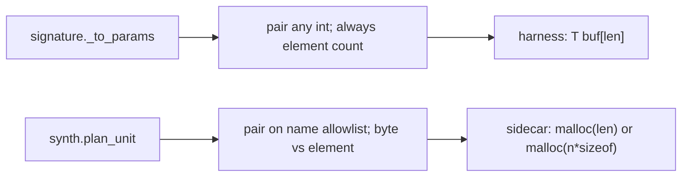
```mermaid
graph LR
  SG["signature._to_params"] --> R1["pair any int; always element count"]
  SY["synth.plan_unit"] --> R2["pair on name allowlist; byte vs element"]
  R1 --> H1["harness: T buf[len]"]
  R2 --> H2["sidecar: malloc(len) or malloc(n*sizeof)"]
```

**After**

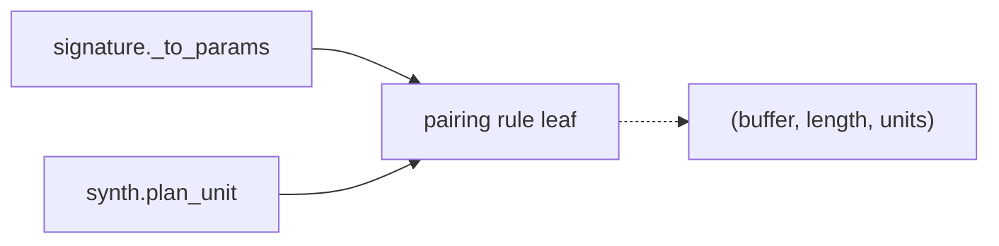
```mermaid
graph LR
  SG["signature._to_params"] --> PR["pairing rule leaf"]
  SY["synth.plan_unit"] --> PR
  PR -.-> U["(buffer, length, units)"]
```

---

### `update-notice-emission-policy` — who may write an unsolicited banner · **Worth exploring** · score 16/25

- **Files**: `update_notice.py:35-65` (returns `str | None`, no emission, no suppression knob);
  `core/cli.py:1236-1244` (suppresses for four subcommands, inline); `esbmc/cli.py:37-40` (same epilogue,
  **no suppression at all**). Estimate **~4 files**.
- **Score**: 16/25 — *leverage 3*, *locality 4*, *blast radius 2*, *heat 2*.
- **Problem**: `forseti verify`, `list-units` and `semantic-loop` are *not* in `cli.py`'s suppression set,
  and they are exactly the commands the three hook adapters shell out to — while all three read stderr as
  evidence on the failure path (`codex/verify_hook.py:95`, `oh_my_pi/verify_hook.py:164`,
  `forseti_gate.py:1730`). On a non-JSON reply the update banner becomes the reported skip reason handed
  back to the model.
- **Deletion test**: **concentrates** — one policy, currently one inline `if`, one silent omission, and
  three downstream readers defending against it. Two emit sites = a real seam, not a hypothetical one.
- **Benefits**: **locality**. Note the *suppression* behaviour has no existing assertion — a test that
  `forseti codex-hook` emits no banner while `forseti verify` does must land first.

**Before**

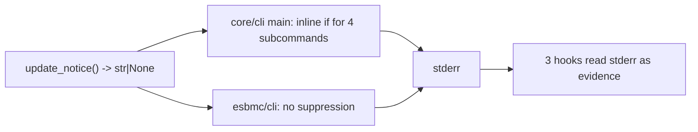
```mermaid
graph LR
  UN["update_notice() -> str|None"] --> CC["core/cli main: inline if for 4 subcommands"]
  UN --> EC["esbmc/cli: no suppression"]
  CC --> SE["stderr"]
  EC --> SE
  SE --> RD["3 hooks read stderr as evidence"]
```

**After**

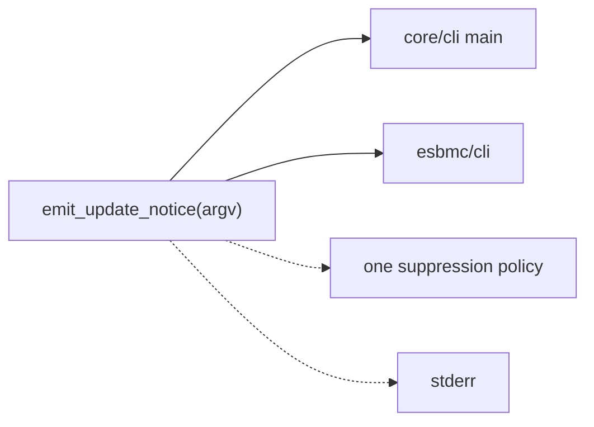
```mermaid
graph LR
  EP["emit_update_notice(argv)"] --> CC["core/cli main"]
  EP --> EC["esbmc/cli"]
  EP -.-> POL["one suppression policy"]
  EP -.-> SE["stderr"]
```

---

### `esbmc-run-boundary` — how we talk to the esbmc binary · **Speculative** · score 15/25

- **Files**: `esbmc/units.py:1237-1262` (`_parse_tree`), `:325-331` (`_error_line`), `:1296-1412`
  (`probe_predefined_guards`); `esbmc/runner.py:209-285` (`verify`), `:58-63` (`_error_message`).
  Estimate **~3 files**.
- **Score**: 15/25 — *leverage 2*, *locality 3*, *blast radius 2*, *heat 4*.
- **Problem**: the `subprocess.run` shape, "esbmc's output is stdout ⧺ stderr", and "an error is the
  first `ERROR:` line" are each spelled twice, and the `ERROR:` extractor has drifted on its fallback
  (`""` vs `"esbmc reported an error"`). Timeout policy has three answers in three places.
- **Deletion test**: **concentrates**, weakly — once the divergent translation policy (fail-loud raise vs
  typed verdict) is subtracted, the shared core is roughly 12 lines. A drift/tidiness candidate, not a
  leverage one.

**Before**

```mermaid
graph LR
  PT["units._parse_tree"] --> SR["subprocess.run + join streams"]
  VF["runner.verify"] --> SR
  PT --> EL["_error_line (fallback '')"]
  VF --> EM["_error_message (fallback 'esbmc reported an error')"]
```

**After**

```mermaid
graph LR
  PT["units._parse_tree"] --> ER["EsbmcRun carrier"]
  VF["runner.verify"] --> ER
  PB["probe_predefined_guards"] --> ER
  ER -.-> AR["argv + exit code"]
  ER -.-> OU["combined output"]
  ER -.-> EL["first ERROR: line"]
```

---

### `nondet-generator-convention-two-slugs` — one spelling for `nondet_*` · **Speculative** · score 14/25

- **Files**: `properties/harness.py:331-338` + `:341-358` + `:175-182`; `precond/synth.py:319-322` +
  `:413-421`. Estimate **~4 files**.
- **Score**: 14/25 — *leverage 2*, *locality 3*, *blast radius 2*, *heat 3*.
- **Problem**: two same-named private `_nondet_slug` functions with the same stated purpose, implemented
  with different regexes, and they disagree: `_Bool` → `nondet__Bool` vs `nondet_Bool`; `const char *` →
  `nondet_const_char__` vs `nondet_const_char`. Neither is broken today — each emitter uses its own slug
  for both the prototype and the call site — but the one external fact (what ESBMC recognises as a nondet
  generator) is stated twice.
- **Deletion test**: **concentrates**, weakly — only the naming convention; the two emitters build
  genuinely different artefacts (`render_semantic_harness` inlines the unit source, `render_sidecar`
  `#include`s it). The fix must *pick* a spelling, which changes emitted C on one side.

**Before**

```mermaid
graph LR
  HA["harness.render"] --> S1["_nondet_slug (regex A)"]
  SY["synth.render_sidecar"] --> S2["_nondet_slug (regex B)"]
  S1 --> D1["nondet__Bool"]
  S2 --> D2["nondet_Bool"]
```

**After**

```mermaid
graph LR
  HA["harness.render"] --> NS["nondet naming leaf"]
  SY["synth.render_sidecar"] --> NS
  NS -.-> D["one spelling + declaration form"]
```

---

## Dropped

No candidate found this run tripped a hard filter. The table below is the **carried-forward** dropped
set, each re-checked against the current tree this run (ranking.md reconciliation step 4) so `dropped`
does not harden into a permanent veto.

| Candidate | Dropped because | Re-check 2026-09-18 |
|---|---|---|
| `signature-reexport-indirection` | Leverage 1 — `__init__.py` is a facade for ~10 external importers; redirecting six names is interface hygiene | Filter holds — `properties/__init__.py:14-28` still re-exports the six names from `.harness` |
| `mcp-server-tool-wrappers` | Leverage 1 — the typed, docstring'd param list *is* the MCP tool schema the SDK introspects | Filter holds — unchanged |
| `verify-and-record-decomposition` | Not a deepening — every line of `forseti_gate.verify_and_record` encodes a fail-closed invariant | Filter holds — unchanged |
| `cli-run-handler-shape` | Leverage 1 — per-command exit-code variation would scatter into flags | Filter holds — still 6 `args.json` handlers with differing exit-code policy |
| `esbmc-init-all-parser-surface` | Leverage 1 — interface hygiene, nothing concentrates | Filter holds — `esbmc/__init__.py:38-42` unchanged |
| `harness-writer-port-inline` | Not a deepening — a one-adapter seam to *inline*, not deepen | Filter holds — `HarnessWriterPort` still has exactly one implementation (`orchestrator/check.py:241`) |
| `cli-json-or-render-epilogue` | Leverage 1 — render fn and exit-code policy differ per command | Filter holds — unchanged |
| `codex-claude-verify-drift` | Fails the deletion test — the *pipelines* genuinely differ (per-file vs per-function, no shared state) | Filter holds for the pipelines. But the **subprocess boundary underneath them is identical in all six sites** and is filed fresh this run as `forseti-cli-json-subprocess-seam` (20/25) — a distinct candidate, not a re-run of this one |

## Too large to automate

None. No candidate scored blast radius 5 this run.

## Pick

**`precond-sidecar-run-seam`, 21/25.**

The **runner-up candidate** is a four-way tie at 20/25: `forseti-cli-json-subprocess-seam`,
`cli-check-phase-argument-block`, `verify-port-test-doubles`, and `scanned-source-carrier`. **The top two
are within 1 point**, so the pick was close and any of the four is a defensible next firing.

The single point of separation is *locality*, and it comes from one clause applied uniformly to all five
candidates in the 20/21 band: the rubric awards locality 5 only when "a change that currently forces
edits in **several files** would become a one-file edit". `precond-sidecar-run-seam`'s ladder/probe
protocol lives in `verify.py` **and** `discharge.py`, so it earns the 5.
`cli-check-phase-argument-block`'s two blocks are both inside `cli.py`, so 5 is definitionally
unavailable to it and it caps at 4 — which is why a 38-line byte-identical duplication in the hottest
file in the tree loses to a 6-line one in a colder module. `scanned-source-carrier` caps at 4 for the
same reason (mostly one module). `forseti-cli-json-subprocess-seam` and `verify-port-test-doubles` both
earn locality 5 but pay blast radius 3 (~10 and ~15 files) against the pick's 2.

Two further reasons the pick is the right one to run **unattended**, neither of which is scored:

- Both drivers already take an injected `VerifyPort`, so the entire seam is exercisable with no `esbmc`
  on `PATH`. `tests/precond` runs in 0.54s (126 tests, verified this run).
- It changes no published interface. `forseti-cli-json-subprocess-seam`'s most valuable finding — that
  codex and oh-my-pi forward no build flags — is a *behaviour fix*, not a refactor, and the autonomy
  contract forbids an unattended run from bundling one into a deepening PR. It is filed at 20/25 as the
  natural next firing, with the flag divergence called out for a human.

`scanned-source-carrier` is explicitly **not** taken despite tying at 20: `esbmc/units.py`'s scan
heuristics have historically required differential runs against a `clang __LINE__` oracle to prove
equivalence, which is more verification than one unattended firing can carry.

## Design

Written at step 4 — see below.
