# Architecture review — forseti — 2026-09-21

**Scope**: the whole `src/forseti/` tree, weighted by heat. `git log --oneline -120 --name-only`
puts `core/cli.py` (13 commits), `esbmc/units.py` (11), `precond/discharge.py` (9),
`properties/proposer.py` (6), `properties/harness.py` (5), `precond/verify.py` (5),
`precond/synth.py` (5), `orchestrator/check.py` (5) and `core/check.py` (5) at the top, so the
scan ran as three parallel passes — `properties/`+`precond/`, `core/`+`orchestrator/`,
`adapters/`+`esbmc/` — each briefed with the existing backlog slugs so nothing was re-derived.

**Picked**: `cli-command-trace-wrapper` — 22/25. See `.architecture/backlog.md`.

**Degradations**: none. `gh` is authenticated, sub-agents were available for both the exploration
pass and the design-it-twice pass, and the advisor adjudicated step 4.

**Diagram legend** (replaces the upstream HTML legend): in every Mermaid block below, a **solid**
edge is part of a module's *interface* — something a caller must know about — and a **dashed**
edge is *inside* the implementation, behind the seam.

## Candidates

### `cli-command-trace-wrapper` — the `cli.command` emission policy is implemented twice · Strong · score 22/25

- **Files** — `src/forseti/core/_precond_cli.py:113-138` (`_traced`), used at `:141-142` and
  `:205-206`; `src/forseti/core/cli.py:801-823` (`_run_semantic_loop`);
  `src/forseti/core/events.py:38-42` (the policy comment and `CLI_COMMAND`);
  `docs/design/0001-harness-portability.md:131` (the one published contract row covering *both*
  emitters). **File-count estimate: 4–5.**
- **Score** — **22/25**
  - *Leverage 4* — three traced subcommands collapse onto one seam, and the "no exit path may
    skip the trace" policy stops being a property two functions happen to share. A fourth traced
    subcommand becomes one call instead of a third copy of the timing prologue.
  - *Locality 5* — changing what `cli.command` carries, or how it is timed, today forces edits in
    two files that must be kept in step by eye. Afterwards it is a one-file edit.
  - *Blast radius 2* — a module and its direct callers, 4–5 files, all private helpers. The wire
    shape is preserved byte-for-byte, so nothing published moves.
  - *Heat 5* — `core/cli.py` is the hottest source file in the tree (13 of the last 120 commits),
    and **both copies landed together in `7bcc812` (#301/#303), the most recent functional
    commit.** The duplication is three days old and already load-bearing.
- **Problem** — `_traced` in `core/_precond_cli.py` and the prologue/epilogue inlined into
  `_run_semantic_loop` are the same seam: start a `time.monotonic()` clock, call a handler that
  returns `tuple[int, X | None]`, emit exactly one `CLI_COMMAND` event carrying the same five
  common fields (`command`, `source`, `function`, `exit_code`, `duration_s`) plus two
  command-specific extras, and return the exit code. The *reasoning* is duplicated too, in
  parallel prose — `_precond_cli.py:120-123` ("Every return path of `run` … lands here, so no path
  can skip the trace") against `cli.py:804-808` ("Wrapping the whole body means the early argument
  errors and the caught engine errors are traced too"). `core/events.py:38-41` states the policy
  once, and `docs/design/0001-harness-portability.md:131` publishes one contract row for both, yet
  the code carries two independent enforcements of it. Worse, the shared half is parked in the
  wrong module: `_precond_cli.py:1-10` documents itself as precond-only glue ("this only parses
  args, formats, and maps the assessment to an exit code"), so a general CLI-tracing concern lives
  inside the precondition subcommand file and `core/cli.py` cannot reach it without importing
  precond glue.
- **Deletion test** — **concentrates.** Delete the inline timing/`record_event` block in
  `_run_semantic_loop` and delete `_traced`'s precond-specific framing, in favour of one
  command-tracing seam promoted out of `_precond_cli.py` into a module `core/cli.py` may
  legitimately import. The policy then lives beside the `CLI_COMMAND` constant it emits, and the
  per-command extras become the *only* thing a call site states. Nothing moves to the callers:
  each `_run_*` shrinks from "start a clock, call, build a field dict, record, return" to "trace
  this command with these extras".
- **Solution** — a new leaf holding one `traced_command(...)` helper that owns the clock, the
  common five fields and the single-emission guarantee, taking the command name, the handler, the
  args, and a callback producing the command-specific extras from the handler's typed second
  return value. `_run_synth`, `_run_discharge` and `_run_semantic_loop` each become a one-line
  call. `_traced` is deleted.
- **Benefits** — *Leverage*: the three handlers stop restating the trace contract; the fourth one
  cannot get it wrong. *Locality*: the "one event, every exit path, these five fields" invariant
  has a single home next to `CLI_COMMAND`, so the design-doc row at
  `0001-harness-portability.md:131` maps onto exactly one implementation. *Test surface*: the
  invariant becomes directly testable at the seam — today it can only be observed indirectly,
  through `tests/core/test_precond_cli.py:266` (parametrized over two commands × three exit paths)
  and `tests/core/test_semantic_loop_cli.py:568-665`, which exercise it twice because there are
  two implementations to catch.
- **Before / After**

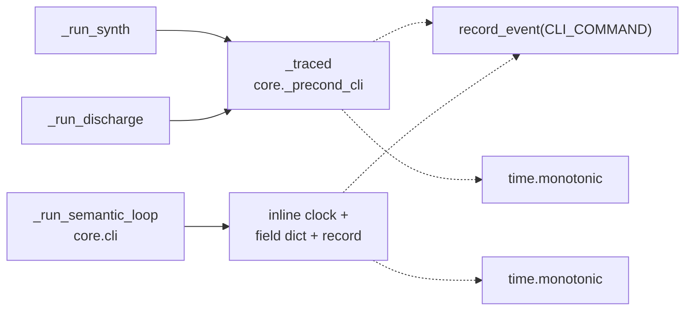

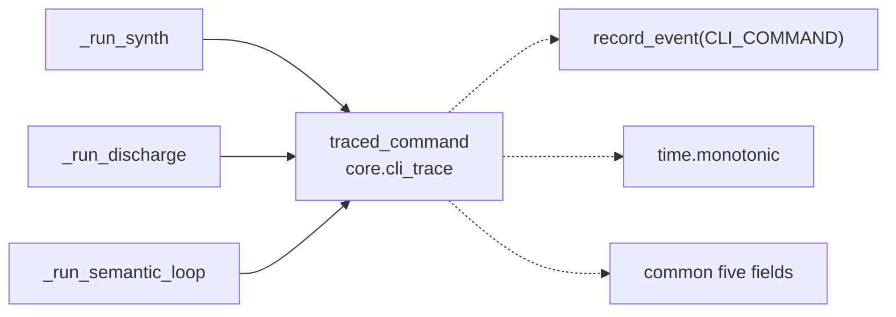

- **Recommendation strength** — Strong. Behaviour-preserving, strongly pinned by esbmc-free tests
  on both sides, and the duplication is three days old rather than settled convention.

---

### `cli-check-phase-argument-block` — the check-phase flag block, twice · Strong · score 20/25

*(Carried over from the backlog, first seen 2026-09-18; re-validated this run.)*

- **Files** — `src/forseti/core/cli.py:526-563` (the `check` subparser) and `:732-769` (the
  `semantic-loop` subparser); precedent at `:276-291` (`_add_unit_store_arguments`) and
  `core/_precond_cli.py:41-88` (`_add_precondition_arguments`). **File-count estimate: 1.**
- **Score** — **20/25** (leverage 3 — one file's two blocks collapse, no caller changes;
  locality 4 — both sites are already inside `cli.py`, so the rubric's "several *files* → one
  file" 5 is definitionally unavailable; blast radius 1 — one file, argparse surface unchanged;
  heat 5 — the hottest file in the tree).
- **Problem** — the two blocks are character-for-character identical apart from two prose strings.
  Re-checked at HEAD `f888cf0`: the multi-line `--unwind-ladder` f-string interpolating
  `CHECK_DEFAULT_UNWIND_LADDER` is byte-identical at `:538-542` and `:744-748`; the only deltas are
  the `--json` help (`:555` vs `:761`) and the passthrough example (`:561` vs `:767`). Changing the
  documented ladder default has to be done twice or the two subcommands silently document
  different defaults.
- **Deletion test** — concentrates; the extraction was already started twice in this codebase
  (`_add_unit_store_arguments`, `_add_precondition_arguments`) and stopped one block short.
- **Solution** — `_add_check_phase_arguments(p, *, json_help, passthrough_example)`.
- **Benefits** — *Locality*: the ladder default is documented once. *Test surface*: unchanged —
  both parsers are already exercised through `cli.main`.
- **Before / After**

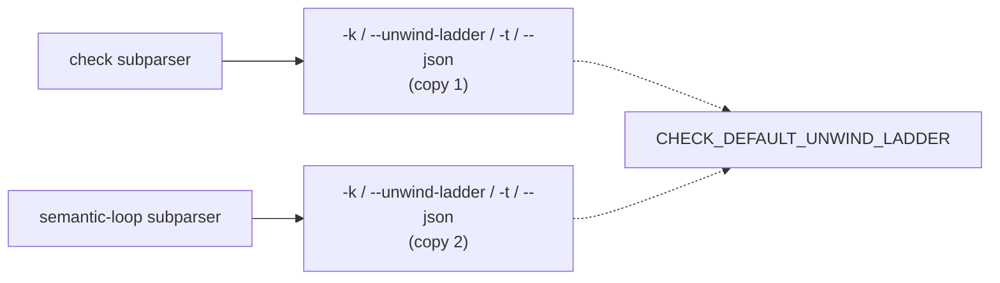

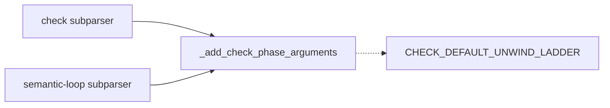

- **Recommendation strength** — Strong. The lowest-risk candidate in the tree; the natural next
  firing.

---

### `precond-unit-lister-default-four-copies` — four entry points, four unit-lister defaults, two that drop the timeout · Strong · score 20/25

- **Files** — `src/forseti/precond/verify.py:243-245` (`verify_precondition`, forwards
  `timeout_s`), `:277` (`synthesize`, **drops** it), `src/forseti/precond/discharge.py:344`
  (`emit_obligations`, **drops** it), `:385-388` (`discharge_precondition`, forwards it);
  `verify.py:173-200` (`plan_for`, the shared body); `core/_precond_cli.py:60-67`, `:148-153`,
  `:212-216`. **File-count estimate: 5.**
- **Score** — **20/25** (leverage 4 — four call sites collapse and a whole drift class becomes
  unrepresentable; locality 5 — the default policy spans two source files today and would become a
  one-file edit; blast radius 3 — five files, two exported signatures gain a keyword and
  `--emit-only` starts honouring `-t`; heat 4 — `discharge.py` 9 and `verify.py` 5 of the last 120
  commits).
- **Problem** — four entry points restate the same
  `list_units_fn or (lambda src: list_units(src, esbmc_bin=..., ...))` prologue before calling
  `plan_for`, and the copies have drifted: two forward the caller's `timeout_s`, two fall through
  to `list_units`' own `timeout_s: float = 30.0` (`esbmc/units.py:1512`).
  `tests/precond/test_discharge.py:679-713` states the invariant explicitly — every ESBMC
  parse-tree run a driver makes on its own must honour the requested timeout — and the siblings
  violate it with no test to notice. `forseti synth --emit-only -t 5` runs its probe with a 30 s
  budget.
- **Deletion test** — concentrates. One `unit_lister(esbmc_bin, timeout_s)` seam makes the
  drift unrepresentable rather than merely fixed.
- **Solution** — one lister factory (or fold the lister into `plan_for` and pass `esbmc_bin`/
  `timeout_s` through), plus threading `-t` into the two `--emit-only` CLI paths.
- **Benefits** — *Leverage*: four sites, one policy. *Test surface*: `emit_obligations` — a
  published export backing `forseti discharge --emit-only` — currently has **zero** tests under
  `tests/precond/`; giving it a seam is what makes it testable at all.
- **Before / After**

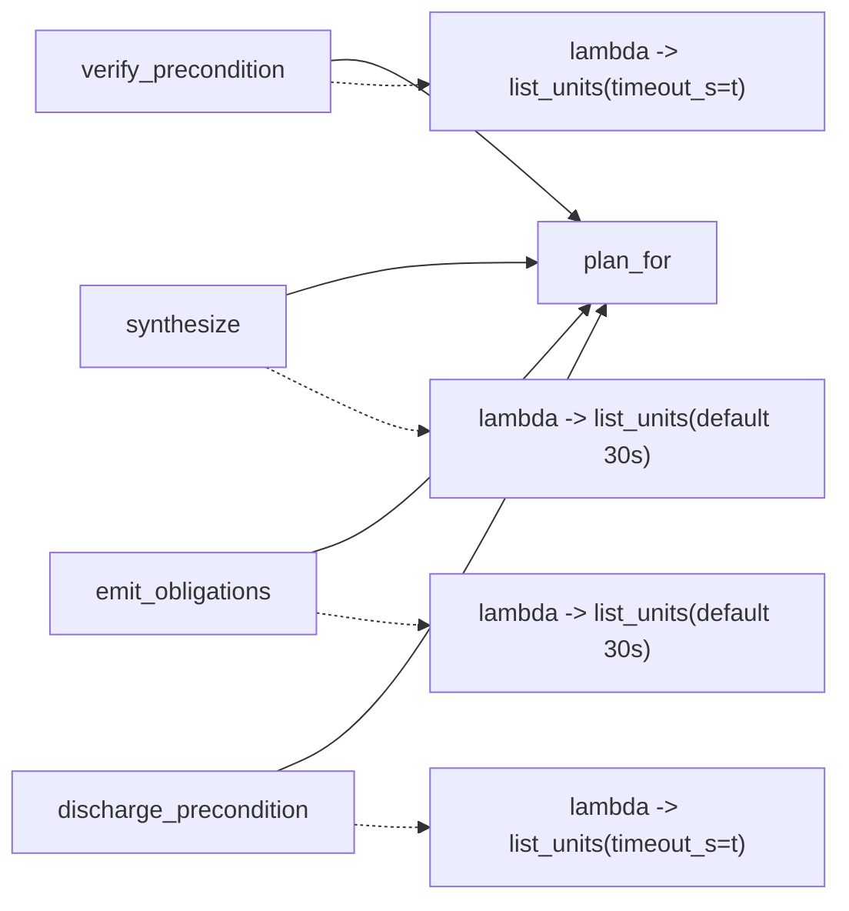

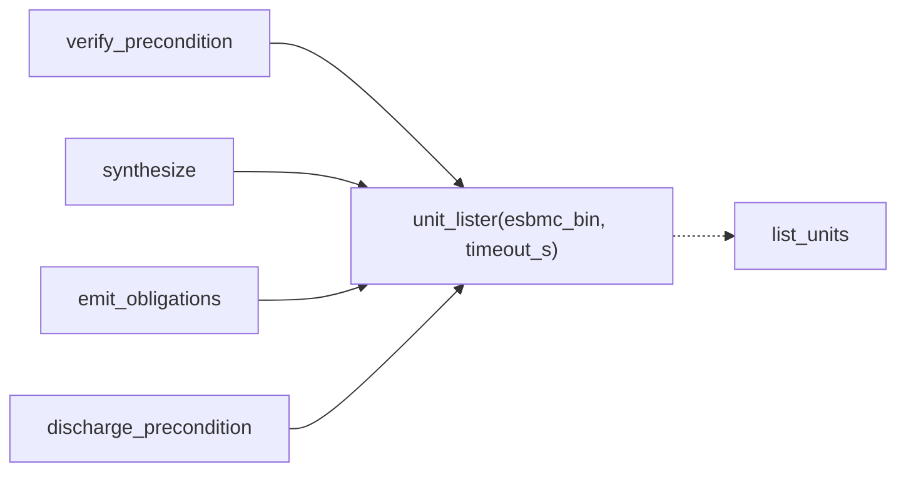

- **Recommendation strength** — Strong, with one caveat for whoever takes it: honouring `-t` on
  `--emit-only` is a (corrective) **CLI behaviour change**, so it wants to be called out in the PR
  body rather than folded in silently.

---

### `sibling-snapshot-staging-seam` — two snapshot stagers that have drifted three ways · Worth exploring · score 20/25

- **Files** — `src/forseti/adapters/claude_code/forseti_gate.py:552-765` (`_enumerable_source`),
  `:1484-1643` (`_verifiable_source`), `:414-444` (`_kernel_dir`), `:446-552`
  (`_index_ignore_snapshot`), `:286-309` (the two prefixes). **File-count estimate: 2–3.**
- **Score** — **20/25** (leverage 4 — the deeply-nested verify caller stops reaching past the
  staging seam; locality 5 — staging policy lives in two context managers today, one afterwards;
  blast radius 2 — two or three files, all private; heat 3 — `forseti_gate.py` 5 of the last 120).
- **Problem** — both context managers stage an immutable sibling snapshot beside a source, yield
  the path, and clean up, and they disagree in three measurable ways. Directory resolution: `:670`
  uses `_kernel_dir(os.path.dirname(spelled))`, `:1608` does the lexical thing the enumerate side
  documents at `:604-616` as staging beside the wrong translation unit. Index protection: the
  enumerate side registers `.git/info/exclude` and verifies with a real-path `git check-ignore`,
  failing closed; the verify side does neither. Cleanup: `:755-765` raises `UnitsUnavailable` on a
  failed unlink, `:1641-1643` silently suppresses it.
- **Deletion test** — concentrates. One `_staged_snapshot(...)` puts kernel-path resolution,
  exclude registration, check-ignore verification and cleanup policy in one place; the per-caller
  parts (`#line`/BOM prepend, `os.utime`) are payload, not a second stager.
- **Solution** — one stager with a `transform`/`mtime_ns` payload hook.
- **Benefits** — *Locality*: the asymmetric test coverage (≈15 staging tests on the enumerate
  side, none on exclude/kernel-paths/cleanup for the verify side) stops being a coverage gap and
  becomes one tested seam.
- **Before / After**

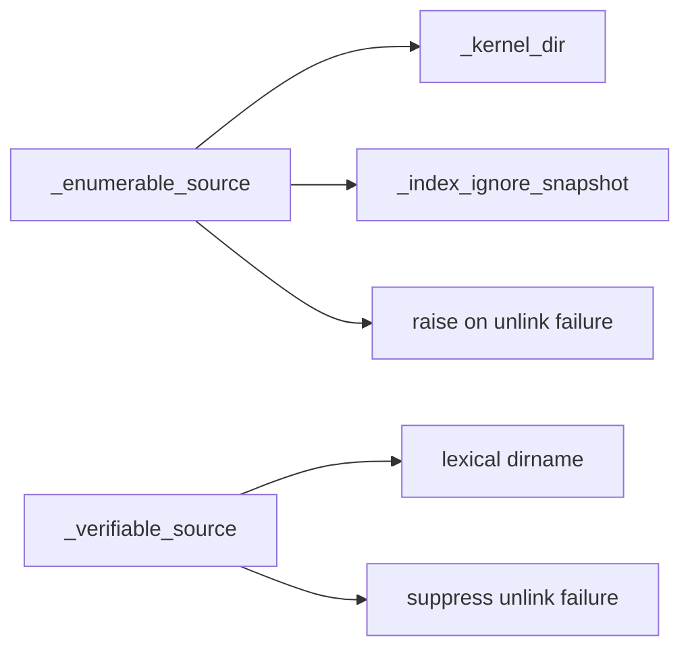

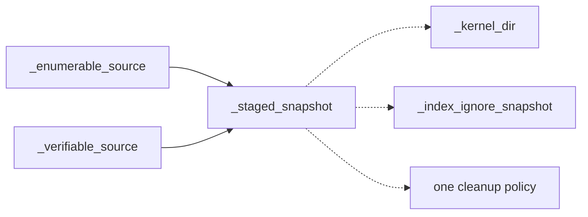

- **Recommendation strength** — Worth exploring, not Strong: reconciling the two directory
  resolutions is a **behaviour** change in the gate's most load-bearing path, and
  `.architecture/reviews/` history shows the same-directory-vs-mirrored question has a residual
  that wants a human. The three drifts should be reported as findings alongside the extraction,
  not silently unified.

---

### `forseti-cli-json-subprocess-seam` — six hand-rolled subprocess boundaries across three harnesses · Strong · score 20/25

*(Carried over, first seen 2026-09-18; all six sites re-confirmed this run at `forseti_gate.py:803`
and `:1646`, `property_gate.py:257`, `codex/verify_hook.py:82`, `oh_my_pi/verify_hook.py:114` and
`:137`.)* Score unchanged: leverage 4, locality 5, blast radius 3 (~10 files), heat 4.
Full card in `.architecture/reviews/2026-09-18-precond-sidecar-run-seam.md` and the backlog.

---

### `verify-port-test-doubles` — `FakeVerify` verbatim in 11 test modules · Worth exploring · score 20/25

*(Carried over, first seen 2026-09-18; re-confirmed this run — fresh class definitions counted at
`tests/core/test_core_check.py:55`, `tests/core/test_core_loop.py:63`,
`tests/orchestrator/test_persistence.py:26`, plus the `test_check.py`/`test_telemetry.py`/
`test_loop.py` copies.)* Score unchanged: leverage 4 (test-only, so it caps there), locality 5,
blast radius 3 (~15 files), heat 4.

---

### `scanned-source-carrier` — no carrier for "this source, scanned" · Worth exploring · score 20/25

*(Carried over, first seen 2026-09-18; re-confirmed — `esbmc/units.py:1530-1548` still threads
`masked` and `candidates` as loose positional args.)* Score unchanged: leverage 4, locality 4,
blast radius 3, heat 5. Still deliberately not picked: `units.py`'s scan heuristics have
historically needed differential runs against a `clang __LINE__` oracle to prove equivalence,
which is more verification than one unattended firing can carry.

---

### `renderability-authority-misses-identifiers` — the static authority has no identifier rule · Worth exploring · score 19/25

- **Files** — `src/forseti/properties/harness.py:261-338` (`renderability_reason`, and its
  docstring claim at `:262-264`), `:150-160` (`render_semantic_harness` delegating every
  `(signature, spec)` guard to it); `src/forseti/properties/proposer.py:415-438`
  (`validate_candidate`'s identifier rules — the only place they live), `:427-431` against
  `harness.py:325-334`. **File-count estimate: 4.**
- **Score** — **19/25** (leverage 4 — the seam moves to where the rule belongs and one exported
  entry point stops emitting invalid C; locality 4; blast radius 3 — four files and a behaviour
  change on an exported function; heat 4).
- **Problem** — `renderability_reason` documents itself as "the single static authority on whether
  a `(signature, spec)` pair can become a valid harness", and `render_semantic_harness` treats it
  as exactly that. But the identifier-existence rule lives only in the proposer's gate, so a caller
  holding the two documented inputs gets an incomplete check. The exploration pass **ran** it:
  `render_semantic_harness` with spec `result >= y` over a signature whose only param is `x`
  returns C containing `__ESBMC_assert((result >= y), "forseti:semantic");` — an undeclared `y`,
  no `HarnessError`. ESBMC gets a parse error instead of a fail-loud rejection. Second symptom:
  `proposer.py:432-435` re-expresses the output-parameter rule in a second vocabulary, and because
  `renderability_reason` is consulted first at `:427-431`, that branch is shadowed for output
  params.
- **Deletion test** — concentrates. Fold the identifier rules into the authority;
  `validate_candidate` shrinks to kind + safety + vacuity, the three genuinely source-free checks.
- **Solution** — move the identifier/`referenced_params` rules behind `renderability_reason` (or a
  `candidate_reason` beside it).
- **Benefits** — *Locality*: one home for "can this become a harness". *Test surface*: the 17
  `test_renderability_reason_*` tests become the complete oracle rather than a partial one.
- **Before / After**

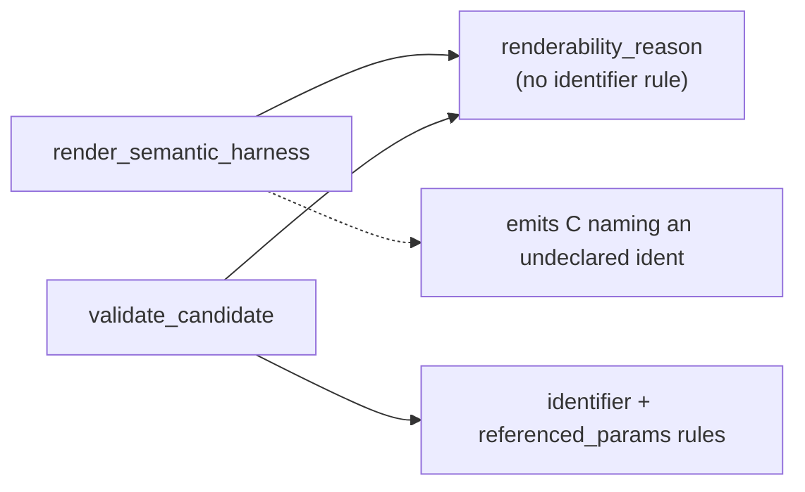

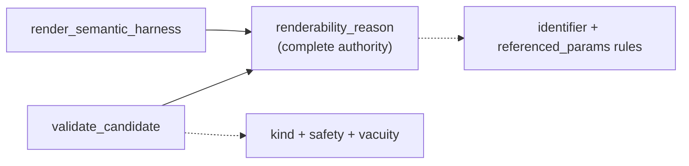

- **Recommendation strength** — Worth exploring. It is partly a **bug fix on a published export**
  (`render_semantic_harness` would start raising `HarnessError` where it emitted C), which an
  unattended run should not bundle into a refactor. The CLI paths narrow the exposure —
  `orchestrator/check.py:255` re-parses and fails loud — so the hole is on the direct API.

---

### `stop-gate-turn-outcome-carrier` — five outstanding kinds, four hand-built tallies · Worth exploring · score 19/25

- **Files** — `src/forseti/adapters/claude_code/stop_gate.py:252-462` (`main`, 210 lines),
  `:373-383`, `:409-423`, `:435-449` (the same five-field event tail, three times), `:44`, `:58`,
  `:68`, `:88`, `:127`, `:131`, `:145` (seven shallow `_*_message` helpers).
  **File-count estimate: 2–3.**
- **Score** — **19/25** (leverage 4, locality 4, blast radius 2, heat 3).
- **Problem** — `main()` computes five independent outstanding kinds, then re-derives from them at
  four separate exits (`outstanding` at `:298`, `n_out` at `:407`, the `decision` label at `:369`,
  the event tail three times). There is no value that says "this turn's tally", which is why `:373`
  and `:409` differ in which fields they carry.
- **Deletion test** — concentrates. A `TurnOutcome` owning the five buckets plus `.blocking`,
  `.n_out`, `.decision`, `.event_fields()` deletes all three hand-built tails.
- **Solution** — one `TurnOutcome` carrier; the `_*_message` helpers become its rendering.
- **Benefits** — *Locality*: the tally has one definition. *Test surface*: the `decision`/`n_*`
  event fields (asserted at `test_stop_gate_semantic.py:317`, `:333`) become properties of a value
  rather than of four code paths.
- **Before / After**

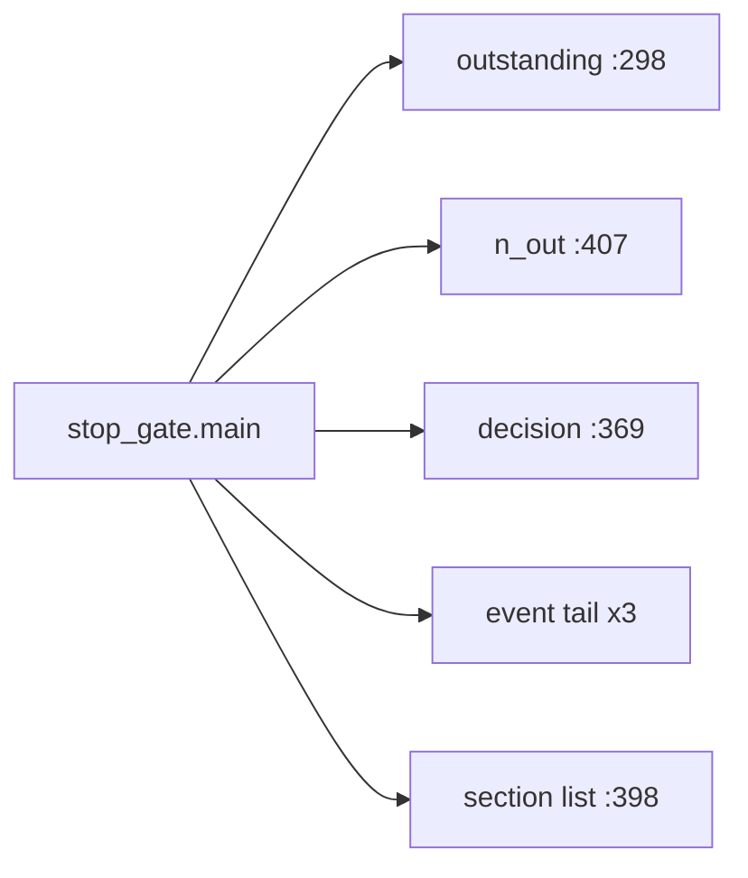

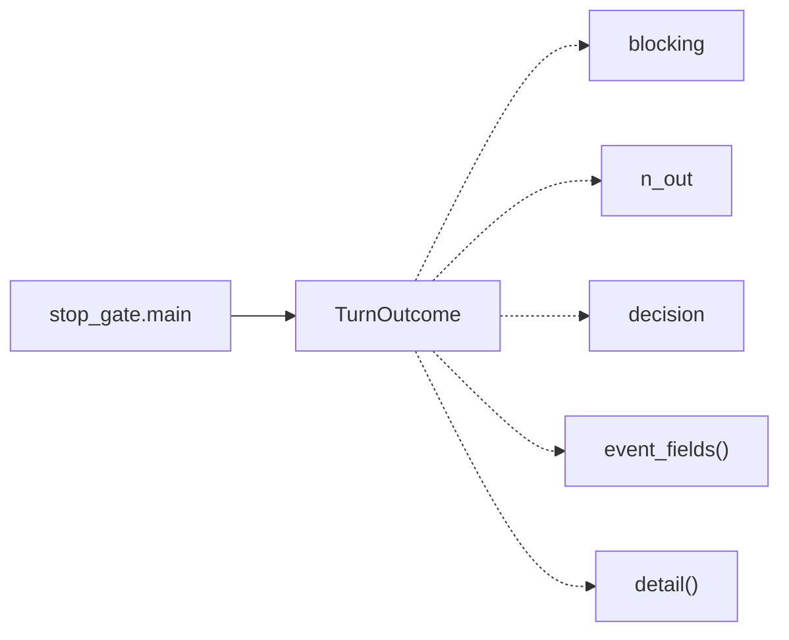

- **Recommendation strength** — Worth exploring. Constraint: the `stop` event field names in
  `.forseti/events.jsonl` are a trace format consumers filter on; keep the emitted keys identical.

---

### Remaining fresh candidates (compact)

| Candidate | Score | Sites | Why it ranked here |
|---|---|---|---|
| `semantic-loop-mode-vocabulary` | 18/25 | `core/loop.py:78`, `core/cli.py:658-663`, `:855-857`, `core/mcp_server.py:283-285` | Three legal modes restated four times; two published faces spell them differently (`check-only` vs `check_only`) bridged only by a `cast`. Only the `match` is `assert_never`-checked. Must stay additive. |
| `gate-state-carrier` | 18/25 | `forseti_gate.py:1786-1820` + 24 raw-key sites; `stop_gate.py`, `post_bash.py`, `property_gate.py` | Gate state is a bare `dict[str, Any]` with seven string keys spelled across 23 signatures. Concentrates, but `.forseti/gate_state.json` is persisted, so key names must not move. |
| `param-union-dispatch-three-walks` | 18/25 | `properties/harness.py:167-173`, `:351-368`, `:414-421` | Three hand-written dispatches over a two-member sealed union that disagree on the unknown case (raise / **skip** / raise); the third raise is dead. The one walk that does not fail loud is the one deciding what gets nondet-filled. |
| `repo-scope-resolution-prologue` | 18/25 | `forseti_gate.py:1148-1169`, `:1347-1367`, `:1403-1411`, `:998-1126` | Three sibling scans repeat a four-line `rev-parse --show-toplevel` prologue to satisfy a four-argument predicate. "This project's position in its repository" is one unnamed concept. |
| `assessment-vocabulary-four-tables` | 17/25 | `precond/verify.py:65-74`, `:89-111`, `:113-129`, `:206-214`; `precond/model.py:81-107` | One 7-member vocabulary interpreted by four hand-maintained tables in two modules, none exhaustiveness-checked. Verified: `DISCHARGED_VERIFIED` renders as `'ERROR (...)'`. `ASSESSMENT_EXIT_CODES` is a published exit-code contract. |
| `check-source-event-emission-bypass` | 17/25 | `core/check.py:177-203`; `orchestrator/check.py:288-379`; `orchestrator/telemetry.py:152-182` | Two independent emission systems produce the same two event names with different shapes and cardinality. The valuable fix is a **wire change** (cardinality of `property.check.start`) and belongs to a human; the behaviour-preserving half is narrower than it looks. Nothing currently asserts the Core-side shape. |
| `post-bash-gate-trace-seam` | 17/25 | `post_bash.py:44-78`; `post_tool_use.py:100-150` | `post_bash` is the only one of five gate emitters that emits no canonical `gate.decision`, and it re-derives the decision instead of using `Report.is_failure`/`.exit_code` from #275. **Fold into `canonical-gate-decision-helper` rather than filing twice.** |
| `signature-tests-two-homes` | 15/25 | `tests/properties/test_signature.py:31-145`; `tests/properties/test_harness.py:464-514`, `:796-823` | Nine test names in both files, five byte-identical; `test_signature.py` is a strict superset. Test hygiene, not module depth. |
| `orchestrator-run-record-append` | 13/25 | `orchestrator/persistence.py:188-236` | The same eight-line JSONL recipe twice — but **neither function has a caller in `src/`**. The honest move is to ask a human whether `.forseti/runs/` is still live before merging or deleting. |

## Dropped

| Candidate | Dropped because |
|---|---|
| `hook-subcommand-dispatch-triple` | Already in the backlog — it is the same "one dataclass per harness" idea as `harness-registry-dispatch-table`, in a different handler pair. Folded into that entry as a widening rather than filed twice. Constraint recorded there: `cli.py:925-929` documents the per-invocation lazy imports as deliberate, so any table must keep the import inside the dispatch callable. |
| `post-bash-gate-trace-seam` (as a separate entry) | Overlaps `canonical-gate-decision-helper`; recorded as a widening of it, with the missing fifth emitter noted. |
| `event-log-write-text-atomic-reexport` | Leverage 1 — a one-line import fix plus moving three tests. Import hygiene, nothing concentrates. |
| `esbmc-result-render-runner-cluster` | Leverage 1 — `render.py:31,58` are exhaustive `match`es over a sealed union with `assert_never` and `runner.py:66` `classify` is a genuine abstraction over esbmc's banner grammar. Shallow by line count only; deleting them scatters. |

## Too large to automate

None this run. No surviving candidate scored blast radius 5. The two that come closest are
`pointer-length-pairing-two-parsers` (blast radius 4 — reconciling byte-length against
element-count decides what a generated harness allocates, a behaviour decision) and
`precond-under-unwound-detection-into-esbmc` (blast radius 4 — changes `esbmc.verify`'s published
verdict under one flag); both stay `proposed` in the backlog for a human to schedule.

## Pick

**`cli-command-trace-wrapper`, 22/25.**

The **runner-up candidate** is `cli-check-phase-argument-block` at 20/25, which won the four-way
tie-break inside the 20-point band on the rubric's first criterion, lower blast radius (1, against
3 for `precond-unit-lister-default-four-copies`, `forseti-cli-json-subprocess-seam`,
`verify-port-test-doubles` and `scanned-source-carrier`, and 2 for `sibling-snapshot-staging-seam`).

The top two are **2 points apart**, so this was not a close pick. What separated them is locality
and leverage on the same axis: `cli-command-trace-wrapper`'s two copies sit in two *different*
modules, so consolidating them is the rubric's "several files → one file" 5, where
`cli-check-phase-argument-block`'s two blocks are both inside `cli.py` and cap at 4; and the trace
seam pays back across three subcommands where the argparse block pays back across two.

Three further reasons it is the right one for an unattended firing:

1. **It is the newest duplication in the tree.** Both copies landed together in `7bcc812`
   (#301/#303), the most recent functional commit. Catching a duplication three days after it
   appears is worth more than catching one that has been stable for a month.
2. **The contract it enforces is already written down exactly once** — `core/events.py:38-41` and
   `docs/design/0001-harness-portability.md:131` — so there is an existing, published oracle for
   what the seam must preserve. The refactor is behaviour-preserving by construction.
3. **It is strongly pinned by esbmc-free tests on both sides.**
   `tests/core/test_precond_cli.py:266-290` is parametrized over both precond commands × all three
   exit paths, and `tests/core/test_semantic_loop_cli.py:568-665` covers the loop's success,
   argument-error and all-rejected paths. Handler identity is separately pinned by
   `tests/core/test_core_cli_dispatch.py:62-65` and `tests/core/test_precond_cli.py:57`, so
   `_run_synth` / `_run_discharge` / `_run_semantic_loop` must keep their names and module
   bindings — a constraint the design must respect.

## Design

Four interfaces were produced in parallel by sub-agents, each briefed to a different constraint,
before any adjudication. All four satisfy the same hard constraints, which are worth restating
because they are what makes this refactor behaviour-preserving:

1. The emitted JSON stays byte-identical per command (`record_event` serialises with
   `sort_keys=True`, so only the key *set* and the values are load-bearing).
2. `_run_synth`/`_run_discharge` stay in `_precond_cli` and `_run_semantic_loop` in `cli`, under
   exactly those names, as the objects argparse binds — `tests/core/test_precond_cli.py:57` and
   `tests/core/test_core_cli_dispatch.py:62-65` assert *identity*, not just callability.
3. Exactly one event per invocation, on every exit path. Today this is a **structural**
   guarantee: the handler returns `tuple[int, X | None]` instead of calling `sys.exit`. All four
   designs keep it structural and none adds a `try/finally` — an escaping exception records
   nothing today, and inventing a payload for a crash would be a wire-format change.
4. The new home must be importable by both `core/cli.py` and `core/_precond_cli.py` without a
   cycle.
5. The handler's second return element is differently typed per command (`Assessment | None` vs
   `SemanticLoopResult | None`) and must stay checkable under `ty check src tests`.

**One fact all four flagged independently:** `src/forseti/` contains no generics today — no
`TypeVar`, no `Generic[`, no PEP 695 type parameters, and (for Design A) no `@overload`. Whichever
design is taken is the first to find out how `ty>=0.0.81` behaves on the construct it needs, and
each carries a stated fallback.

### Design A — minimal interface: `@traced("synth")`, one entry point, closed command set

New `core/_cli_trace.py`. A decorator factory `traced(command: CliCommand)` returning a frozen
`TracedHandler(command, run)` whose `__call__` is the whole policy. `CliCommand` is a
`Literal["synth", "discharge", "semantic-loop"]`; a private `_payload_fields` holds one `match`
arm per command, closed with `assert_never`. Two `@overload` stubs pair the command literal with
its payload type, so `@traced("synth")` accepts only an `Assessment`-returning handler.

*Call site*: `@traced("synth")` above the handler — one line. The `_run_X`/`_X` forwarder split
disappears; `_run_synth` becomes the body.

*Dependencies*: both hard-wired. Argues the clock is a hypothetical seam (one adapter ever;
`monkeypatch.setattr(_cli_trace.time, "monotonic", ...)` is a free seam that costs the interface
nothing) and that injecting the sink would make the tests **weaker**, because asserting a Python
dict against a fake stops testing `sort_keys`, the one-line append and JSON-serialisability —
which are what make the trace a contract.

*Stated weakest point*: **the seam is closed.** A fourth traced subcommand costs one line at the
call site but requires editing `_cli_trace.py` twice (a `match` arm and an `@overload`), and the
trace module must import `Assessment` and `SemanticLoopResult` — so `_precond_cli` transitively
gains an import of `core.loop` (and thus `orchestrator`/`properties`) that it does not have today.
Compensating property: `assert_never` makes that edit a type error rather than a silent drift.
Second cost: a mismatched payload degrades to `null` rather than failing loudly.

### Design B — maximum flexibility: injectable `Tracer` with an ambient `ContextVar`

New `core/_cli_trace.py` publishing **14 names**: `Handler`, `FieldsFor`, `Clock`, `FRAME_FIELDS`,
`TraceSink` (Protocol), `discard`, `Tracer` (frozen dataclass bundling sink + clock),
`current_tracer`, `use_tracer` (context manager over a `ContextVar`), `TracedCommand[R]` (generic
frozen dataclass with `.run(handler, args)`), `unit_fields`, `RecordedEvent`, `CollectingSink`,
`StepClock`. Per-command projections merge *under* the three frame fields, so a projection cannot
clobber `command`/`exit_code`/`duration_s`.

*Call site*: a projection function, a module-level `_SYNTH = TracedCommand("synth", _precond_fields)`,
and `return _SYNTH.run(_synth, args)`.

*Dependencies*: both injected. Argues the sink is a real seam with three adapters doing three
different jobs (`record_event`, `CollectingSink`, `discard`) and that this is the repo's own house
style — `orchestrator/telemetry.py:41-90` already ships `EventSink` + `NullSink` + `ListSink` +
`JsonlSink`. Concedes the clock is the weaker of the two and would be the first thing cut.

*Stated weakest point, in its own words*: "the payoff is entirely in futures… break-even is
roughly the fourth traced command, or the first non-`events.jsonl` destination. **If neither
arrives, this design is a net loss and Design A wins.**" Second: the ambient `ContextVar` is
action at a distance — reading `_run_synth` no longer tells you where the event goes, and no
production path can use the explicit `tracer=` override, because argparse owns the call.

### Design C — trivial common case: a `CliTrace[T]` family used as a decorator

New `core/_cli_trace.py` with a frozen generic `CliTrace[T](extras)` whose `__call__(command)`
returns a decorator. Two commands sharing a published contract row share one family object:
`_traced = CliTrace[Assessment](_precond_extras)` covers both `synth` and `discharge`.
`functools.wraps` carries `__name__`/`__qualname__` so tracebacks and the dispatch test's failure
message still say `_run_synth`.

*Call site*: `@_traced("synth")` — one line, and the handler body is byte-for-byte today's
`_synth`. Six functions become four in `_precond_cli`; the `_run_X`/`_X` split is gone.

*Dependencies*: both inside. Same reasoning as A, plus a second-order argument: `record_event`
never raises, so "a seam whose dependency has no error mode and no second implementation carries
nothing". Notes `CliTrace` is a frozen dataclass, so a future `sink=record_event` field would
arrive with zero call-site churn — the seam is *shaped* for it without being *paid for*.

*Stated weakest point*: **the source signature lies about the bound signature.** `cli.py` will
read `def _run_semantic_loop(args) -> tuple[int, SemanticLoopResult | None]` while what the module
exports under that name is `(Namespace) -> int`. Also flags that if `ty` degrades on the generic
decorator application, `_run_synth` becomes `Unknown` and **nothing errors** — the check silently
stops checking — which is why its test surface includes a type-level pin.

### Design D — ports and adapters: `traced(...)` with `TracePort` and `ClockPort`

New `core/cli_trace.py` (unprefixed — the seam is not private glue). One function
`traced[ResultT](command, run, args, *, fields, clock=time.monotonic, trace=record_event)`, two
`Protocol`s with positional-only parameters in `orchestrator/ports.py`'s idiom, a shipped
`ListTrace` test adapter, a `COMMON_FIELDS` frozenset, and `if TYPE_CHECKING` structural guards
that fail `ty check` if `record_event` or `time.monotonic` drifts from its port.

*Call site*: a `fields` builder plus `return traced("synth", _synth, args, fields=_precond_fields)`.
The `_run_X`/`_X` split is **kept**, so no signature lies.

*Dependencies*: per-port pricing, done rigorously. `TracePort` is judged **weakly real** — the
grounded second adapter is a dry-run `NullTrace`, which the design doc already commits to ("a dry
run (`persist=False`) records nothing") and `--no-store` already exists on `propose`/`submit-property`.
It explicitly refuses to count `adapters/claude_code/event_log.log_event` as a second adapter even
though it is structurally assignable, calling that "gaming the rule". `ClockPort` is declared
**hypothetical** outright: "Nobody will supply a second production clock. I am not going to pretend
otherwise."

*Stated weakest point*: because injection is by default argument and `main` is untouched, **the
fake adapters never run on the argparse dispatch path.** A test driving `traced` with a `ListTrace`
proves the wrapper emits correctly; it does not prove `args.func` is bound to a handler that calls
the wrapper. So the port does not increase confidence in the property that actually matters — it
increases locality and makes the duration assertion exact.

*Bonus finding*: D was asked whether a port here is the right precedent for eventually fixing
`core/check.py` vs `orchestrator/check.py` (the backlog's `check-source-event-emission-bypass`).
Its answer is **no**, with evidence: those are two different events wearing the same name in two
different envelopes (`unit_id`/`outcome` flat vs `index`/`k`/`verdict`/`detail` in a frozen `Event`),
so swapping the sink reconciles nothing — "you would have a port whose two adapters emit
incompatible schemas and call it unified". That reasoning is recorded on the backlog entry.

### Adjudication

*Written below after the advisor pass.*
