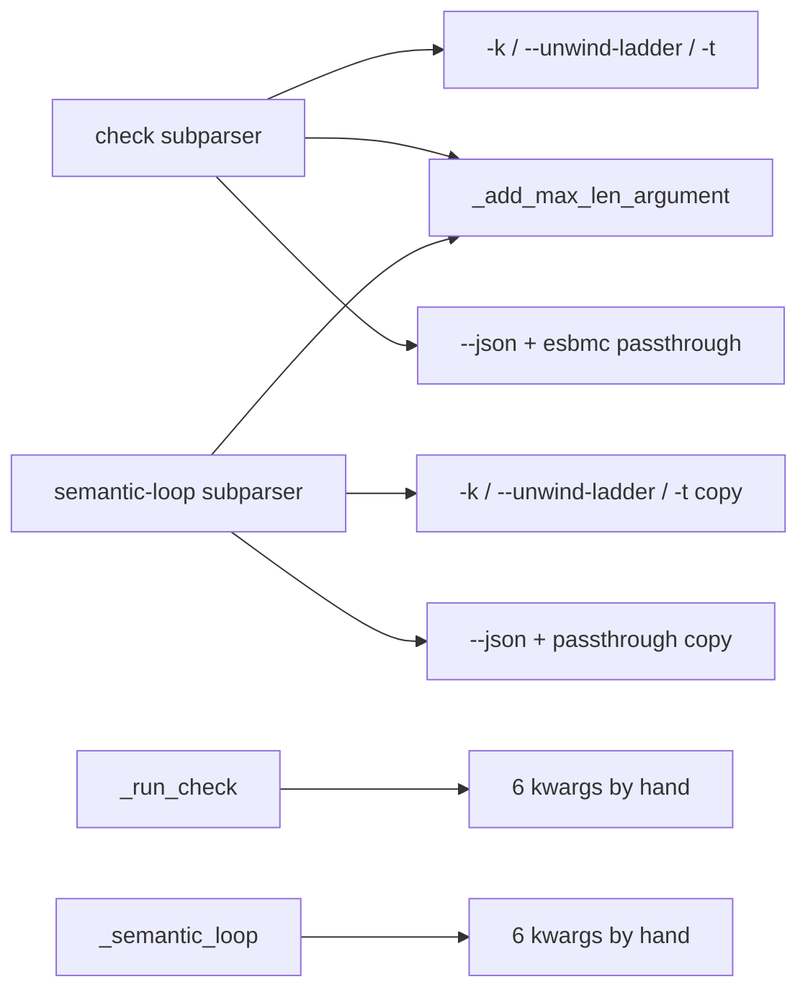
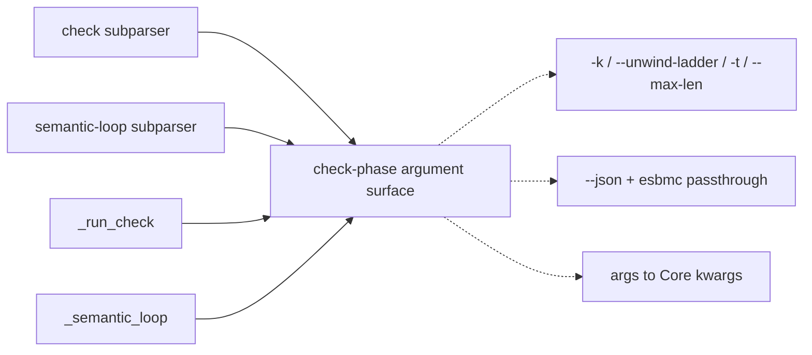
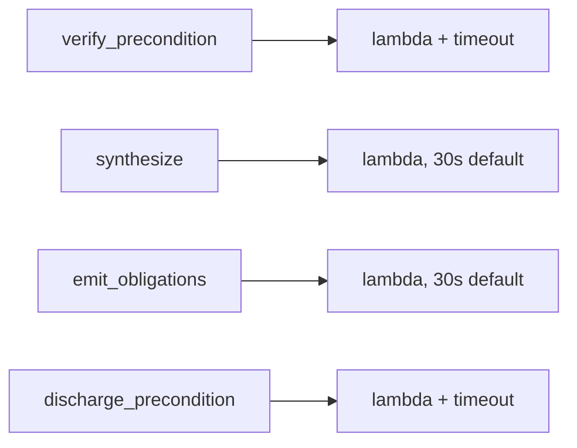
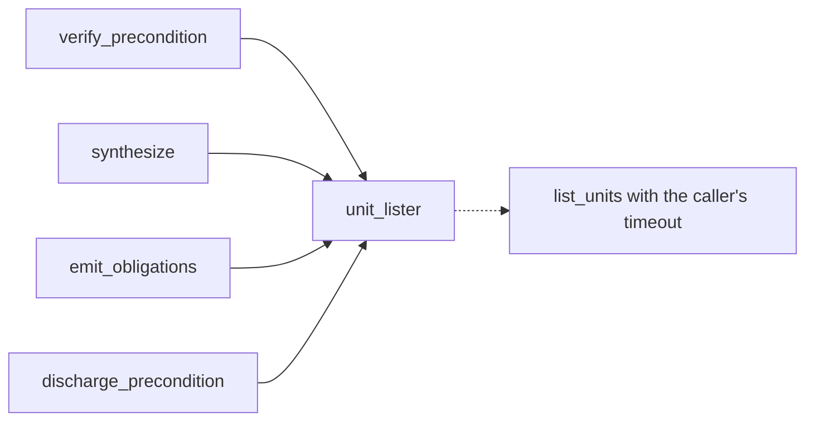
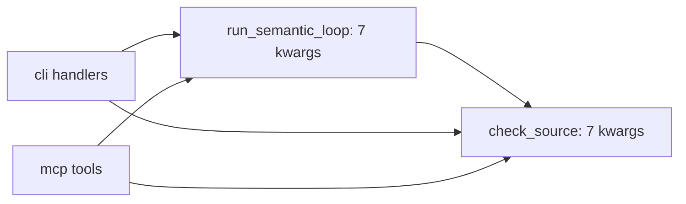
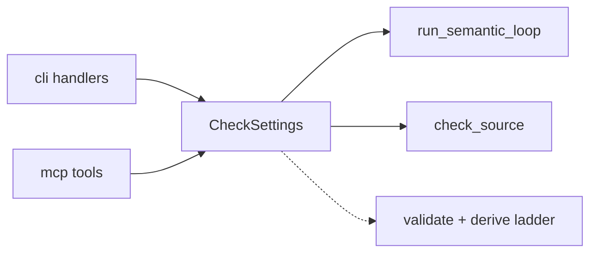
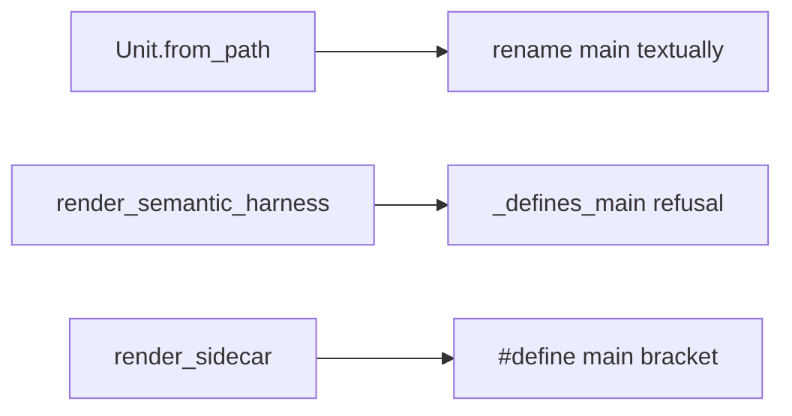
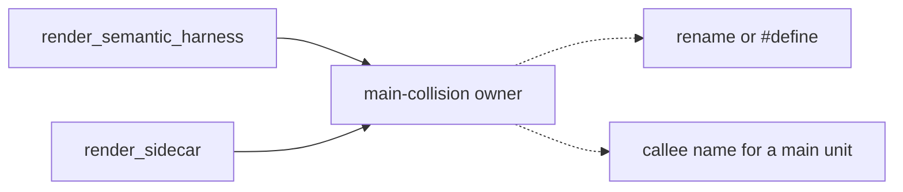
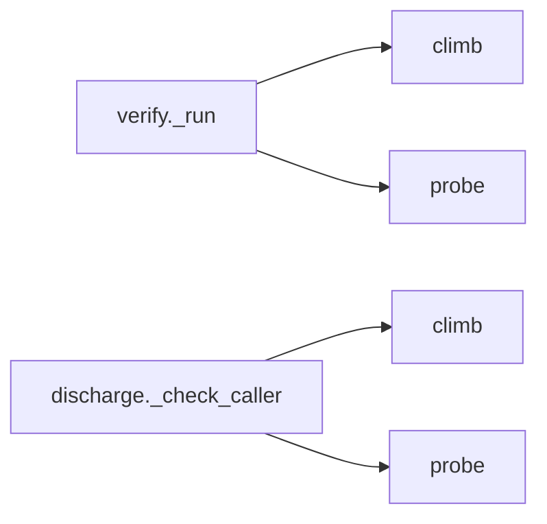
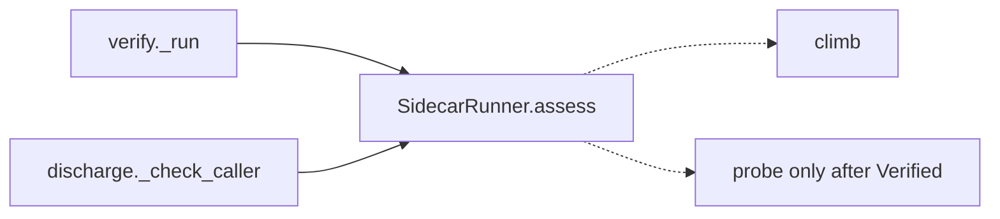

# Architecture review — forseti — 2026-09-22

**Scope**: the hot spots since the 2026-09-21 firing. Three commits changed code: `e552555`
(#306, `max_len` threaded through `core/check.py`, `core/cli.py`, `core/loop.py`,
`core/mcp_server.py`, `orchestrator/{check,ports,transcript}.py`, `properties/harness.py`),
`a913b99` (#305, `precond/synth.py` + `precond/verify.py`) and `2840647` (#307, `core/_cli_trace.py`).
The scan ran as three parallel passes:
- one on #306's `max_len` threading and the check-phase surface around it;
- one on `precond/` + `orchestrator/` + `properties/` for friction the backlog does not already list;
- one re-checking every `proposed` backlog entry at HEAD `e552555`.

**Picked**: `cli-check-phase-argument-block`, 22/25. See the PR and `.architecture/backlog.md`.

**Degradations**: none. `gh` is authenticated, sub-agents were available, and the advisor was consulted
at the pick.

**Heat is measured this run, not estimated.** Heat is derived from **W**, the number of commits in
`HEAD~60..HEAD` that touch any of the entry's listed modules. The mapping is W 0–1 → 1, 2–3 → 2,
4–5 → 3, 6–7 → 4, ≥8 → 5. The rule is applied to every `proposed` entry, not only the fresh ones, so
several scores moved (see the backlog's `Re-check 2026-09-22` lines). Earlier firings estimated heat
by eye. Two examples of what changed:
- `scanned-source-carrier` had been scored at heat 5 with W=0.
- `sibling-snapshot-staging-seam` had been scored at heat 3 with W=1.

Measuring heat is what splits the old five-way 20/25 tie.

**Diagram legend**: in every Mermaid block, a **solid** edge is part of a module's *interface*.
A **dashed** edge is *inside* the implementation, behind the seam.

## Candidates

### `cli-check-phase-argument-block` — the check-phase flag surface, written twice · Strong · score 22/25

- **Files**
  - `src/forseti/core/cli.py:547-585`: the `check` subparser's flag block.
  - `:755-793`: the `semantic-loop` subparser's flag block.
  - `:636-652` (`_run_check`) and `:885-905` (`_semantic_loop`): the two handlers that turn the same
    parsed flags into Core keyword arguments.
  - Earlier partial extractions: `_add_unit_store_arguments` (`:276-291`) and
    `_add_max_len_argument` (`:512-530`, added by #306), plus `add_esbmc_invocation_arguments`
    (`esbmc/verify_cli.py:43`).
  - In-repo template for the finished pair: `add_verify_arguments`/`verify_kwargs`
    (`esbmc/verify_cli.py:74-124`).
  - **File-count estimate: 2** (`core/cli.py` plus one new test file).
- **Score** — **22/25**
  - *Leverage 4*: four call sites simplify (two parser blocks and two handler forwards). The shared
    surface is `-k`, `--unwind-ladder`, `-t`, `--max-len`, `--json`, and `--esbmc-bin` with its `--`
    passthrough. Adding a fifth check-phase knob becomes a one-site edit instead of four. This was
    raised from 3 because the entry now takes the handler-kwargs half as well as the argparse half
    (see *Solution*).
  - *Locality 4*: the check-phase argument surface, its defaults and its help prose live in one
    place. Both sites are in one file, so the rubric's "several files → one file" 5 is not available.
  - *Blast radius 1*: one source file, private helpers only. The argparse surface and the Core calls
    stay byte-identical.
  - *Heat 5*: W=9. `core/cli.py` is the hottest source file in the tree, and #306 edited both
    blocks one day ago.
- **Problem**
  - **The blocks are identical except in two places.** The two flag blocks are character-for-character
    identical apart from the `--json` help (`:577` vs `:785`) and the passthrough example (`:583` vs
    `:791`). That includes the f-string help interpolating `CHECK_DEFAULT_UNWIND_LADDER`.
  - **Every knob is a four-site edit.** Each new check-phase knob lands in both blocks and both
    handler forwards. #306 shows the cost: it added `--max-len` by extracting `_add_max_len_argument`,
    the codebase's *third* partial extraction that pulls out one flag and stops. It then still edited
    both handlers by hand (`max_len=args.max_len` at `:651` and `:904`).
  - **The drift the entry predicted has happened, identically in both copies.** Since #306, a
    `--max-len ≥ 16` appends an N+1 rung to the default ladder. Both `--unwind-ladder` help strings
    (`:559-563`, `:767-771`) still say the default is "whichever of 8,16 exceed --unwind". A fix today
    has to be made twice, and in the MCP face's two docstrings too.
  - **The handlers repeat the translation from args to Core kwargs.** They forward the same six
    values, `unwind`, `unwind_ladder`, `timeout`, `esbmc_args`→`extra_flags`, `esbmc_bin` and
    `max_len`. The only difference is a keyword spelling: `timeout_s=` for `check_source` and
    `check_timeout_s=` for `run_semantic_loop`, because the loop also takes a `propose_timeout_s`.
- **Deletion test**: **concentrates.** Delete both blocks and both forwards in favour of one
  argument-surface module inside `cli.py`, owning the flags, their defaults, their help and the
  args→kwargs translation. Complexity does not reappear at the call sites: each subparser states only
  its two prose deltas, and each handler states only the keyword its Core entry point spells
  differently.
- **Solution**: add a private `_add_check_phase_arguments` / `_check_phase_kwargs` pair in `cli.py`,
  modelled on `add_verify_arguments` / `verify_kwargs`.
  - `_add_check_phase_arguments` registers the shared surface once. It takes as parameters only the
    two strings that genuinely differ.
  - `_check_phase_kwargs` is the one place the parsed flags become Core keyword arguments.
  - The exact interface is settled by the design pass below.
  - The stale ladder help is **not** fixed here: it is published CLI help and the MCP tool
    descriptions carry the same sentence. It is reported as a finding for a human.
- **Benefits**
  - *Leverage*: a new check-phase knob, or a default change, is one edit.
  - *Locality*: the ladder help, which is wrong today, becomes a one-site fix.
  - *Test surface*: the helpers can be tested directly against a bare `ArgumentParser`, esbmc-free,
    without driving `cli.main`. Behaviour preservation is shown by diffing `format_help()` for both
    subcommands against the pre-change tree.
- **Before / After**

### `precond-unit-lister-default-four-copies` — four unit-lister defaults, two that drop the timeout · Strong · score 20/25

- **Files**
  - `precond/verify.py:243-245` (forwards `timeout_s`) and `:277` (`synthesize` has no `timeout_s`
    at all).
  - `precond/discharge.py:344` (`emit_obligations` drops it) and `:385-388` (forwards it).
  - `plan_for` at `verify.py:173-200`.
  - CLI sites `core/_precond_cli.py:61-65`, `:151-155`, `:215-219`.
  - Estimate ~5.
- **Score**: 20/25.
  - *Leverage 4*: four entry points share one default.
  - *Locality 5*: two modules become one seam.
  - *Blast radius 3*: `emit_obligations` is a published export.
  - *Heat 4*: W=6. #305 touched `verify.py`.
- **Problem**: four copies of `list_units_fn or (lambda src: list_units(...))`. Two of them fall
  through to `list_units`' own 30 s default, so `forseti synth --emit-only -t 5` probes with a 30 s
  budget.
- **Correction this run**: `emit_obligations` *is* tested (`tests/precond/test_discharge.py:642-670`
  pins its `SynthError`/`OSError` mappings). Only the default lister lambda is unexercised.
- **Deletion test**: concentrates. One `unit_lister(esbmc_bin, timeout_s)` seam makes the drift
  impossible to write.
- **Why it is not the pick**: 2 points behind. It also carries a CLI behaviour change (honouring `-t`
  on `--emit-only`) that must be called out rather than folded in.

### `check-settings-carrier` — the check phase's seven knobs have no name · Worth exploring · score 17/25 (new)

- **Files**
  - `core/check.py:76-129`, `:202-217`
  - `core/loop.py:50-58`, `:133-140`, `:162`, `:220-233`
  - `core/cli.py:636-652`, `:885-905`
  - `core/mcp_server.py:221-232`, `:299-318`
  - Estimate ~8–9 including tests.
- **Score**: 17/25.
  - *Leverage 3*: concentrates the Core layers, but the MCP faces keep their flat schema, because
    the typed parameter list *is* the tool schema (see the dropped `mcp-server-tool-wrappers`).
  - *Locality 4*.
  - *Blast radius 4*: changes the signatures of `check_source` and `run_semantic_loop`, both exported
    from `core/__init__.py`.
  - *Heat 5*: W=11.
- **Problem**
  - `unwind`, `unwind_ladder`, `timeout_s`, `extra_flags`, `esbmc_bin`, `max_len` and `verify_port`
    are threaded as loose keywords through six layers. `run_semantic_loop` passes all of them
    straight through; it needs the `check_timeout_s` prefix only to tell its timeout apart from the
    proposer's.
  - Validation is split by knob, and the ordering differs:
    - `max_len` is validated before anything runs (`loop.py:162`, `check.py:203`).
    - The ladder is validated only inside the driver (`orchestrator/check.py:309`), *after*
      `property.check.start` is written and, in the loop, after the LLM call.
    - `validated_max_len`'s docstring claims it mirrors `validated_ladder`. It does not.
- **Deletion test**: partial. It concentrates the Core layers and validation, but the face parameter
  lists only move.
- **Solution sketch**: a frozen `CheckSettings` with `.ladder` / `.verify_port(source)`, validated
  at construction.
- **Relation to the pick**: this candidate overlaps the pick only at the CLI's args→kwargs
  translation. The pick's `_check_phase_kwargs` is the CLI half of this idea, with no change to an
  exported signature.

### `harness-main-rename-owner` — the module that emits `int main` does not own avoiding the collision · Worth exploring · score 17/25 (new)

- **Files**
  - `orchestrator/ports.py:24-32`, `:53-108` (`Unit.from_path`'s text rewrite to
    `__forseti_unused_main`).
  - `properties/harness.py:182-185`, `:670-689` (`_defines_main` refuses only a leftover
    *definition*).
  - `precond/synth.py:69-73`, `:448-450` (the `#define main __forseti_source_main` bracket, #305).
  - `properties/proposer.py:77-78` (a stated no-`main` precondition its production callers do not
    meet).
  - Estimate ~8.
- **Score**: 17/25.
  - *Leverage 3*.
  - *Locality 4*.
  - *Blast radius 2*.
  - *Heat 3*: W=4.
- **Problem**
  - "Rename a source's `main` away" is now implemented twice, with two spellings and two mechanisms:
    a text rewrite on the check path and a `#define` on the precond path.
  - The rule "a unit that *is* `main` is called by its renamed name" is written twice (`ports.py:107`,
    `synth.py:449`).
  - The check path's guarantee is split across two packages and linked only by a docstring
    (`harness.py:678-687`: "`Unit.from_path`'s job").
  - Verified by running: the text rewrite leaves a `main` that is referenced but not called
    (`int (*g)(void) = main;`) untouched. The `#define` path handles it.
- **Deletion test**: partial. On the check path it concentrates into the renderer that emits the
  colliding `int main`. Across the two renderers only the constant and the callee rule concentrate:
  one path pastes the source in, the other `#include`s it.

### `precond-sidecar-verdict-choreography` — the climb → probe → match walk, written twice · Worth exploring · score 17/25 (new)

- **Files**
  - `precond/verify.py:282-318` (`_run`) and `:321-368` (`_assess_non_vacuity`).
  - `precond/discharge.py:596-692` (`_check_caller`).
  - `precond/run.py:199-217` (`probe(at: SettledRun)` accepts any settled run).
  - Estimate ~4–5.
- **Score**: 17/25.
  - *Leverage 3*.
  - *Locality 4*.
  - *Blast radius 2*.
  - *Heat 3*: W=4.
- **Problem**
  - This is the residue PR #294 left and the 2026-09-21 re-check said was "recorded on its own entry".
    No such entry existed, so it is filed now.
  - Both drivers hand-write the same sequence: climb → handle `Violated` → handle not-`Verified` →
    probe at the settled k → a three-arm `match`.
  - "Only probe after a Verified climb" exists nowhere in code.
- **Deletion test**: partial. The sequence and the probe rule concentrate in `run.py`. The
  per-branch vocabularies (`Assessment`, `CallerOutcome`) and discharge's blame logic stay in each
  driver.
- **Solution sketch**: a `SidecarRunner.assess(...)` returning a closed `Settled | Probed` union.
  Needs a design pass first: the interface could come out as wide as the two walks.

### Remaining candidates (compact)

Every `proposed` entry was re-checked at HEAD `e552555`, and none is resolved. Scores below use the
measured heat. Full per-entry notes are in the backlog's `Re-check 2026-09-22` lines.

**19/25**
- `forseti-cli-json-subprocess-seam` (4,5,3; W=5)
- `verify-port-test-doubles` (4,5,3; W=5): 11 `FakeVerify` classes, 15 doubles in all, 104 call sites
- `harness-reply-triage-two-hooks` (4,4,2; W=5)
- `renderability-authority-misses-identifiers` (4,4,3; W=6): #306 added a public
  `build_property_harness` on the same unvalidated path
- `semantic-loop-mode-vocabulary` (3,4,2; W=9): the hyphen spelling now also reaches `events.jsonl`
  through `cli.command`
- `update-notice-emission-policy` (3,4,2; W=9)

**18/25**
- `sibling-snapshot-staging-seam` (4,5,2; W=1)
- `canonical-gate-decision-helper` (3,3,2; W=8)
- `harness-registry-dispatch-table` (3,3,2; W=9)

**17/25**
- `proposalresult-provenance-reflatten` (W=5)
- `unit-id-slug-derivations` (W=3): `_unit_slug`'s callers are dead in `src/`
- `open-caller-checks-openings-record` (W=3): correction, `find_open_callers` *does* run in
  `test_discharge.py:679-713`, but with all five openings empty, so a swapped keyword still passes
- `stop-gate-turn-outcome-carrier` (W=1)
- `gate-state-carrier` (W=3): 13 `state: dict[str, Any]` annotations, not 23
- `param-union-dispatch-three-walks` (W=2): grew to 5 walks and 7 `isinstance` sites via #306's
  `plan_length_bounds`
- `check-source-event-emission-bypass` (W=7): Core's `property.verdict` drops `length_bounds`

**16/25**
- `scanned-source-carrier` (W=0)
- `pointer-length-pairing-two-parsers` (W=2): widened, see below
- `proposal-request-prologue` (W=3)
- `repo-scope-resolution-prologue` (W=1)
- `adapter-install-skeleton-two-harnesses` (W=2)
- `precond-under-unwound-detection-into-esbmc` (W=7)
- `assessment-vocabulary-four-tables` (W=4)

**15/25 and below**
- `hook-stdin-envconfig-prologue` 15
- `semantic-loop-ingestion-verdict` 15 (new)
- `counterexample-fired-label-predicate` 14
- `esbmc-caller-openings-module-split` 14
- `precond-cli-subcommand-skeleton` 14
- `signature-tests-two-homes` 14
- `signature-definition-locator` 14 (new)
- `harness-length-bounds-planned-twice` 14 (new)
- `store-column-registry` 13
- `nondet-generator-convention-two-slugs` 13
- `gate-env-config-extraction` 12
- `esbmc-run-boundary` 12
- `orchestrator-run-record-append` 12

**New entries filed this run**
- `semantic-loop-ingestion-verdict`: the CLI overrides a `held` outcome to exit 1 when every
  submitted candidate was rejected (`cli.py:921-927`). The MCP `semantic_loop` tool returns `held`
  with no override, and Codex's `AGENTS.md:88-94` tells the model that `empty` means "every
  candidate was rejected".
- `signature-definition-locator` (verified by running): `extract_signature` reads a commented-out
  definition (`/* int f(long x, long y) { } */ int f(int x) {…}` gives `(long x, long y)`), while
  `find_definition_brace` masks comments and finds the real one. It is a corrective change, not a
  pure refactor.
- `harness-length-bounds-planned-twice`: `build_property_harness` calls `plan_length_bounds` once
  inside `render_semantic_harness` and again for the reported bounds. `render_property_harness` is
  now caller-less in `src/`.

**Widened**: `pointer-length-pairing-two-parsers`. #306 made the element-vs-byte drift visible to
users. `cli.py:515` says `check --max-len` "Mirrors `synth --max-len` (same name, same default)",
but for `f(int *p, size_t len)`, `--max-len 8` means 8 ints under `check` and 8 bytes under `synth`.
The cap is also emitted two ways (`harness.py:226-227` always emits `>= 0`; `synth.py:333-336`
omits it for unsigned types).

## Dropped

| Candidate | Dropped because |
|---|---|
| `max-len-ladder-rule-two-homes` (new) | Leverage 1. `default_unwind_ladder_above` (`core/check.py:82-102`) and `precondition_ladder` (`precond/run.py:83-88`) both derive `max_len+1`, but their shapes differ on purpose: `check` has a user-chosen base `unwind` shared with scalar-only properties, `synth` does not. A shared helper would take that difference as a parameter, and merging them changes one path's ladder. The *behavioural* version (per-property ladder trimming from `RenderedHarness.length_bounds`) changes the settled `k` on the wire and is a human's call. |
| `signature-reexport-indirection` | Leverage 1. Re-checked: #306 only added exports to `properties/__init__.py`; the facade reasoning is unchanged. |
| `mcp-server-tool-wrappers` | Leverage 1. Re-checked: #306 added `max_len` to both tools' typed parameter lists, and those lists are still the MCP schema. |
| `verify-and-record-decomposition` | Not a deepening. `forseti_gate.py` is unchanged since the last re-check. |
| `cli-run-handler-shape` | Leverage 1. Re-checked: `_run_harness_action` still owns the generic shape. |
| `esbmc-init-all-parser-surface` | Leverage 1. `esbmc/__init__.py` is unchanged. |
| `harness-writer-port-inline` | Simplification, not a deepening. #306 widened `RenderedHarness` with `length_bounds`, which makes the port carry more, not less. |
| `cli-json-or-render-epilogue` | Leverage 1. Re-checked: each epilogue still renders a different payload. |
| `codex-claude-verify-drift` | Fails the deletion test. The adapters are unchanged. |
| `event-log-write-text-atomic-reexport` | Leverage 1. Unchanged. |
| `esbmc-result-render-runner-cluster` | Leverage 1. Unchanged. |

## Too large to automate

None this run. No candidate scored blast radius 5.

## Pick

**`cli-check-phase-argument-block`, 22/25.** It is the top score, 2 points clear of the runner-up
candidate `precond-unit-lister-default-four-copies` (20/25), so this is not a close pick.

Before measured heat and the kwargs-half rescope, the entry sat in a five-way 20/25 tie. It would
have won that tie on the rubric's first tie-break anyway: blast radius 1 is the lowest in the whole
backlog. It is the entry the 2026-09-21 firing named as the natural next firing.

Why it is safe to take unattended:
- It touches one source file.
- The argparse surface and the Core keyword calls are behaviour-preserving, which the design pass
  proves by diffing `format_help()` against the pre-change tree.
- Both subcommands are already driven through `cli.main` by esbmc-free tests
  (`tests/core/test_core_check.py:433-722`, `tests/core/test_semantic_loop_cli.py:502`, `:688`).

Constraints the implementation must keep:
- `tests/core/test_core_cli_dispatch.py` pins handler identity (`cli._run_check`,
  `cli._run_semantic_loop`), so those names and bindings stay.
- The stale `--unwind-ladder` help is reported, not fixed. It also lives in
  `core/mcp_server.py`'s two tool docstrings and `demo/scaffold/CLAUDE.md:83-85`, so a one-copy fix
  would widen the drift.

## Findings for a human (not refactors)

1. **The Claude Code Stop gate can never settle a capped `(ptr, len)` property.**
   `adapters/claude_code/property_gate.py:303-306` passes `--unwind 4 --unwind-ladder ""`, and an
   explicit ladder that never exceeds `max_len` (default 8) reports UNKNOWN. The Oh-My-Pi hook uses
   the default ladder and does get the N+1 rung.
2. **The `--unwind-ladder` / `unwind_ladder` default is described wrongly in four places.** The two
   CLI copies say "whichever of 8,16 exceed --unwind", and the two MCP docstrings name the old
   one-argument `default_unwind_ladder_above(unwind)`. None mentions the N+1 rung #306 adds. The
   `-k` rule is also misstated at `core/check.py:174-179`, `cli.py:526-528` and `mcp_server.py`
   (`:212-215`, `:284-287`): an explicit `-k` *is* extended past `max_len`
   (`tests/core/test_core_check.py:344`).
3. **A bad ladder is validated late.** A bad `--unwind-ladder` fails only after `property.check.start`
   is written and, in `semantic-loop --mode propose`, after the LLM call. A bad `--max-len` fails
   before either.
4. **`extract_signature` parses a commented-out definition.** Filed as `signature-definition-locator`.
5. **A `main` referenced but not called is not renamed on the check path.** Filed under
   `harness-main-rename-owner`. The docstring at `esbmc/units.py:849-850` claims more than the
   scanner does.
6. **The MCP `semantic_loop` tool reports `held` when every submitted candidate was rejected.**
   Codex's `AGENTS.md` says `empty`. Filed as `semantic-loop-ingestion-verdict`.
7. **`core/loop.py:37-40` names a `forseti verify --fix` that does not exist.**

## Design

### Problem-space framing

Constraints any interface must satisfy:
- **Help must not change.** `format_help()` for `check` and `semantic-loop` stays byte-identical.
  Help order is registration order, so the shared registration must sit exactly where each block sits
  today: right after `_add_unit_store_arguments` in `check`, and right after `--max-candidates` in
  `semantic-loop`.
- **Core calls must not change.** The keyword arguments reaching `check_source` / `run_semantic_loop`
  stay identical, and both exported signatures stay as they are. The one real difference is the
  timeout keyword (`timeout_s` vs `check_timeout_s`).
- **The stale `--unwind-ladder` help is carried verbatim**, not fixed.
- **Handler identity is pinned.** `tests/core/test_core_cli_dispatch.py` pins `cli._run_check` and
  `cli._run_semantic_loop`, and forbids shared builders binding `func`.
- **Everything stays in `core/cli.py`.** It is the only consumer.
- **Dependency category:** in-process and pure (argparse plus a dict). No port, no I/O.

Illustrative shape, not a proposal:
`check_source(args.source, function=…, store_root=…, **<check-phase kwargs>(args))`.

Four designs were produced in parallel by sub-agents, each under a different constraint.

### Design A — minimal interface: two entry points plus a `timeout_kw` selector

- `_add_check_phase_arguments(p, *, json_help: str, passthrough_example: str) -> None`. Both
  arguments are required and keyword-only, so neither subcommand's wording is the silent default.
- `_check_phase_kwargs(args, *, timeout_kw: Literal["timeout_s", "check_timeout_s"]) -> dict[str, Any]`.
  It returns six keys: `unwind`, `unwind_ladder`, `<timeout_kw>`, `extra_flags`, `esbmc_bin`,
  `max_len`.
- `_add_max_len_argument` is folded into the registrar, since its only callers are these two sites.
  `_parse_ladder` stays module-level because tests import it.
- The 4-line "`None` means Core derives the ladder" comment moves into the reader's docstring.
- **Hides:** 11 lines of flag spelling, defaults, metavars, the `:g` timeout format, the passthrough
  prose, registration order, the `None`-vs-`()` ladder rule, and the list→tuple conversion for
  `extra_flags`.
- **Trade-offs:**
  - The registrar carries the leverage: about 38 lines per site become one call.
  - The reader is thin: about 6 lines per site. Its value is that the six forwarded values are
    spelled once.
  - The `**dict` splat is not keyword-checked by `ty`, the same cost as `verify_kwargs`. A recorder
    test and an `inspect.signature` test make up for it.

### Design B — maximum flexibility: a `CheckPhaseSettings` value with `from_args` / `as_kwargs`

- `_add_check_phase_arguments(p, *, json_help, passthrough_help)` registers the flags.
- A frozen dataclass `CheckPhaseSettings` has fields `unwind`, `unwind_ladder`, `timeout_s`,
  `max_len`, `extra_flags` and `esbmc_bin`, with Core's defaults. `from_args(args)` builds it from
  the parsed args, and `as_kwargs(*, timeout_keyword="timeout_s")` returns the Core keywords.
- A programmatic caller gets typed fields. A seventh setting is one field plus one `add_argument`
  plus one `from_args` line.
- The design names an explicit trigger for moving the class next to `check_source`: the MCP tools
  adopting it. Until then a shared module is a hypothetical seam.
- **Trade-offs:**
  - `from_args` is still a hand mapping, because two names differ.
  - It adds a class whose only consumer converts it straight back into a dict.
  - `timeout_keyword` is a plain `str`, not a `Literal`, so a third entry point stays possible.
  - Unlike A, it has three names to learn (the helper, the class, and `as_kwargs`).

### Design C — optimise for the common caller: `check`'s spelling is the default

- The same two functions as A, but with defaults:
  - `_add_check_phase_arguments(p, *, json_help="emit the check run as a JSON object", passthrough_example="... file.c --function f -- -DNDEBUG")`
  - `_check_phase_kwargs(args, *, timeout_key: Literal[...] = "timeout_s")`
- `check` calls both with no arguments. `semantic-loop` passes its three overrides.
- `_add_max_len_argument` is kept as its own function, for its #299 docstring.
- **Trade-offs:**
  - The `check` call sites read as one plain call each, which is the most readable result for the
    common case.
  - One subcommand's prose becomes the helper's default. A future third subcommand that forgets to
    override the defaults silently inherits `check`'s `--json` help and passthrough example.
  - The designer rejected a `for_loop: bool` flag, because it would hide the exception inside the
    helper.

### Design D — declarative spec: a frozen `_CheckPhaseFace` per subcommand

- `@dataclass(frozen=True) class _CheckPhaseFace` has three fields: `json_help`,
  `passthrough_example` and `timeout_kw: Literal[...]`.
- Two module constants, `_CHECK_FACE` and `_SEMANTIC_LOOP_FACE`, hold the only differences between
  the subcommands, side by side.
- `_add_check_phase_arguments(p, face)` and `_check_phase_kwargs(args, face)` take the face.
- The designer is explicit that the seam is real (two adapters) but does **not** earn a
  `Protocol`/ABC/registry: the adapters differ only in three values, not in behaviour.
- A table-of-`add_argument`-records version was rejected: three of seven entries are irregular
  (a delegated esbmc helper, a trailing `nargs="*"` positional, a custom type with f-string help).
- **Trade-offs:**
  - The difference between the two subcommands reads like a six-line diff.
  - Each call site states the face once, at both the parser and the handler, so the two ends cannot
    disagree about which subcommand they serve.
  - It costs one private dataclass and two constants.

### Adjudication criteria (in order)

1. **Depth**: how much behaviour sits behind how much interface a caller must learn.
2. **Locality**: where change, bugs and verification concentrate afterwards.
3. **Seam placement**: is the seam where something actually varies? One adapter is a hypothetical
   seam; two is a real one.
4. **Test surface**: can the behaviour be exercised through the interface, without reaching past it?
5. **Blast radius**: between two otherwise-equal designs, the smaller diff wins.

### Adjudication

The advisor adjudicated against the criteria above, applied in order.

**Winner: Design A.** Two private entry points in `core/cli.py`, with no defaults:
- `_add_check_phase_arguments(p, *, json_help, passthrough_example)`
- `_check_phase_kwargs(args, *, timeout_kw: Literal["timeout_s", "check_timeout_s"])`

Why the other three lost:
- **Design C is out on locality and seam placement.** Making `check`'s prose the helper's default
  re-opens the failure mode this refactor exists to close. #306 added a flag at one site, and the
  other site's prose went silently stale. Under C, a third check-phase subcommand that forgets to
  override would silently inherit `check`'s `--json` help and passthrough example. That also cuts
  against the repo's "never silently pass" rule, which `cli.py:874-878` cites from CLAUDE.md.
- **Design B is out on depth and seam placement.** `CheckPhaseSettings` is a value type whose only
  consumer immediately calls `as_kwargs()` to turn it back into a dict.
  - Deletion test: delete the class and the complexity does not reappear; it becomes A's two explicit
    arguments.
  - Its justification is a *future* MCP adoption, which is a hypothetical seam by the repo's own
    rule.
  - It asks callers to learn three names without hiding any behaviour.
- **Runner-up design: D.** It loses to A on depth, and its locality edge is not real.
  - `_CheckPhaseFace` is a three-field record with no behaviour, two instances, both module-local. It
    adds interface without hiding behaviour, which is what shallow means.
  - D's claimed win is that a parser site and its handler site cannot disagree about which
    subcommand they serve. Under A that disagreement is not silent: a wrong `timeout_kw` raises
    `TypeError` from `check_source` / `run_semantic_loop` on the first test that drives the handler.
    D buys a name to prevent something already caught loudly.
  - Blast radius then favours A's smaller diff.

**Implementation notes carried from the adjudication:**
- **Pin the missing seam first.** The red test imports and exercises `_add_check_phase_arguments` /
  `_check_phase_kwargs`, which do not exist yet. A test asserting only that "the two blocks agree"
  would pass today and prove nothing.
- **Baselines were captured before any edit.** `format_help()` for both subcommands and the exact
  keyword arguments reaching `check_source` / `run_semantic_loop` were recorded over six argv shapes,
  with `COLUMNS=100`, from a scratch working directory. After the change both must diff empty.
- **Non-vacuity check after green:** flip `timeout_kw` at one handler and confirm the recorder test
  fails.
- **Keep:**
  - `_parse_ladder` stays module-level, because tests import it.
  - `_add_max_len_argument` folds into the registrar, because its only callers are these two sites.
  - The stale ladder help is carried verbatim.
- **Out of scope by construction:** the `adapters/codex/AGENTS.md` ↔ `adapters/prompt-tools-fallback.md`
  verbatim-sync rule. This change touches no prompt text and no `--help` output.
