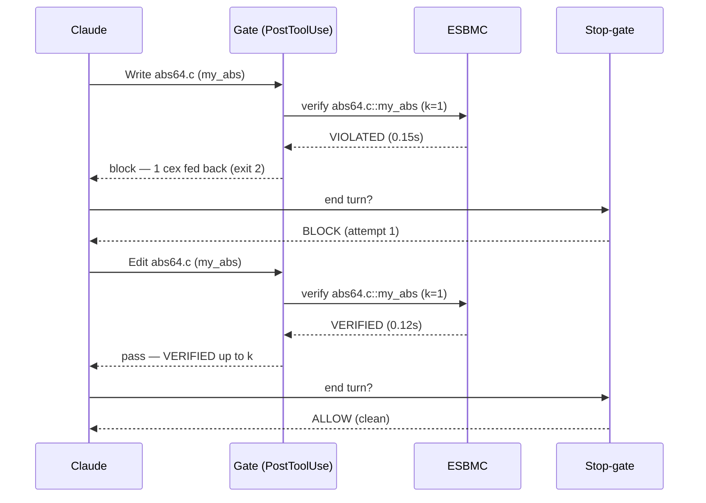

# Forseti — Claude Code adapter (v0: safety verify-gate)

A **self-contained** Claude Code plugin that puts ESBMC inside the coding loop as
a *hard gate*. It has **no dependency on the `esbmc-plugin`** and needs no MCP
server — the hooks call the neutral `forseti` CLI directly.

> **Forseti returns a verdict; the harness owns the loop.** The hooks are the
> trigger/gate, Claude is the worker, the `forseti` CLI is the tool. Forseti
> itself never loops — each call verifies once and returns `VERIFIED (up to k) |
> VIOLATED + counterexample | UNKNOWN | ERROR`.

## What it does

- **PostToolUse hook** — after every `Write`/`Edit`/`MultiEdit` of a `.c`/`.h`
  file, it verifies each top-level function defined in that file at the
  **function level** (`esbmc --function <name>`): no `main`, no harness. ESBMC
  havocs the parameters and checks the built-in **safety** properties (memory
  safety, signed overflow, array bounds, division by zero, UB). A non-`VERIFIED`
  verdict is fed straight back to Claude as the counterexample to fix — **except**
  a unit that takes a **pointer/array parameter**, which is reported
  `NEEDS_CONTRACT` and *not* gated (see the note under **Known limitations**).
- **Stop hook** — blocks the turn from ending while any touched unit is not
  `VERIFIED up to k`. After `MAX_STOP_ATTEMPTS` (3) consecutive blocks with no
  fix, it lets the turn end but with a **loud** unverified residual — never a
  silent pass, never an infinite loop.

Latest verdicts are cached in `.forseti/gate_state.json` (per project,
gitignored). Forseti core stays stateless; the *gate* is what is stateful. The
full ordered history of the loop — every hook firing, ESBMC call, and gate
decision — is appended to `.forseti/events.jsonl` (see **Loop trace** below).

### Scope: v0 = safety, v1 = semantics

A harness is only needed to express a **contract you invented** ("the output is
sorted", "abs(x) ≥ 0"). Language-level **safety** properties are free at the
function level — that is all v0 checks. Generated *semantic* properties (propose
→ render harness → check) are **v1**, not wired here yet.

## Requirements

- `esbmc` on `PATH` (the gate shells out to it via Forseti).
- The `forseti` CLI on `PATH`: from the Forseti repo, `pip install -e .` (the
  hooks fall back to `python -m forseti.core` if the package is importable but
  the script is not on `PATH`).

## Enable it

Hooks load at **session start**, so after either method, **restart Claude Code**
(`claude`), then confirm with `/hooks`.

**As a plugin (recommended, portable):** install this directory as a plugin (via
your marketplace, or point Claude Code at `adapters/claude-code/`). The
`hooks/hooks.json` wires both hooks using `${CLAUDE_PLUGIN_ROOT}`.

**As project settings (no plugin):** add to the target project's
`.claude/settings.json`, replacing `ABS_PATH` with the absolute path to this
directory:

```json
{
  "hooks": {
    "PostToolUse": [
      { "matcher": "Write|Edit|MultiEdit",
        "hooks": [{ "type": "command", "command": "python3 \"ABS_PATH/hooks/post_tool_use.py\"", "timeout": 300 }] }
    ],
    "Stop": [
      { "matcher": "*",
        "hooks": [{ "type": "command", "command": "python3 \"ABS_PATH/hooks/stop_gate.py\"", "timeout": 120 }] }
    ]
  }
}
```

## Try the demo

In a C project with the plugin enabled, ask Claude:

> *Implement `int64_t my_abs(int64_t x)` that returns the absolute value, in
> `abs64.c`.*

Claude writes the obvious `(x < 0) ? -x : x`. The PostToolUse hook verifies
`abs64.c::my_abs` and returns **VIOLATED** with the counterexample `x =
INT64_MIN` (`arithmetic overflow on neg`, CWE-190/191). Claude reads it, saturates
`INT64_MIN → INT64_MAX`, and the re-verify returns **VERIFIED up to k**. Only then
does the Stop-gate let the turn end. See
[`docs/walkthroughs/0002-hook-enforced-safety.md`](../../docs/walkthroughs/0002-hook-enforced-safety.md).

## Loop trace (understand the back-and-forth)

`gate_state.json` is a *snapshot* (latest verdict per unit). To see the whole
`write → verify → cex → fix` sequence, the hooks also append an ordered event log
to **`.forseti/events.jsonl`** — one JSON object per line:

- `edit` — a `Write`/`Edit`/`MultiEdit` fired: the tool, the file, the functions found.
- `verify` — one ESBMC call: the unit, `verdict`, `k`, `duration_s`, and the **exact `argv`**.
- `gate` — the PostToolUse decision: `pass`, or `block` (how many cex were fed back).
- `stop` — the Stop-gate decision: `block`, loud `residual`, or `allow`.

Render it as a **mermaid sequence diagram** with the bundled tool (point it at the
project dir or the `events.jsonl` file):

```console
$ python3 adapters/claude-code/tools/trace_to_mermaid.py path/to/project
```

For the `my_abs` demo the one turn comes out as:



The trace captures Claude's **actions** (the code it writes/edits) and the
verifier's responses, not Claude's natural-language messages — those live only in
Claude Code's own session transcript (`~/.claude/projects/<slug>/<session>.jsonl`)
and can be woven in by timestamp. Logging is best-effort: a trace write never
turns a verdict into an error.

## Configuration

| Setting | Where | Default | Notes |
|---|---|---|---|
| Safety flags | `SAFETY_FLAGS` in `hooks/forseti_gate.py` | `--overflow-check` | bounds/pointer/div-by-zero are ESBMC defaults; unsigned-overflow left OFF (legal wraparound) |
| Unwind bound *k* | `FORSETI_UNWIND` env | `1` | a `VERIFIED` is only "up to k"; **loops need a higher k** |
| Verify timeout | `FORSETI_VERIFY_TIMEOUT_S` env | `110` | per-function budget, passed to `forseti verify --timeout` so ESBMC honors it (the subprocess is bounded ~15 s higher). Each verdict is persisted the moment it lands, so the `300` s PostToolUse hook timeout must stay above this per-function budget — raise both together for very slow units. |
| List-units timeout | `FORSETI_LIST_UNITS_TIMEOUT_S` env | `30` | budget for the one `forseti list-units` parse per edited file; a `--parse-tree-only` run does no solving, so this rarely needs raising |
| Stop-gate attempts | `MAX_STOP_ATTEMPTS` in `forseti_gate.py` | `3` | blocks then lets the turn end with a loud residual |

## Known limitations (v0)

- **Function detection uses ESBMC's clang frontend** (`forseti list-units`), the
  same parser that verifies — so typedef'd pointers, K&R and multi-line
  signatures, function-like macros, `#if` blocks, and a `*` inside a comment are
  all classified correctly (no regex, issue #131). Each edited `.c` file gets one
  extra `--parse-tree-only` parse (no solving, fast); if enumeration fails (esbmc
  missing, C parse error) the file's units are recorded as a blocking ERROR
  verdict rather than silently skipped.
- **Only `.c` translation units are verified; header definitions are out of
  scope.** ESBMC cannot parse a `.h` standalone (`forseti verify`/`list-units`
  both error with "failed to figure out type of file"), and a function defined in
  an `#include`d header is attributed to the header, not its includer — so it is
  not gated either way. A `.h` edit is a clean pass (nothing enumerated). This
  trades the old regex's behaviour, which errored on a header that happened to
  contain a definition; you can't verify what ESBMC won't parse.
- **No k-escalation.** The gate verifies at one fixed k; an `UNKNOWN` (e.g. a
  loop under-unwound) blocks with guidance to raise `FORSETI_UNWIND`, rather than
  laddering k automatically.
- **Pointer/array units are not gated yet (`NEEDS_CONTRACT`).** At the function
  level ESBMC passes a pointer parameter an *unconstrained* value (object identity
  + offset over the whole object universe, including the invalid object), so any
  `*p`/`p[i]` yields a **sound but unactionable** `dereference failure` — the code
  isn't wrong; the caller-side memory precondition is simply absent. Rather than
  feed that phantom back as a fixable counterexample (which made correct code loop
  forever), a unit with a pointer/array parameter is classified `NEEDS_CONTRACT`
  by **signature** (never by matching the cex text — a real out-of-bounds prints
  the same string): the ESBMC run is skipped, the unit is **not** gated, and it is
  reported loudly but non-blocking. Actually verifying these — by generating a
  memory precondition/harness — is [#122](https://github.com/pmatos/forseti/issues/122)
  (design in [RFC-0003](../../docs/design/0003-memory-preconditions.md)).
- **Safety only.** Functional correctness beyond the built-in safety checks is
  the v1 semantic-property path.
- **Very slow, many-function files.** Verdicts persist incrementally so a hook
  kill can't cause a silent pass, but a file whose *total* verification exceeds
  the PostToolUse hook timeout can have its last, still-running function cut off
  before its verdict lands. Raise the hook timeout (and `FORSETI_UNWIND` budget)
  for such files.
- **Only tool-based edits are gated.** The gate fires on `Write`/`Edit`/
  `MultiEdit`. A C file created or modified out-of-band via the `Bash` tool
  (`cat > f.c`, a generator script, `sed -i`) does not trigger it and is not
  verified — the "hard gate" is only as complete as the tools it observes.
  Closing this (Bash handling or a session-scoped worktree scan) is tracked in
  [#99](https://github.com/pmatos/forseti/issues/99).
