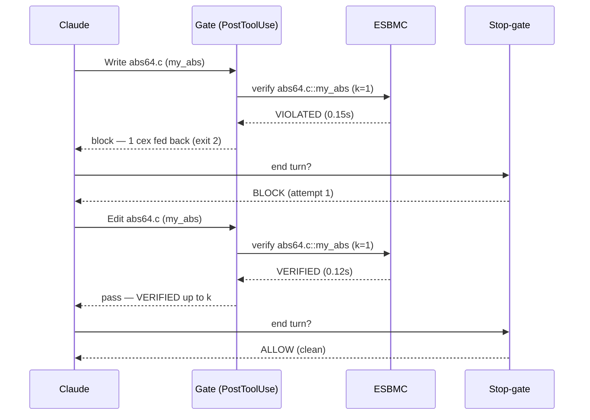

# Forseti — Claude Code adapter (v0: safety verify-gate)

A **self-contained** Claude Code plugin that puts ESBMC inside the coding loop as
a *hard gate*. It has **no dependency on the `esbmc-plugin`** and needs no MCP
server — the hooks call the neutral `forseti` CLI directly.

> **Forseti returns a verdict; the harness owns the loop.** The hooks are the
> trigger/gate, Claude is the worker, the `forseti` CLI is the tool. Forseti
> itself never loops — each call verifies once and returns `VERIFIED (up to k) |
> VIOLATED + counterexample | UNKNOWN | ERROR`.

## What it does

- **PostToolUse hook** — after every `Write`/`Edit`/`MultiEdit` of a `.c`/`.h`
  file, it verifies each top-level function defined in that file at the
  **function level** (`esbmc --function <name>`): no `main`, no harness. ESBMC
  havocs the parameters and checks the built-in **safety** properties (memory
  safety, signed overflow, array bounds, division by zero, UB). A non-`VERIFIED`
  verdict is fed straight back to Claude as the counterexample to fix — **except**
  a unit that takes a **pointer/array parameter**, which is reported
  `NEEDS_CONTRACT` and *not* gated (see the note under **Known limitations**).
- **PostToolUse `Bash` hook** — a C file written *out-of-band* via the `Bash`
  tool (`cat > f.c`, a generator script, `sed -i`, a heredoc) carries a `command`
  string, not a `file_path`, so it never triggers the edit hook above. After every
  `Bash` call this hook asks `git` which C sources changed and verifies each one
  whose content differs from what the gate last saw — the same function-level
  ESBMC pass, feeding any counterexample back the same way. It never parses the
  shell command for filenames (unreliable); discovery is the union of `git status`
  (working-tree/index changes) and C **committed since the session baseline HEAD**,
  so a command that writes *and* commits a C file in one shot (`cat > f.c && git
  commit …`, leaving a clean worktree) is still caught. Content-hash freshness is
  the real gate, so a file merely committed *unchanged* is deduped back out and
  untouched third-party C is skipped — save for C a HEAD movement
  (`checkout`/`merge`/`rebase`) sweeps in, a deliberate over-gate noted under
  **Known limitations**. Requires the project to be a **git repository**.
- **SessionStart hook** — records the content of every C file already dirty at
  session start as the *baseline*, plus the baseline HEAD commit, so the
  out-of-band scan gates only C the agent changes **during** the session (whether
  left dirty or committed), never pre-existing WIP it never touched. Without it a
  `git status` scan would flag the user's uncommitted C on the very first turn.
- **Stop hook** — blocks the turn from ending while any touched unit is not
  `VERIFIED up to k`. As an ESBMC-free backstop it also re-checks `git` for C
  files changed out-of-band that are still unverified, and blocks on those too —
  so the heavy verification stays in the 300 s PostToolUse budget, never in the
  kill-sensitive Stop hook. Freshness compares the last-verified content against
  the worktree copy **and** the staged (index) and committed (`HEAD`) blobs, so a
  Bash command that stages or commits a divergent blob and then reverts the
  worktree — leaving it hashing clean while unverified C sits in the index/`HEAD`,
  ready to ship — is still caught (issue #99 review); the block spells out the
  index/commit-shaped remediation (`git add`/`git restore --staged`), since
  editing the worktree cannot reconcile a staged blob. After `MAX_STOP_ATTEMPTS`
  (3) consecutive blocks with no fix, it lets the turn end but with a **loud**
  unverified residual — never a silent pass, never an infinite loop.

Latest verdicts are cached in `.forseti/gate_state.json` (per project,
gitignored). Forseti core stays stateless; the *gate* is what is stateful. The
full ordered history of the loop — every hook firing, ESBMC call, and gate
decision — is appended to `.forseti/events.jsonl` (see **Loop trace** below).

### Scope: v0 = safety, v1 = semantics

A harness is only needed to express a **contract you invented** ("the output is
sorted", "abs(x) ≥ 0"). Language-level **safety** properties are free at the
function level — that is all v0 checks. Generated *semantic* properties (propose
→ render harness → check) are **v1**, not wired here yet.

## Requirements

- `esbmc` on `PATH` (the gate shells out to it via Forseti).
- The `forseti` CLI on `PATH`: from the Forseti repo, `pip install -e .` (the
  hooks fall back to `python -m forseti.core` if the package is importable but
  the script is not on `PATH`).
- `git` on `PATH`, and the target project a git repository — required only for
  gating out-of-band `Bash` writes; the edit-triggered gate works without it.

## Enable it

Hooks load at **session start**, so after either method, **restart Claude Code**
(`claude`), then confirm with `/hooks`.

**As a plugin (recommended, portable):** install this directory as a plugin (via
your marketplace, or point Claude Code at `adapters/claude-code/`). The
`hooks/hooks.json` wires both hooks using `${CLAUDE_PLUGIN_ROOT}`.

**As project settings (no plugin):** add to the target project's
`.claude/settings.json`, replacing `ABS_PATH` with the absolute path to this
directory:

```json
{
  "hooks": {
    "SessionStart": [
      { "matcher": "*",
        "hooks": [{ "type": "command", "command": "python3 \"ABS_PATH/hooks/session_start.py\"", "timeout": 60 }] }
    ],
    "PostToolUse": [
      { "matcher": "Write|Edit|MultiEdit",
        "hooks": [{ "type": "command", "command": "python3 \"ABS_PATH/hooks/post_tool_use.py\"", "timeout": 300 }] },
      { "matcher": "Bash",
        "hooks": [{ "type": "command", "command": "python3 \"ABS_PATH/hooks/post_bash.py\"", "timeout": 300 }] }
    ],
    "Stop": [
      { "matcher": "*",
        "hooks": [{ "type": "command", "command": "python3 \"ABS_PATH/hooks/stop_gate.py\"", "timeout": 120 }] }
    ]
  }
}
```

## Try the demo

In a C project with the plugin enabled, ask Claude:

> *Implement `int64_t my_abs(int64_t x)` that returns the absolute value, in
> `abs64.c`.*

Claude writes the obvious `(x < 0) ? -x : x`. The PostToolUse hook verifies
`abs64.c::my_abs` and returns **VIOLATED** with the counterexample `x =
INT64_MIN` (`arithmetic overflow on neg`, CWE-190/191). Claude reads it, saturates
`INT64_MIN → INT64_MAX`, and the re-verify returns **VERIFIED up to k**. Only then
does the Stop-gate let the turn end. See
[`docs/walkthroughs/0002-hook-enforced-safety.md`](../../docs/walkthroughs/0002-hook-enforced-safety.md).

## Loop trace (understand the back-and-forth)

`gate_state.json` is a *snapshot* (latest verdict per unit). To see the whole
`write → verify → cex → fix` sequence, the hooks also append an ordered event log
to **`.forseti/events.jsonl`** — one JSON object per line:

- `edit` — a `Write`/`Edit`/`MultiEdit`, or a `Bash` out-of-band write, fired: the tool, the file, the functions found.
- `verify` — one ESBMC call: the unit, `verdict`, `k`, `duration_s`, and the **exact `argv`**.
- `gate` — the PostToolUse decision: `pass`, or `block` (how many cex were fed back).
- `stop` — the Stop-gate decision: `block`, loud `residual`, or `allow`.

Render it as a **mermaid sequence diagram** with the bundled tool (point it at the
project dir or the `events.jsonl` file):

```console
$ python3 adapters/claude-code/tools/trace_to_mermaid.py path/to/project
```

For the `my_abs` demo the one turn comes out as:



The trace captures Claude's **actions** (the code it writes/edits) and the
verifier's responses, not Claude's natural-language messages — those live only in
Claude Code's own session transcript (`~/.claude/projects/<slug>/<session>.jsonl`)
and can be woven in by timestamp. Logging is best-effort: a trace write never
turns a verdict into an error.

## Configuration

| Setting | Where | Default | Notes |
|---|---|---|---|
| Safety flags | `SAFETY_FLAGS` in `hooks/forseti_gate.py` | `--overflow-check` | bounds/pointer/div-by-zero are ESBMC defaults; unsigned-overflow left OFF (legal wraparound) |
| Unwind bound *k* | `FORSETI_UNWIND` env | `1` | a `VERIFIED` is only "up to k"; **loops need a higher k** |
| Verify timeout | `FORSETI_VERIFY_TIMEOUT_S` env | `110` | per-function budget, passed to `forseti verify --timeout` so ESBMC honors it (the subprocess is bounded ~15 s higher). Each verdict is persisted the moment it lands, so the `300` s PostToolUse hook timeout must stay above this per-function budget — raise both together for very slow units. |
| Stop-gate attempts | `MAX_STOP_ATTEMPTS` in `forseti_gate.py` | `3` | blocks then lets the turn end with a loud residual |
| Out-of-band include | `FORSETI_GATE_INCLUDE` env | *(all C files)* | `:`/`,`-separated globs; if set, only changed C files matching one are scanned. A bare name (`src`) matches any path segment; a glob (`kernels/*.c`) matches the project-relative path. |
| Out-of-band exclude | `FORSETI_GATE_EXCLUDE` env | `third_party`, `vendor`, `node_modules` | same syntax; excludes win over includes. Setting it **replaces** the defaults. Git's own ignore rules already drop gitignored build output before this applies. |

## Known limitations (v0)

- **Function detection is a regex heuristic**, not a C parser — it finds
  column-0 function *definitions* (prototypes excluded). Unusual formatting
  (return type on its own line, K&R style) may be missed; a false positive
  surfaces as an ERROR verdict rather than a silent skip.
- **No k-escalation.** The gate verifies at one fixed k; an `UNKNOWN` (e.g. a
  loop under-unwound) blocks with guidance to raise `FORSETI_UNWIND`, rather than
  laddering k automatically.
- **Pointer/array units are not gated yet (`NEEDS_CONTRACT`).** At the function
  level ESBMC passes a pointer parameter an *unconstrained* value (object identity
  + offset over the whole object universe, including the invalid object), so any
  `*p`/`p[i]` yields a **sound but unactionable** `dereference failure` — the code
  isn't wrong; the caller-side memory precondition is simply absent. Rather than
  feed that phantom back as a fixable counterexample (which made correct code loop
  forever), a unit with a pointer/array parameter is classified `NEEDS_CONTRACT`
  by **signature** (never by matching the cex text — a real out-of-bounds prints
  the same string): the ESBMC run is skipped, the unit is **not** gated, and it is
  reported loudly but non-blocking. Actually verifying these — by generating a
  memory precondition/harness — is [#122](https://github.com/pmatos/forseti/issues/122)
  (design in [RFC-0003](../../docs/design/0003-memory-preconditions.md)).
- **Safety only.** Functional correctness beyond the built-in safety checks is
  the v1 semantic-property path.
- **Very slow, many-function files.** Verdicts persist incrementally so a hook
  kill can't cause a silent pass, but a file whose *total* verification exceeds
  the PostToolUse hook timeout can have its last, still-running function cut off
  before its verdict lands. Raise the hook timeout (and `FORSETI_UNWIND` budget)
  for such files.
- **Out-of-band gating needs a git repo.** C files written via the `Bash` tool
  are gated by a `git status`-scoped scan (the `Bash` PostToolUse hook, plus the
  Stop-gate backstop). In a project that is **not** a git repository that scan is
  inactive — a Bash-written C file there is not verified. The degraded scope is
  recorded in the trace (`oob_scan_skipped`) rather than passing silently, but it
  is not gated. Scope is **"C changed since session start"** (issue
  [#99](https://github.com/pmatos/forseti/issues/99)): the SessionStart hook
  baselines the already-dirty tree *and* the current HEAD, so the scan catches this
  session's Bash writes — including a C file written **and committed in one shot**
  (a clean worktree `git status` alone would miss), recovered by diffing the
  baseline HEAD against the current one — while never gating pre-existing
  uncommitted or committed/third-party C the agent never touched. Two documented
  bounds of the HEAD-diff: (1) a HEAD movement that brings in C without the agent
  authoring it (a `git checkout`/`merge`/`rebase` run via Bash) is conservatively
  gated — an over-gate that blocks loudly, never a silent pass; (2) in a repo with
  **no commits** at session start there is no baseline HEAD, so the very first
  commit's C is caught only if it is also left dirty. It relies on content changes
  git can see; a change git cannot (a file outside the work tree, or one matched by
  `.gitignore`) is not scanned. A file changed *between* sessions is re-baselined
  on the next fresh start, so it is treated as pre-existing rather than gated.
- **Staged/committed-blob freshness is single-hash and content-literal.** The gate
  records one last-verified hash per file, so if you stage a *previously* verified
  blob and then keep editing to a newer verified version, the now-superseded staged
  blob is conservatively gated until you re-stage or unstage it — an over-gate that
  blocks loudly, never a silent pass. Likewise the staged/committed blob is compared
  byte-for-byte, so a git content filter (`core.autocrlf`, a clean/smudge filter)
  that rewrites the blob relative to the worktree can over-gate. Both resolve by
  bringing the index/commit to the verified content (`git add`) and re-verifying.
- **mtime is not used.** Freshness is keyed on a SHA-256 of file content, so a
  `cp -p`/`tar` that preserves an old timestamp cannot slip an unverified change
  past the gate, and an unchanged file is never needlessly re-verified.
