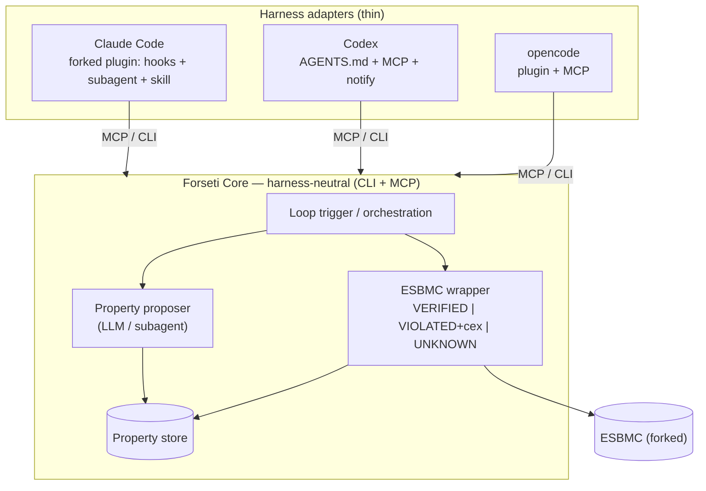
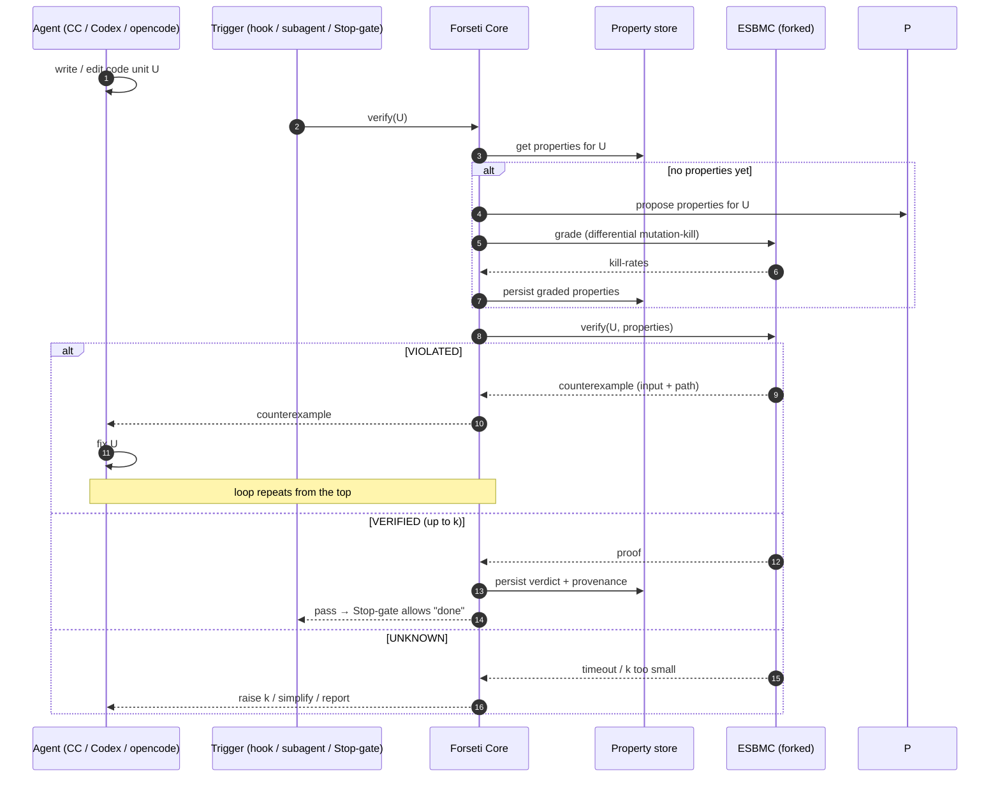

# Design RFC 0001 — Harness portability & the loop protocol

- **Status:** Draft / RFC (thinking aid — not yet an ADR)
- **Date:** 2026-06-16

## Problem

The Forseti loop must run inside **multiple agent harnesses** — Claude Code, Codex, and
opencode — without rewriting the logic three times. Each harness has a different extension
model:

| Harness | Triggers / extension points | Tool access |
|---|---|---|
| **Claude Code** | hooks (PreToolUse/PostToolUse/Stop), subagents, skills, slash commands, plugins | MCP, CLI |
| **Codex** | `AGENTS.md`, `notify` hook (limited) | MCP, CLI |
| **opencode** | plugin API, custom commands, agents/modes — **no tool-use hooks** | MCP, CLI |

Hooks differ everywhere; the one substrate **all three share is MCP (+ a plain CLI).**

## Strawman: neutral core + thin adapters

Push *all logic* into a **harness-neutral Forseti Core**, and keep each harness's glue thin.

- **Forseti Core** (write once): the ESBMC wrapper, the property proposer, the loop logic, and
  the property store — exposed as a **CLI** and an **MCP server**.
- **Per-harness adapters** (thin): translate that harness's *triggers* into Core calls.
  - **Claude Code** — a **fork of the existing `esbmc-plugin`** (kept downstream, like the ESBMC
    fork): a `PostToolUse` hook that verifies after edits, a `Stop` hook that gates "done" on a
    proof, a **property-generation subagent**, and a skill/slash-command. All call Core.
  - **Codex** — `AGENTS.md` instructions + Core registered as an MCP server + a `notify` hook.
  - **opencode** — **no tool-use hooks**, so it uses the *prompt+tools fallback*: a custom
    command / subagent drives Core via MCP and emulates the Stop-gate in its own instructions.
    Same Core, weaker enforcement.

> **The hook is just the *trigger/gate*. The agent is the *worker*. The Core is the *tool*.**
> Where a harness lacks a given hook, it degrades gracefully to the agent calling Core tools
> directly from its prompt — same Core, weaker enforcement.

## One turn of the loop (protocol)

## Loop control (decided direction)

Control flow is **hook-triggered, agent-as-worker**, with a fallback where hooks don't exist:
- Where tool-use hooks exist (**Claude Code**; **Codex** via its limited hooks/notify), a hook
  auto-runs `verify` after edits and a **Stop-gate** blocks "done" until the unit is VERIFIED.
- **opencode has no tool-use hooks** → **prompt+tools fallback**: a custom command / subagent
  tells the model to call `verify` after writing and keep fixing until it passes. Weaker
  *enforcement*, identical *Core*.

The Core is the same everywhere; only the trigger differs.

## Observability (required from day one)

A loop spanning hooks, an agent, the Core, and ESBMC is undebuggable without a **structured
event log**. Every step in the sequence diagram emits a JSONL event to a per-session trace:
`trigger.fired`, `core.verify.start`, `esbmc.invoke` / `esbmc.verdict`, `counterexample`,
`fix.attempt`, `stopgate.decision`, `property.proposed` / `property.graded`. One trace = one
replayable story of what the system did and why, across any harness. (Roadmap **W10**.)

## What ESBMC actually returns (terminology — read this first)

ESBMC emits **no proof object.** For a unit + property it returns a **verdict**:
- **VERIFIED** — no violation found *up to bound k*, under the harness's assumptions;
- **VIOLATED** — plus a **counterexample** (concrete input + path);
- **UNKNOWN** — timeout / bound too small.

Trust in a VERIFIED is therefore *reproducible* ("re-run the same ESBMC version/flags/k → same
answer"), or at most backed by an SV-COMP-style **correctness witness** a *separate validator*
re-checks. A genuine, independently kernel-checkable **proof** is the **Lean branch's** job
([ADR-0007](../adr/0007-lean-off-critical-path.md)) — not ESBMC's. **Never write "proof" in this
repo where we mean "reproducible verdict."**

## The store — what it's actually *for*

Three jobs, usually lumped together:

1. **Result cache (speed).** Key = `hash(unit text + property + ESBMC version + flags + k)` → the
   stored **verdict** (good / bad+counterexample / unknown). ESBMC is deterministic for fixed
   input, so an identical query skips the expensive re-run. **This is the "asked the same thing
   twice" case** — auto-invalidated when anything in the key changes.
2. **Spec registry (intent across edits).** Key = unit id (`path::symbol`) → the properties we
   *intend* to hold + their grades. **Survives edits:** when the agent rewrites `rb_push` we
   re-check the same intent instead of regenerating it (slow + non-deterministic) every turn.
3. **Evidence record (shipping).** Serialized `unit → properties + latest verdict + provenance
   (ESBMC version, flags, k, code-hash)`. **Not a proof** — a *reproducible-verification* record:
   enough to re-run and get the same verdict. The honest form of the deck's "ship code with its
   guarantees" question.

Keyed two ways: cache by content-hash, registry by unit-id.

**Low-regret path (recommended) — no DB yet:**
- **Registry + evidence record** = in-repo files keyed by unit id (`.forseti/<unit>.yaml`):
  versioned, diffable, portable.
- **Result cache** = local content-hash store (dir or tiny SQLite), *ephemeral*, not committed;
  **ESBMC version in the key**.
- **Analytics DB** = deferred to **GEPA (P2/P3)**; rebuild a derived index from the files when
  corpus-wide kill-rate queries are actually needed. Measure before building.

## Still open (then these become ADRs)

- **Stop-gate strictness** — block hard on VERIFIED, or allow "VERIFIED-up-to-k with a flagged
  residual" so an UNKNOWN doesn't deadlock the agent.
- **Cache scope** — per-repo only vs a shared cross-project cache (and trusting a shared cache
  across ESBMC versions — hence the version in the key).
- ~~Unit granularity~~ — **decided: function/symbol level (`path::symbol`)**.
