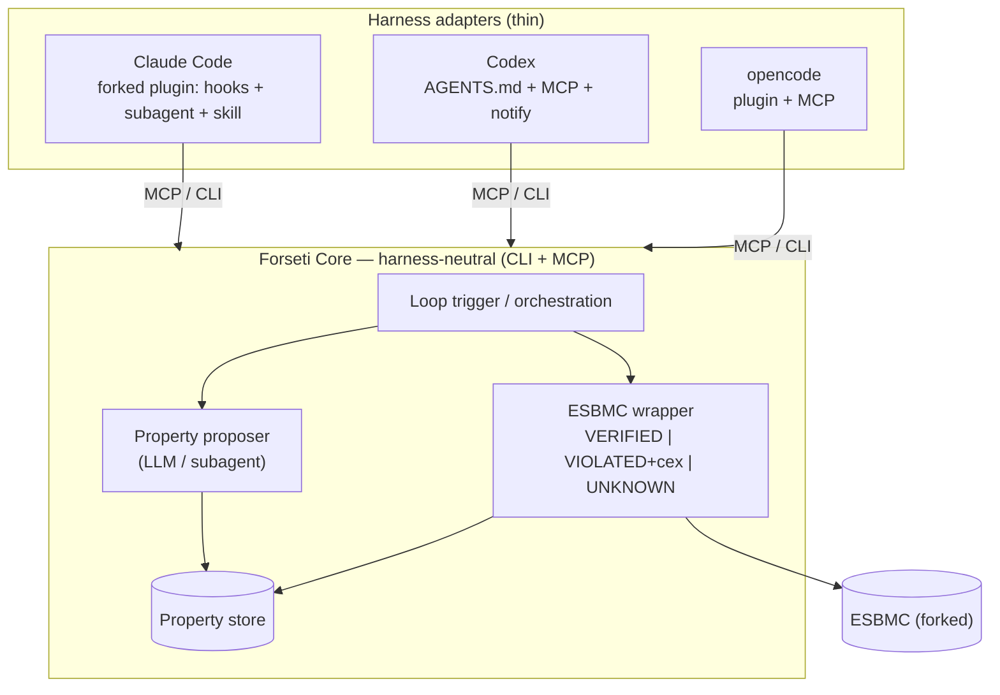
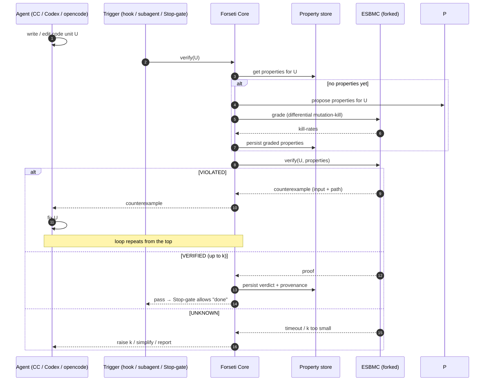

# Design RFC 0001 — Harness portability & the loop protocol

- **Status:** Draft / RFC (thinking aid — not yet an ADR)
- **Date:** 2026-06-16

## Problem

The Forseti loop must run inside **multiple agent harnesses** — Claude Code, Codex, and
opencode — without rewriting the logic three times. Each harness has a different extension
model:

| Harness | Triggers / extension points | Tool access |
|---|---|---|
| **Claude Code** | hooks (PreToolUse/PostToolUse/Stop), subagents, skills, slash commands, plugins | MCP, CLI |
| **Codex** | `AGENTS.md`, `notify` hook (limited) | MCP, CLI |
| **opencode** | plugin API + event hooks, custom commands, agents/modes | MCP, CLI |

Hooks differ everywhere; the one substrate **all three share is MCP (+ a plain CLI).**

## Strawman: neutral core + thin adapters

Push *all logic* into a **harness-neutral Forseti Core**, and keep each harness's glue thin.

- **Forseti Core** (write once): the ESBMC wrapper, the property proposer, the loop logic, and
  the property store — exposed as a **CLI** and an **MCP server**.
- **Per-harness adapters** (thin): translate that harness's *triggers* into Core calls.
  - **Claude Code** — a **fork of the existing `esbmc-plugin`** (kept downstream, like the ESBMC
    fork): a `PostToolUse` hook that verifies after edits, a `Stop` hook that gates "done" on a
    proof, a **property-generation subagent**, and a skill/slash-command. All call Core.
  - **Codex** — `AGENTS.md` instructions + Core registered as an MCP server + a `notify` hook.
  - **opencode** — an opencode plugin (its event hooks) + Core as an MCP server.

> **The hook is just the *trigger/gate*. The agent is the *worker*. The Core is the *tool*.**
> Where a harness lacks a given hook, it degrades gracefully to the agent calling Core tools
> directly from its prompt — same Core, weaker enforcement.

## One turn of the loop (protocol)

## The property store

Properties describe **intent** for a unit of code, so they must **persist across edits** (the
loop keeps rewriting the code; the property is the fixed target). That argues for a store rather
than regenerating every turn — and the store is also what enables **proof-carrying packaging**
(the deck's open question): *the store is "the code + its proofs."*

**Keying.** A property attaches to a stable **unit id** (e.g. `path::symbol`), while each *verdict*
records the **content hash** it was checked against — so we can tell "this proof is stale, the code
changed under it" from "this property still holds."

**Form factor — the open fork:**
- **In-repo files** (e.g. `.forseti/<unit>.yaml`): versioned with the code → naturally
  proof-carrying, diffable in PRs, zero infra, trivially portable across harnesses. Weaker at
  cross-corpus queries.
- **SQLite DB**: great for the grading/GEPA analytics (aggregate kill-rates across the corpus),
  single file, portable. Not human-diffable; doesn't "ship with the code" on its own.
- **Hybrid (leaning here):** in-repo files are the **source of truth** (proof-carrying, versioned);
  a **derived SQLite index** is rebuilt from them for grading/GEPA analytics. Mirrors the thesis —
  the proof travels *with* the code.

## Open questions to resolve (then these become ADRs)

1. **Loop control model** — hook/Stop-gate trigger + agent-as-worker + Core-as-tool, vs a
   Core-driven orchestrator that calls the model, vs pure prompt+tools (no hooks).
2. **Store form factor** — hybrid (files + derived index) vs DB-only vs files-only.
3. **Unit granularity** — function-level vs file/module-level units for properties & keying.
