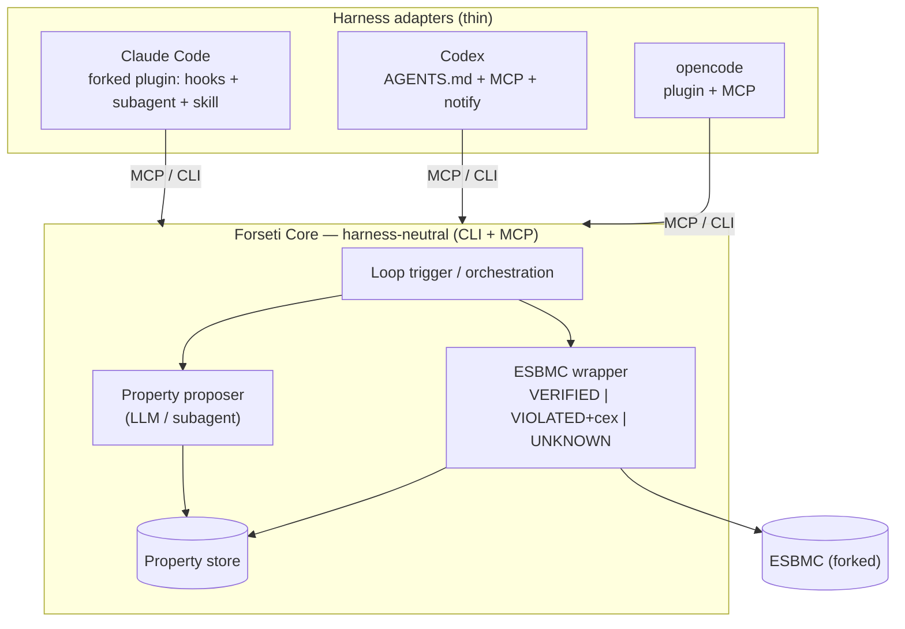
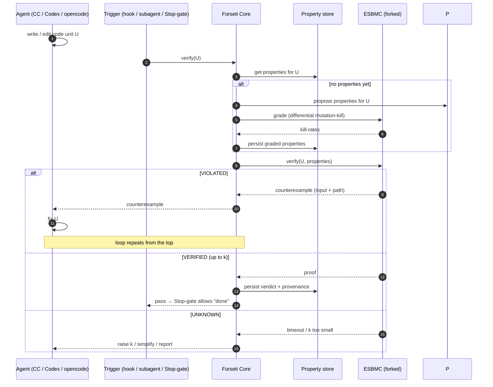

# Design RFC 0001 — Harness portability & the loop protocol

- **Status:** Draft / RFC (thinking aid — not yet an ADR)
- **Date:** 2026-06-16

## Problem

The Forseti loop must run inside **multiple agent harnesses** — Claude Code, Codex, and
opencode — without rewriting the logic three times. Each harness has a different extension
model:

| Harness | Triggers / extension points | Tool access |
|---|---|---|
| **Claude Code** | hooks (PreToolUse/PostToolUse/Stop), subagents, skills, slash commands, plugins | MCP, CLI |
| **Codex** | `AGENTS.md`, `notify` hook (limited) | MCP, CLI |
| **opencode** | plugin API, custom commands, agents/modes — **no tool-use hooks** | MCP, CLI |

Hooks differ everywhere; the one substrate **all three share is MCP (+ a plain CLI).**

## Strawman: neutral core + thin adapters

Push *all logic* into a **harness-neutral Forseti Core**, and keep each harness's glue thin.

- **Forseti Core** (write once): the ESBMC wrapper, the property proposer, the loop logic, and
  the property store — exposed as a **CLI** and an **MCP server**.
- **Per-harness adapters** (thin): translate that harness's *triggers* into Core calls.
  - **Claude Code** — a **fork of the existing `esbmc-plugin`** (kept downstream, like the ESBMC
    fork): a `PostToolUse` hook that verifies after edits, a `Stop` hook that gates "done" on a
    proof, a **property-generation subagent**, and a skill/slash-command. All call Core.
  - **Codex** — `AGENTS.md` instructions + Core registered as an MCP server + a `notify` hook.
  - **opencode** — **no tool-use hooks**, so it uses the *prompt+tools fallback*: a custom
    command / subagent drives Core via MCP and emulates the Stop-gate in its own instructions.
    Same Core, weaker enforcement.

> **The hook is just the *trigger/gate*. The agent is the *worker*. The Core is the *tool*.**
> Where a harness lacks a given hook, it degrades gracefully to the agent calling Core tools
> directly from its prompt — same Core, weaker enforcement.

```mermaid
flowchart TB
    subgraph H["Harness adapters (thin)"]
      CC["Claude Code<br/>forked plugin: hooks + subagent + skill"]
      CX["Codex<br/>AGENTS.md + MCP + notify"]
      OC["opencode<br/>plugin + MCP"]
    end
    subgraph Core["Forseti Core — harness-neutral (CLI + MCP)"]
      L["Loop trigger / orchestration"]
      P["Property proposer<br/>(LLM / subagent)"]
      W["ESBMC wrapper<br/>VERIFIED | VIOLATED+cex | UNKNOWN"]
      DB[("Property store")]
    end
    CC -->|MCP / CLI| Core
    CX -->|MCP / CLI| Core
    OC -->|MCP / CLI| Core
    L --> P --> DB
    L --> W --> ESBMC[("ESBMC (forked)")]
    W --> DB
```

## One turn of the loop (protocol)

```mermaid
sequenceDiagram
    autonumber
    participant A as Agent (CC / Codex / opencode)
    participant T as Trigger (hook / subagent / Stop-gate)
    participant F as Forseti Core
    participant S as Property store
    participant E as ESBMC (forked)

    A->>A: write / edit code unit U
    T->>F: verify(U)
    F->>S: get properties for U
    alt no properties yet
        F->>P: propose properties for U
        F->>E: grade (differential mutation-kill)
        E-->>F: kill-rates
        F->>S: persist graded properties
    end
    F->>E: verify(U, properties)
    alt VIOLATED
        E-->>F: counterexample (input + path)
        F-->>A: counterexample
        A->>A: fix U
        Note over A,F: loop repeats from the top
    else VERIFIED (up to k)
        E-->>F: proof
        F->>S: persist verdict + provenance
        F-->>T: pass → Stop-gate allows "done"
    else UNKNOWN
        E-->>F: timeout / k too small
        F-->>A: raise k / simplify / report
    end
```

## Loop control (decided direction)

Control flow is **hook-triggered, agent-as-worker**, with a fallback where hooks don't exist:
- Where tool-use hooks exist (**Claude Code**; **Codex** via its limited hooks/notify), a hook
  auto-runs `verify` after edits and a **Stop-gate** blocks "done" until the unit is VERIFIED.
- **opencode has no tool-use hooks** → **prompt+tools fallback**: a custom command / subagent
  tells the model to call `verify` after writing and keep fixing until it passes. Weaker
  *enforcement*, identical *Core*.

The Core is the same everywhere; only the trigger differs.

## Observability (required from day one)

A loop spanning hooks, an agent, the Core, and ESBMC is undebuggable without a **structured
event log**. Every step in the sequence diagram emits a JSONL event to a per-session trace:
`trigger.fired`, `core.verify.start`, `esbmc.invoke` / `esbmc.verdict`, `counterexample`,
`fix.attempt`, `stopgate.decision`, `property.proposed` / `property.graded`. One trace = one
replayable story of what the system did and why, across any harness. (Roadmap **W10**; the
minimal cross-harness slice below is #213 — full replay/redaction/export stays #15.)

### Canonical Core lifecycle events (implemented, #213)

Core emits a small, harness-neutral event vocabulary from `forseti.core.events` — dotted
names, distinct at a glance from an adapter's own short local names (`edit`, `gate`, `stop`,
...):

| Event | Emitted by | Fields |
|---|---|---|
| `property.proposed` | `core.propose.propose_source`, `core.submit.submit_source` | `unit_id`, `property_id`, `expression`, `provider`, `model`, `channel` (`"llm"` \| `"submitted"`) |
| `property.check.start` | `core.check.check_source` | `unit_id` |
| `property.verdict` | `core.check.check_source` | `unit_id`, `property_id`, `outcome`, `k` |
| `gate.decision` | Claude Code's `post_tool_use` | `harness`, `adapter`, `unit_ids` (`path::symbol`, per verified function), `decision` |
| `gate.decision` | Codex's `verify_hook` | `harness`, `adapter`, `files` (raw edited paths — the hook verifies a whole file at a time, no per-function enumeration), `decision` |

All four append to `<store_root>/events.jsonl` — the project's `.forseti/events.jsonl` when
`store_root` is the default, the same file the Claude Code adapter's own
`adapters.claude_code.event_log` trace already writes to (`edit`/`verify`/`gate`/`stop`/
`session`, keyed by `type`). **One trace file, two vocabularies**, not three incompatible
formats: adapter-local events are trigger metadata around a harness's own hook shape (a
Claude Code `PostToolUse` firing, a Stop-gate attempt count); canonical events are what
happened in Core, independent of which harness asked for it. A dry run (`persist=False`)
records nothing — `record_event`'s own `mkdir` would otherwise violate the documented
"a dry run touches nothing" contract `propose_source`/`submit_source` hold themselves to.

Both adapters emit `gate.decision` at their own per-edit gate point: Claude Code's
`adapters.claude_code.post_tool_use` (pass/block after verifying an edited file's functions)
and Codex's `adapters.codex.verify_hook` (pass/unresolved/block after an `apply_patch`). The
two differ in granularity, and the event says so honestly rather than faking parity: Claude
Code enumerates and verifies each function, so its `unit_ids` are real `path::symbol` keys
joinable with `property.proposed`/`property.verdict`; Codex verifies a whole edited file at a
time (no per-function enumeration), so its event carries `files` — raw source paths — instead
of `unit_ids`. Recording is best-effort and never raises — a trace failure must not turn a
real verdict into a hook crash.

### The composed semantic-loop operation (implemented, #213)

`propose`/`submit` and `check` above are still independently useful (a dry-run proposal, a
re-check with no new candidates), but composing "ingest → persist → render harness → check →
verdict policy" into the single `verify(U)` step the sequence diagram above always depicted was
deferred in the first #213 slice until a second caller needed the composed shape — Codex's
AGENTS.md wiring below is that second caller. `forseti.core.loop.run_semantic_loop` is the one
entry point: `path::symbol` in, one of three ingestion modes (`propose` — ask the configured
LLM proposer; `submit` — ingest already-formed candidates, no LLM call; `check_only` — skip
ingestion, check what the store already holds), then always `check_source` and Core's own
`PropertyCheckRun.outcome` — a worst-outcome-wins `held | violated | unknown | error | empty`
that both faces below return unchanged, so an adapter reads one field instead of re-deriving
severity from `verdicts[]` itself. Exposed as `forseti semantic-loop <source> --function NAME
--mode {propose,submit,check-only}` (CLI) and the `semantic_loop` MCP tool; both call
`run_semantic_loop` and return `SemanticLoopResult.to_dict()` — no separate serializer. Neither
face formats a unit id, persists a candidate, or renders a harness itself — those stay exactly
where `propose_source`/`submit_source`/`check_source` already put them; the composed op only
sequences the existing calls and adds the `outcome` policy on top.

The Claude Code subagent (`adapters/claude-code/agents/property-check.md`) now makes one
`--mode propose` call instead of a separate `propose` then `check`, and reads `outcome` instead
of recomputing worst-outcome-wins from `verdicts[]` itself. Codex's `AGENTS.md` gained a
semantic-property section that was simply absent before this issue — the capability matrix
below described a Codex "host-model property generation" capability, but no adapter file
actually told the model to call `submit`/`check`; the closest instructions were the safety-only
`verify` loop shared with opencode's fallback. That gap is closed by adding a `semantic_loop`
(`mode: "submit"`) block to `AGENTS.md`, parallel to (not merged into) the shared safety block.

### Capability / enforcement matrix (implemented, #213)

Adapters differ in what their harness lets them do, not in which Core operations they call.
Every row below calls the same `forseti verify` / `propose` / `submit` / `check` /
`semantic-loop` (CLI or MCP); only the trigger and gate strictness change per harness.

| Capability | Claude Code | Codex | opencode (fallback) |
|---|---|---|---|
| Post-edit trigger | `PostToolUse` hook, native | `PostToolUse` hook (`apply_patch` matcher), native | none — prompt+tools only |
| Completion / Stop-gate | `Stop` hook, blocks the turn (`MAX_STOP_ATTEMPTS`, then a loud residual) on either an unverified safety unit **or** a VIOLATED stored semantic property (#213 — previously reported the latter but never blocked on it) | none — no turn-completion hook; per-edit `PostToolUse` block is the only enforcement point | none — instructions ask the model to keep fixing until `verify` passes |
| Host-model property generation | a property-generation subagent calls `forseti semantic-loop --mode propose` (one composed call, #213; formerly separate `propose`+`check`, #95) | `AGENTS.md`'s semantic-property section (#213) tells the active turn's model to call the `semantic_loop` MCP tool with `mode: "submit"` directly — no subagent concept | the driving model calls `propose`/`submit` via MCP per its own prompt instructions |
| Transport | CLI (hooks shell out to `forseti ... --json`) | CLI (hooks shell out to `forseti ... --json`) + MCP (`forseti mcp`) available to the model | MCP only |
| Enforcement level | **Strong**: PostToolUse blocks on a counterexample, Stop-gate blocks turn completion up to a bounded number of attempts on either an unverified safety unit or a VIOLATED semantic property (unresolved/failed/skipped/deferred semantic outcomes stay loud-but-non-blocking) | **Medium**: PostToolUse blocks on a counterexample (VIOLATED), but nothing gates "done" — an UNKNOWN is reported (`systemMessage`), never silently passed, but does not block; a VIOLATED semantic property from `submit`/`check` is likewise reported to the active turn, not gated | **Weak**: purely convention — a model that ignores its own instructions can end the turn with an unverified edit; still never silently reports a fabricated pass, because nothing reports a verdict without calling Core |
| Install | `forseti enable-project --harness claude-code [--shared]` → `.claude/settings(.local).json` | `forseti enable-project --harness codex` → `.codex/config.toml` (Codex 0.148+ requires `/hooks` trust after install) | no installer — wire the MCP server (`forseti mcp`) and the fallback prompt/command by hand |

"Honest degradation" is the operative rule from the strawman above: a harness without a given
hook does not get a fake version of it — it drops to the next weaker enforcement level
(prompt+tools) while calling the exact same Core. #249 (Oh My Pi) extends this table with its
own row once its adapter lands; the columns above are what a new adapter needs to fill in.

## What ESBMC actually returns (terminology — read this first)

ESBMC emits **no proof object.** For a unit + property it returns a **verdict**:
- **VERIFIED** — no violation found *up to bound k*, under the harness's assumptions;
- **VIOLATED** — plus a **counterexample** (concrete input + path);
- **UNKNOWN** — timeout / bound too small.

Trust in a VERIFIED is therefore *reproducible* ("re-run the same ESBMC version/flags/k → same
answer"), or at most backed by an SV-COMP-style **correctness witness** a *separate validator*
re-checks. A genuine, independently kernel-checkable **proof** is the **Lean branch's** job
([ADR-0007](../adr/0007-lean-off-critical-path.md)) — not ESBMC's. **Never write "proof" in this
repo where we mean "reproducible verdict."**

## The store — what it's actually *for*

Three jobs, usually lumped together:

1. **Result cache (speed).** Key = `hash(unit text + property + ESBMC version + flags + k)` → the
   stored **verdict** (good / bad+counterexample / unknown). ESBMC is deterministic for fixed
   input, so an identical query skips the expensive re-run. **This is the "asked the same thing
   twice" case** — auto-invalidated when anything in the key changes.
2. **Spec registry (intent across edits).** Key = unit id (`path::symbol`) → the properties we
   *intend* to hold + their grades. **Survives edits:** when the agent rewrites `rb_push` we
   re-check the same intent instead of regenerating it (slow + non-deterministic) every turn.
3. **Evidence record (optional, for shipping).** `unit → properties + latest verdict + provenance
   (ESBMC version, flags, k, code-hash)`. **Not a proof** — a *reproducible-verification* record.
   This is an **opt-in export**, not the storage layer: `forseti export` emits a committable bundle
   only when you actually want to publish guarantees (the deck's packaging open question).

Keyed two ways: cache by content-hash, registry by unit-id.

**Where it lives — per-project, *not* committed.** The store is local to each project under
`.forseti/` and is **gitignored by default.** It's machine-generated and churns every loop turn —
an artifact, not source. (*"Per-project"* and *"in git"* are different axes: we want per-project,
**not** committed.)

**Recommended storage — one per-project SQLite DB:** because it's not committed, the
files-vs-DB tradeoff flips (no PR-diff benefit to win), so prefer a single
**`.forseti/forseti.db`**:
- holds the **result cache** + the **spec registry** (+ latest verdicts) — one file, queryable,
  simplest thing that serves all three jobs;
- **GEPA analytics** = add tables/queries to the same DB when needed — no second store;
- the committable **evidence bundle** is produced on demand by `forseti export`, fully decoupled.

**Open:** cache **scope** — per-project (default, simplest, trustworthy) vs a shared cross-project
cache later (the ESBMC version is already in the key, but a shared cache adds a poisoning-trust
question).

## Still open (then these become ADRs)

- **Stop-gate strictness** — block hard on VERIFIED, or allow "VERIFIED-up-to-k with a flagged
  residual" so an UNKNOWN doesn't deadlock the agent.
- **Cache scope** — per-project (default) vs a shared cross-project cache later (see store section).

**Decided:** unit granularity = function/symbol level (`path::symbol`); store = one per-project
`.forseti/forseti.db`, gitignored; "evidence" = opt-in `forseti export`, not the storage layer.
