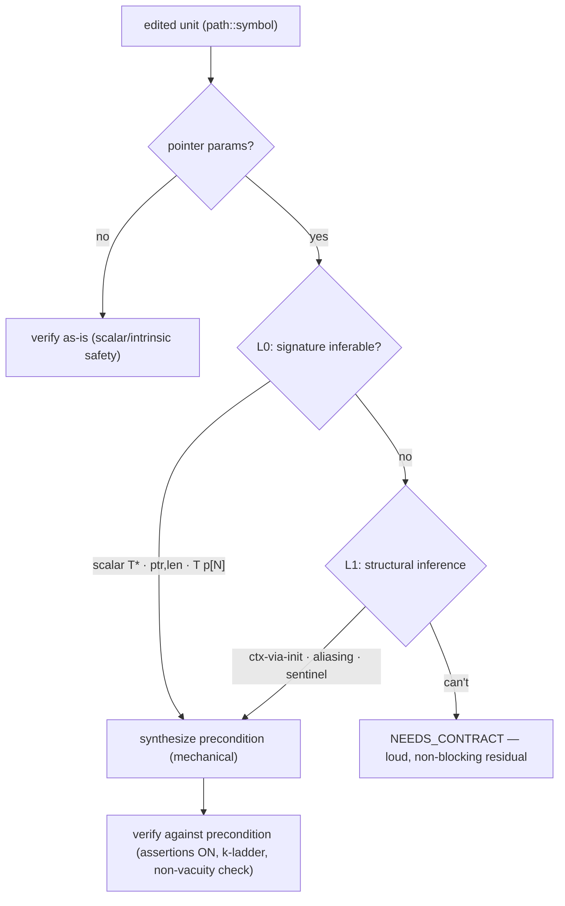

# Design RFC 0003 — Memory preconditions: a sound, automatic safety gate on pointer-taking functions

- **Status:** Draft / RFC (thinking aid — not yet an ADR)
- **Date:** 2026-07-24
- **Tracks:** [#122](https://github.com/pmatos/forseti/issues/122)

## Problem

The v0 Claude Code safety gate verifies each edited function at the **function level**
(`esbmc --function f`, no harness). ESBMC synthesizes a caller that passes every parameter a
**nondeterministic** value. For a pointer parameter that value is not a "random address" — ESBMC
models a pointer as **object identity + byte offset**, and an unconstrained pointer ranges over
the whole *object universe*, including the **invalid / NULL object**. So the first real `*p` /
`p[i]` has a legal execution where `p` has no valid provenance, and ESBMC (soundly) reports
`dereference failure: invalid pointer` or `... Incorrect alignment`.

This is **not an ESBMC bug and not a false positive** — under the empty precondition the function
genuinely *is* unsafe (a caller *can* pass garbage). But it makes the gate fire on essentially
**any** function that dereferences a pointer parameter — i.e. most real C — demanding a source
"fix" for correct code.

**Observed (the sha1 run that motivated this):** a correct SHA‑1 (all four FIPS vectors pass) hit
5 pointer units flagged VIOLATED (`sha1_init/update/final/transform`, `to_hex`); the writer made
5 edit→verify rounds (18 ESBMC calls) chasing unsatisfiable counterexamples before the Stop‑gate
let the turn end with a loud residual. The scalar unit (`rotl32`) VERIFIED. The gate asked the
model to fix code that was already correct.

## The distinction that dissolves most of it

Two things get called "properties." They are *not* the same kind of thing, and conflating them
made this look harder than it is.

| | **Functional / semantic property** | **Memory precondition** (this RFC) |
|---|---|---|
| Example | "output is sorted", "this computes SHA‑1", "`abs(x) ≥ 0`" | "`msg` is a valid object of `len` bytes", "`ctx` is a live SHA‑1 context" |
| Depends on | the **algorithm** being implemented | only the **type signature** (and a little structure) |
| How to obtain | LLM **proposer** + differential grading + GEPA (#65/#64/#4/#5) | **read it off the signature** — mechanical, deterministic |
| Hard? | yes — the research core | **no** — for the common shapes it is boilerplate |
| Vehicle | rendered semantic harness / `assert` after the call | materialize a valid object; `__ESBMC_is_fresh` / harness |

The memory precondition is the **simpler, structural** beast. It must **not** be routed through
the functional‑property machinery (proposer/GEPA). It gets its own **signature‑driven
synthesizer**, with an LLM used only as a fallback for the genuinely structural‑ambiguous cases.

## What ESBMC actually models — and what "fixing" it means

The rule (both corroborated against our pinned fork, `esbmc 8.3.0`):

> Make the **pointed‑to object** exist. Do **not** constrain the pointer bits.
> `p != NULL` says nothing about lifetime, extent, alignment, or offset — you must *materialize*
> the backing object, because object sizes live in a table populated only by allocation sites.

Both delivery vehicles work **in our fork today** (verified end‑to‑end):

| Approach (esbmc 8.3.0) | clean code | off‑by‑one `p[n]` |
|---|---|---|
| **Generated harness** — `malloc(len)` *symbolic size*, unwinding assertions ON | VERIFICATION SUCCESSFUL | FAILED (`array bounds violated`) |
| **Function contract** — `__ESBMC_requires(__ESBMC_is_fresh(p, n))` + `--enforce-contract` | SUCCESSFUL | FAILED |

Our fork exposes `--enforce-contract`, `--replace-call-with-contract`, `--enforce-all-contracts`,
`__ESBMC_contract`, and `--force-malloc-success`.

Two subtleties that must be encoded, or the "proof" is a lie:

1. **Exact sizing.** `malloc(len)` with *symbolic* `len` makes `p[len]` out of bounds. A fixed
   `uint8_t buf[MAX]` does **not** — an off‑by‑one read into the slack passes silently. Size the
   object to the symbolic length, never to a constant upper bound.
2. **Unwinding assertions ON.** The gate today runs `--no-unwinding-assertions --unwind 1`; with
   these harnesses that turns an under‑unwound loop into a *fake* proof. Assertions must be **on**
   (the default) with a k‑ladder, exactly as the corpus discipline (`examples/README.md`) already
   requires.

## Strawman: a signature‑driven synthesizer + honest fallback

A dedicated **memory‑precondition synthesizer**, layered by how inferable the precondition is. The
synthesized artifact lives in a **sidecar** (a generated verification unit that includes the
source), never in the user's file — so the user's `sha1.c` stays pristine (*transparent*) and
Forseti stays a mechanical oracle (it enforces a precondition; it does not judge correctness).

- **L0 — mechanical (deterministic, zero‑LLM).** `scalar T*` → one fresh object; `T* p` adjacent
  to an integer `len|n|size|count` → `is_fresh(p, len)` / `malloc(len)`; fixed array `T p[N]` →
  size `N` straight from the signature. Covers most real C **and all of sha1's one‑shot + digest**.
- **L1 — structural inference (LLM fallback, still automatic + transparent).** Reachable context
  (construct `ctx` by calling `sha1_init`, *not* a nondet blob), ambiguous pointer/length pairing,
  aliasing intent, NUL‑terminated sentinels. This is **structural** inference, kept separate from
  the functional‑property proposer; results are stored per `path::symbol` and reused.
- **L2 — honest fallback.** No verifying, justified precondition → `NEEDS_CONTRACT`: non‑blocking,
  loudly reported, **never a phantom VIOLATED, never a silent pass.**

## Soundness: an assumed precondition must become a *checked* obligation

The failure mode that would betray Forseti's entire value: an auto‑synthesized precondition that is
**too strong** turns a *sound* VIOLATED into an **unsound VERIFIED**. Guards:

1. **Compositional discharge.** A precondition *assumed* when checking `f` becomes an *obligation
   checked at every caller* (`--replace-call-with-contract`): the leaf assumption "`msg` is valid"
   is only sound because each caller is **proven** to pass a valid `msg`; the top‑level entry
   (which allocates real objects) discharges the chain. This is the CBMC/AWS modular model and is
   what makes "no gaps, automatic, transparent" *sound* rather than merely green.
2. **Non‑vacuity.** Every generated harness is checked for reachability of the property site (the
   corpus `assert(0)`‑at‑the‑site discipline). A precondition that makes the property unreachable
   is rejected.
3. **Honest labeling until discharged.** Before compositional discharge exists (staging), a
   VERIFIED under an *assumed, undischarged* precondition is reported **as such** — never as a full
   verdict.

Corollary (both reviewers agree): we must **materialize**, never **suppress**. Pattern‑matching
"dereference failure" in the counterexample text to silence it is unsound — a *real* out‑of‑bounds
bug prints the same string. Classification is **signature‑based** ("we did not check this without a
contract"), never cex‑content‑based.

## Vehicle: contract vs. sidecar harness

| | **Contract** (`is_fresh` + enforce/replace) | **Generated sidecar harness** (`malloc` + call) |
|---|---|---|
| Compositional discharge | **yes** (`--replace-call-with-contract`) | no (per‑entry; assumption not auto‑discharged) |
| Expressiveness | `is_fresh` excludes interior/stack/global/aliasing/pre‑existing‑heap; `assigns` ≤ 100 elems, no multi‑level | **anything** — interior pointers, aliasing, `init`‑constructed contexts |
| Source cleanliness | annotation attaches to the definition → needs a generated **copy** of the TU to stay out of the user's file | naturally separate (includes the source) |
| Maturity note | benign `is_fresh` temporary *warning* observed; validate it is cosmetic | plain BMC, well‑trodden |

**Recommendation:** contracts are the **sound target** (only they discharge); generated sidecar
harnesses are the **fallback** for what `is_fresh` can't express and the **fast first step**.
*Open question:* keeping contracts out of the user's source implies verifying a **generated copy**
of the translation unit with contracts injected — acceptable, but to be prototyped in Stage 3.

## Reframing "no gaps"

We can fully close the **pointer‑provenance** gap. Two gaps are irreducible and are handled by
*honesty*, not faking:

- **The BMC bound** ("all lengths") stays **verified up to k**, unwinding assertions ON so a short
  bound is FAILED (not a fake proof), with a padding‑boundary coverage argument (SHA‑1 lengths
  0/1/55/56/63/64/…). True unboundedness via `__ESBMC_loop_invariant` + `--loop-invariant-check`
  only where it pays.
- **Unstated struct invariants** → L1, or the loud L2 residual.

So the target is **no *silent* gaps and no *false* verdicts** — the project's existing
Q.E.D.‑up‑to‑k vocabulary. Anything stronger over‑claims.

## Staged plan (→ sub-issues of #122)

| Stage | Deliverable | Value |
|---|---|---|
| **S1** | **Stop the phantoms.** Signature‑based `NEEDS_CONTRACT`; don't feed the havoc cex back as fixable; non‑blocking residual. | Unblocks the demo today; ends the thrash. |
| **S2** | **L0 mechanical synthesis + right ESBMC config** (assertions ON, k‑ladder, non‑vacuity). Sidecar harness for scalar `T*` / `ptr,len` / `T p[N]`. | sha1's pointer units **verify** (assumed, up to MAX_LEN). Demo lands. |
| **S3** | **Compositional discharge** (`--replace-call-with-contract`); prototype transparent contract injection; upgrade "assumed" → "discharged". | Closes the soundness hole. |
| **S4** | **L1 structural inference** (context‑via‑init, aliasing, sentinels) — a structural analyzer, *not* the semantic proposer. | Genericity beyond the easy shapes. |
| **S5** | **Unboundedness** via loop invariants, where "all lengths" matters. | Escapes the bound where it counts. |

Termination policy (the Stop‑gate's `MAX_STOP_ATTEMPTS`) is **downstream of S1**: once phantoms are
gone the model only loops on real, fixable verdicts, at which point a progress‑ + budget‑based
policy (not a magic count) replaces the "3". Tracked separately.

## Decisions (recommended) & open questions

- **D1 — Structural, not functional.** Memory preconditions are synthesized by a dedicated
  signature‑driven module, **not** the LLM proposer/GEPA path. *(Recommended — settled with
  reviewers.)*
- **D2 — Vehicle.** Contracts as the sound/compositional target; generated sidecar harnesses as
  fallback + fast first step. *(Recommended.)*
- **D3 — Ship S2 before S3 with honest labeling** ("VERIFIED assuming valid caller pointers"),
  upgraded to discharged in S3. *(Recommended; alternative: hold S2 until discharge — never
  over‑claim vs. velocity.)*
- **OQ1** — Transparent contract injection: verify a generated copy of the TU vs. accept
  source annotations vs. harness‑only for the transparent path.
- **OQ2** — `ptr,len` pairing heuristic robustness (multiple buffers; length in a struct; sentinel
  strings) — how much is L0 vs. L1.
- **OQ3** — Validate the `is_fresh` temporary warning is cosmetic, not a soundness gap.

## References

- [#122](https://github.com/pmatos/forseti/issues/122) (parent) · sub‑issues S1–S5
- Functional‑property line (contrast): #65 (proposer), #64 (harness writer), #95 (semantic gate),
  #4/#5 (grading/GEPA epics)
- Adapter: #45 / #14 (W9) · `adapters/claude-code/`
- Corpus verification discipline: `examples/README.md`
- ESBMC docs: memory model & pointer safety, non‑determinism, function contracts
  (`esbmc.github.io/docs`)
