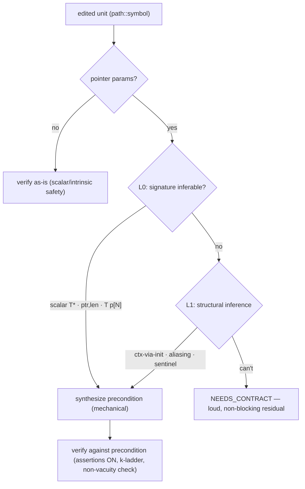

# Design RFC 0003 — Memory preconditions: a sound, automatic safety gate on pointer-taking functions

- **Status:** Draft / RFC (thinking aid — not yet an ADR)
- **Date:** 2026-07-24
- **Tracks:** [#122](https://github.com/pmatos/forseti/issues/122)

## Problem

The v0 Claude Code safety gate verifies each edited function at the **function level**
(`esbmc --function f`, no harness). ESBMC synthesizes a caller that passes every parameter a
**nondeterministic** value. For a pointer parameter that value is not a "random address" — ESBMC
models a pointer as **object identity + byte offset**, and an unconstrained pointer ranges over
the whole *object universe*, including the **invalid / NULL object**. So the first real `*p` /
`p[i]` has a legal execution where `p` has no valid provenance, and ESBMC (soundly) reports
`dereference failure: invalid pointer` or `... Incorrect alignment`.

This is **not an ESBMC bug and not a false positive** — under the empty precondition the function
genuinely *is* unsafe (a caller *can* pass garbage). But it makes the gate fire on essentially
**any** function that dereferences a pointer parameter — i.e. most real C — demanding a source
"fix" for correct code.

**Observed (the sha1 run that motivated this):** a correct SHA‑1 (all four FIPS vectors pass) hit
5 pointer units flagged VIOLATED (`sha1_init/update/final/transform`, `to_hex`); the writer made
5 edit→verify rounds (18 ESBMC calls) chasing unsatisfiable counterexamples before the Stop‑gate
let the turn end with a loud residual. The scalar unit (`rotl32`) VERIFIED. The gate asked the
model to fix code that was already correct.

## The distinction that dissolves most of it

Two things get called "properties." They are *not* the same kind of thing, and conflating them
made this look harder than it is.

| | **Functional / semantic property** | **Memory precondition** (this RFC) |
|---|---|---|
| Example | "output is sorted", "this computes SHA‑1", "`abs(x) ≥ 0`" | "`msg` is a valid object of `len` bytes", "`ctx` is a live SHA‑1 context" |
| Depends on | the **algorithm** being implemented | only the **type signature** (and a little structure) |
| How to obtain | LLM **proposer** + differential grading + GEPA (#65/#64/#4/#5) | **read it off the signature** — mechanical, deterministic |
| Hard? | yes — the research core | **no** — for the common shapes it is boilerplate |
| Vehicle | rendered semantic harness / `assert` after the call | materialize a valid object; `__ESBMC_is_fresh` / harness |

The memory precondition is the **simpler, structural** beast. It must **not** be routed through
the functional‑property machinery (proposer/GEPA). It gets its own **signature‑driven
synthesizer**, with an LLM used only as a fallback for the genuinely structural‑ambiguous cases.

## What ESBMC actually models — and what "fixing" it means

The rule (both corroborated against our pinned fork, `esbmc 8.3.0`):

> Make the **pointed‑to object** exist. Do **not** constrain the pointer bits.
> `p != NULL` says nothing about lifetime, extent, alignment, or offset — you must *materialize*
> the backing object, because object sizes live in a table populated only by allocation sites.

Both delivery vehicles work **in our fork today** (verified end‑to‑end):

| Approach (esbmc 8.3.0) | clean code | off‑by‑one `p[n]` |
|---|---|---|
| **Generated harness** — `malloc(len)` *symbolic size*, unwinding assertions ON | VERIFICATION SUCCESSFUL | FAILED (`array bounds violated`) |
| **Function contract** — `__ESBMC_requires(__ESBMC_is_fresh(p, n))` + `--enforce-contract` | SUCCESSFUL | FAILED |

Our fork exposes `--enforce-contract`, `--replace-call-with-contract`, `--enforce-all-contracts`,
`__ESBMC_contract`, and `--force-malloc-success`.

Two subtleties that must be encoded, or the "proof" is a lie:

1. **Exact sizing.** `malloc(len)` with *symbolic* `len` makes `p[len]` out of bounds. A fixed
   `uint8_t buf[MAX]` does **not** — an off‑by‑one read into the slack passes silently. Size the
   object to the symbolic length, never to a constant upper bound.
2. **Unwinding assertions ON.** The gate today runs `--no-unwinding-assertions --unwind 1`; with
   these harnesses that turns an under‑unwound loop into a *fake* proof. Assertions must be **on**
   (the default) with a k‑ladder, exactly as the corpus discipline (`examples/README.md`) already
   requires.

## Strawman: a signature‑driven synthesizer + honest fallback

A dedicated **memory‑precondition synthesizer**, layered by how inferable the precondition is. The
synthesized artifact lives in a **sidecar** (a generated verification unit that includes the
source), never in the user's file — so the user's `sha1.c` stays pristine (*transparent*) and
Forseti stays a mechanical oracle (it enforces a precondition; it does not judge correctness).

```mermaid
flowchart TB
    S["edited unit (path::symbol)"] --> A{pointer params?}
    A -- no --> V0["verify as-is (scalar/intrinsic safety)"]
    A -- yes --> L0{L0: signature inferable?}
    L0 -- "scalar T* · ptr,len · T p[N]" --> H["synthesize precondition (mechanical)"]
    L0 -- no --> L1{L1: structural inference}
    L1 -- "ctx-via-init · aliasing · sentinel" --> H
    L1 -- can't --> L2["NEEDS_CONTRACT — loud, non-blocking residual"]
    H --> C["verify against precondition (assertions ON, k-ladder, non-vacuity check)"]
```

- **L0 — mechanical (deterministic, zero‑LLM).** `scalar T*` → one fresh object; `T* p` adjacent
  to an integer whose **kind** sets the size — a **byte length** (`len`/`size`/`nbytes`) →
  `is_fresh(p, len)` / `malloc(len)`, an **element count** (`n`/`count`/`nmemb`) →
  `is_fresh(p, n * sizeof(*p))` / `malloc(n * sizeof(*p))` (equal only when `sizeof(*p) == 1`,
  e.g. sha1's `uint8_t*`; conflating them for a wide `T` reintroduces the phantom VIOLATED this
  gate exists to remove); fixed array `T p[N]` →
  size `N` straight from the signature, and C99's `T p[static N]` beside such a length →
  `max(length, N)`, since that `N` is a caller *minimum* rather than a capacity (see the S2‑landed
  note below). Covers most real C **and all of sha1's one‑shot + digest**.
- **L1 — structural inference (LLM fallback, still automatic + transparent).** Reachable context
  (construct `ctx` by calling `sha1_init`, *not* a nondet blob), ambiguous pointer/length pairing,
  aliasing intent, NUL‑terminated sentinels. This is **structural** inference, kept separate from
  the functional‑property proposer; results are stored per `path::symbol` and reused.
- **L2 — honest fallback.** No verifying, justified precondition → `NEEDS_CONTRACT`: non‑blocking,
  loudly reported, **never a phantom VIOLATED, never a silent pass.**

## Soundness: an assumed precondition must become a *checked* obligation

The failure mode that would betray Forseti's entire value: an auto‑synthesized precondition that is
**too strong** turns a *sound* VIOLATED into an **unsound VERIFIED**. Guards:

1. **Compositional discharge.** A precondition *assumed* when checking `f` becomes an *obligation
   checked at every caller* (`--replace-call-with-contract`): the leaf assumption "`msg` is valid"
   is only sound because each caller is **proven** to pass a valid `msg`; the top‑level entry
   (which allocates real objects) discharges the chain. This is the CBMC/AWS modular model and is
   what makes "no gaps, automatic, transparent" *sound* rather than merely green.
2. **Non‑vacuity.** Every generated harness is checked for reachability of the property site (the
   corpus `assert(0)`‑at‑the‑site discipline). A precondition that makes the property unreachable
   is rejected.
3. **Honest labeling until discharged.** Before compositional discharge exists (staging), a
   VERIFIED under an *assumed, undischarged* precondition is reported **as such** — never as a full
   verdict.

Corollary (both reviewers agree): we must **materialize**, never **suppress**. Pattern‑matching
"dereference failure" in the counterexample text to silence it is unsound — a *real* out‑of‑bounds
bug prints the same string. Classification is **signature‑based** ("we did not check this without a
contract"), never cex‑content‑based.

## Vehicle: contract vs. sidecar harness

| | **Contract** (`is_fresh` + enforce/replace) | **Generated sidecar harness** (`malloc` + call) |
|---|---|---|
| Compositional discharge | **yes** (`--replace-call-with-contract`) | no (per‑entry; assumption not auto‑discharged) |
| Expressiveness | `is_fresh` excludes interior/stack/global/aliasing/pre‑existing‑heap; `assigns` ≤ 100 elems, no multi‑level | **anything** — interior pointers, aliasing, `init`‑constructed contexts |
| Source cleanliness | annotation attaches to the definition → needs a generated **copy** of the TU to stay out of the user's file | naturally separate (includes the source) |
| Maturity note | benign `is_fresh` temporary *warning* observed; validate it is cosmetic | plain BMC, well‑trodden |

**Recommendation:** contracts are the **sound target** (only they discharge); generated sidecar
harnesses are the **fallback** for what `is_fresh` can't express and the **fast first step**.
*Open question:* keeping contracts out of the user's source implies verifying a **generated copy**
of the translation unit with contracts injected — acceptable, but to be prototyped in Stage 3.

> **Superseded by measurement in S3 (see below).** The "Maturity note" row was optimistic: on our
> pinned esbmc 8.3.0 the contract *vehicle* cannot carry a memory precondition at all, so discharge
> landed on an injected obligation instead. The generated‑copy idea survived intact.

## Reframing "no gaps"

We can fully close the **pointer‑provenance** gap. Two gaps are irreducible and are handled by
*honesty*, not faking:

- **The BMC bound** ("all lengths") stays **verified up to k**, unwinding assertions ON so a short
  bound is FAILED (not a fake proof), with a padding‑boundary coverage argument (SHA‑1 lengths
  0/1/55/56/63/64/…). True unboundedness via `__ESBMC_loop_invariant` + `--loop-invariant-check`
  only where it pays.
- **Unstated struct invariants** → L1, or the loud L2 residual.

So the target is **no *silent* gaps and no *false* verdicts** — the project's existing
Q.E.D.‑up‑to‑k vocabulary. Anything stronger over‑claims.

## Staged plan (→ sub-issues of #122)

| Stage | Deliverable | Value |
|---|---|---|
| **S1** | **Stop the phantoms.** Signature‑based `NEEDS_CONTRACT`; don't feed the havoc cex back as fixable; non‑blocking residual. | Unblocks the demo today; ends the thrash. |
| **S2** ✅ | **L0 mechanical synthesis + right ESBMC config** (assertions ON, k‑ladder, non‑vacuity). Sidecar harness for scalar `T*` / `ptr,len` / `T p[N]`. | sha1's pointer units **verify** (assumed, up to MAX_LEN). Demo lands. |
| **S3** ✅ | **Compositional discharge**; transparent contract injection; upgrade "assumed" → "discharged". | Closes the soundness hole. |
| **S4** | **L1 structural inference** (context‑via‑init, aliasing, sentinels) — a structural analyzer, *not* the semantic proposer. | Genericity beyond the easy shapes. |
| **S5** | **Unboundedness** via loop invariants, where "all lengths" matters. | Escapes the bound where it counts. |

Termination policy (the Stop‑gate's `MAX_STOP_ATTEMPTS`) is **downstream of S1**: once phantoms are
gone the model only loops on real, fixable verdicts, at which point a progress‑ + budget‑based
policy (not a magic count) replaces the "3". Tracked separately.

**S2 landed** ([#125](https://github.com/pmatos/forseti/issues/125)): the signature‑driven
synthesizer + sidecar verify live in `src/forseti/precond/` behind `forseti synth <source>
--function NAME`, with fixed‑array extents recovered by `list_units` (`Param.array_extent`). Verdicts
are **honestly labelled** — `ASSUMED_VERIFIED` ("VERIFIED assuming valid caller pointers —
undischarged"), never a full verdict (D3). The `examples/sha1.c` units verify assumed; the
`sha1_bug.c` off‑by‑one is VIOLATED non‑vacuously. Under‑unwound loops (assertions ON) are told from
real out‑of‑bounds structurally and *escalate the k‑ladder*, never masquerade as a violation.

**Extent recovery is honest about its limits** ([#137](https://github.com/pmatos/forseti/issues/137)):
`T p[static N]` (with cv‑qualifiers, either order) is read like a bare `T p[N]`, but an extent that
needs the preprocessor or an expression (`T p[SHA_DIGEST_LENGTH]`, `T p[N+1]`) is **not guessable
from the source** — so it is *flagged* (`Param.array_extent_unresolved`) rather than left
indistinguishable from a plain `T *p`, and the unit is `NEEDS_CONTRACT` instead of being backed by a
one‑element object that phantom‑VIOLATES code reading the declared extent. For a *conventional*
`T p[MACRO]` an accompanying length parameter still wins — the written extent binds nobody (C adjusts
the parameter to `T *`), so the length is the better authority and sizes the object exactly. C99's
`T p[static N]` is the exception: there the extent is a **caller obligation**, a *minimum* rather than
a capacity. A valid caller satisfies both it and the length convention, so the object is sized
`max(length, N)` when `N` is readable — sizing by the length alone would phantom‑VIOLATE a body that
touches all of `N`, and sizing at exactly `N` would phantom‑VIOLATE one that touches `length`
elements when `length > N`. With `N` unreadable (`T p[static MACRO]`) there is no floor to raise the
length to, so L0 declines instead.

**S3 landed** ([#126](https://github.com/pmatos/forseti/issues/126)): `forseti discharge <source>
--function NAME` runs S2 and then turns its assumption into an obligation. The *same* `UnitPlan`
that sizes the sidecar's `malloc` renders a predicate injected into a **generated copy** of the
translation unit at the unit's entry (`src/forseti/precond/synth.py::inject_obligations`), on the
definition's own line so every other line number matches the user's file; every unit in the TU whose
body references the callee (`Unit.calls`, read off the clang AST) is then verified through *its own*
S2 sidecar against that copy, so the obligation is evaluated with that caller's actual arguments. A
caller that passes an invalid or too‑small pointer is **VIOLATED at the call site**, named; a caller
that passes a valid one **discharges** — but only after a site probe confirms it reaches the call at
all, so a dead call site cannot discharge vacuously. The upgrade to `DISCHARGED_VERIFIED` **fails
closed**: it requires that *every* caller was checked and every check passed. An unmaterialisable
caller, an inconclusive ladder, an unreachable site, or no caller at all in this TU each leave the
honest S2 verdict standing with a loud "discharge incomplete" (for the last case, the obligation is
*exported* to the TU's clients — `examples/sha1.c` discharges nothing, and says so). Corpus:
`examples/frame_checksum.c` / `_bug.c`, pinned by `tests/esbmc/test_precond_corpus.py`.

**And it fails closed in the other direction — the phantom must not move to the call site.** The
mirror‑image hazard of discharge is that the *caller* is itself an L0 unit. A caller whose signature
states no extent (`void hash_block(const uint8_t *blk)` for a 16‑byte block) is materialised by the
weakest fallback — one pointee — so it *cannot* satisfy a wider obligation however correct it is,
and blaming it would flag working code: exactly the phantom VIOLATED this RFC exists to remove,
relocated from the callee to the call site. So the discriminator is **length authority**: only a
caller whose every pointer is sized by something the signature actually states (a companion length,
a written array extent) can be `VIOLATED` at the call site; one carrying a bare `SCALAR_PTR` is
`UNDERDETERMINED` — it withholds the upgrade without accusing anyone. Reading such a caller's true
extent is L1's job (S4), and until then the honest S2 verdict stands. Deliberately conservative: a
caller mixing an authoritative pointer with a bare one suppresses a possibly‑real finding rather
than risk a phantom.

**Exit codes remain a statement about the unit under discharge.** A caller that faults on a memory
property of its own before the obligation is reached is reported loudly, with its counterexample,
but the process status stays the callee's `ASSUMED_VERIFIED` 0 — that caller is a *different*
verification unit and its own gate run is what should redden. Only a silent pass is forbidden, which
is why every withheld discharge is spelled out in the label.

**OQ1 answered — verify a generated copy.** Injecting into a copy works and keeps the promise S2
made: `forseti discharge --emit-only` prints exactly what the checker sees, and the acceptance suite
asserts the user's file is byte‑identical afterwards. Source annotations were never a live option
(they would put Forseti's scaffolding in the user's repo); harness‑only cannot discharge at all.

**OQ3 answered — the warning is *not* cosmetic, and it cost us the vehicle.** Measured against esbmc
8.3.0 (pinned by `tests/esbmc/test_contract_vehicle.py`): a `__ESBMC_requires` over plain parameter
arithmetic transplants correctly under `--replace-call-with-contract` (good caller SUCCESSFUL, bad
caller FAILED — so the machinery itself works), but a `requires` whose expression contains an
intrinsic **call** — `__ESBMC_is_fresh`, `__ESBMC_r_ok`, `__ESBMC_get_object_size` — is transplanted
into the caller still referring to a callee‑local temporary that no longer exists. esbmc says
`WARNING: Could not find definition for temporary variable: …return_value$___ESBMC_is_fresh$1` and
then FAILS **every** call site regardless of what it passes; hoisting the intrinsic into a local
first does not help. Under `--enforce-contract` the same `requires` simply has no effect, leaving
the phantom VIOLATED S1 exists to remove. Both directions fail *closed* — never a false VERIFIED —
but neither discharges anything, so `--replace-call-with-contract` is unusable for a **memory**
precondition until our fork fixes the transplant. (`__ESBMC_same_object(p, p + n)` is no substitute:
ESBMC's pointer arithmetic preserves object identity, so it cannot express an extent.)

**The vehicle that does work, and what it gives up.** The obligation is an
`__ESBMC_assert(<predicate>, "forseti:obligation:<fn>:<param>")` at the callee's entry, checking the
same predicate against the same arguments a contract would. What that gives up is **modularity** —
the callee's body is still explored — not soundness; and the label is what tells a caller‑side break
from a bug inside the callee, so classification stays structural rather than counterexample‑prose
matching. Two ESBMC quirks shape the predicate itself and are pinned as tests:
`__ESBMC_r_ok(p, n)` answers *true* when `p`'s offset already lies past its object's end
(`r_ok(malloc(8) + 9, 4)` passes), so the check is **rebased to offset zero** — ask for `offset + n`
bytes from the object's base, where `r_ok` is exact — and guarded against a `size_t` wrap, since a
caller's underflowed length (`len - HEADER`) would otherwise ask for a *tiny*, satisfiable span.
`__ESBMC_get_object_size` would have expressed this directly but aborts without a verdict on exactly
those pointers. `r_ok` is also *weaker* than `is_fresh` — it admits an interior pointer into a larger
live object, which is what makes a caller like `payload_checksum(frame + 2, len - 2)` dischargeable
at all — and it says nothing about write permission; ESBMC checks that separately (`dereference
failure: write access to const object`) in the same run, because the callee's body is explored.

## Decisions (recommended) & open questions

- **D1 — Structural, not functional.** Memory preconditions are synthesized by a dedicated
  signature‑driven module, **not** the LLM proposer/GEPA path. *(Recommended — settled with
  reviewers.)*
- **D2 — Vehicle.** Contracts as the sound/compositional target; generated sidecar harnesses as
  fallback + fast first step. *(Recommended — **revised by S3**: ESBMC contracts cannot carry a
  memory precondition on the pinned build, so the discharge vehicle is an injected obligation
  asserted at the callee's entry. Sidecar harnesses remain the assumption side. See OQ3.)*
- **D3 — Ship S2 before S3 with honest labeling** ("VERIFIED assuming valid caller pointers"),
  upgraded to discharged in S3. *(Recommended; alternative: hold S2 until discharge — never
  over‑claim vs. velocity.)*
- ~~**OQ1**~~ **— answered (S3): verify a generated copy of the TU.** Source annotations were never
  live; harness‑only cannot discharge.
- **OQ2** — `ptr,len` pairing heuristic robustness (multiple buffers; length in a struct; sentinel
  strings) — how much is L0 vs. L1.
- ~~**OQ3**~~ **— answered (S3): not cosmetic.** The temporary‑variable warning marks a transplant
  failure that makes *any* intrinsic‑call `requires` unusable under `--replace-call-with-contract`
  (and inert under `--enforce-contract`). Fails closed, discharges nothing. Fixing it in our fork
  (ADR‑0004) would restore true modular discharge; until then the injected obligation stands.

## References

- [#122](https://github.com/pmatos/forseti/issues/122) (parent) · sub‑issues S1–S5
- Functional‑property line (contrast): #65 (proposer), #64 (harness writer), #95 (semantic gate),
  #4/#5 (grading/GEPA epics)
- Adapter: #45 / #14 (W9) · `adapters/claude-code/`
- Corpus verification discipline: `examples/README.md`
- ESBMC docs: memory model & pointer safety, non‑determinism, function contracts
  (`esbmc.github.io/docs`)
